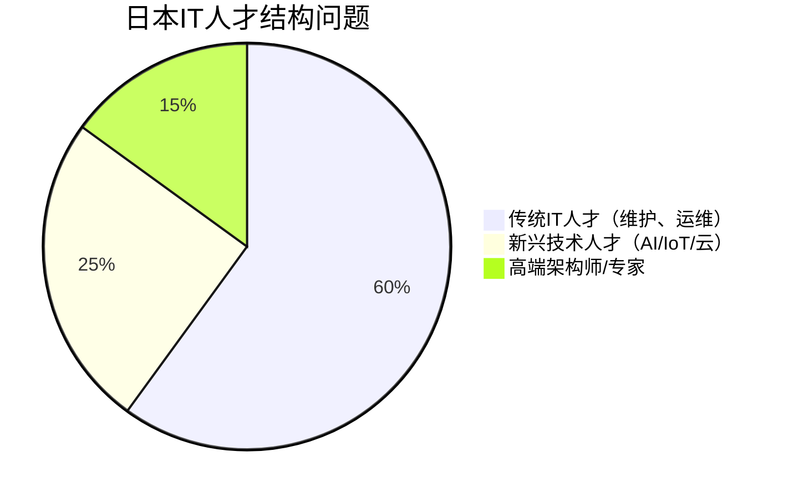
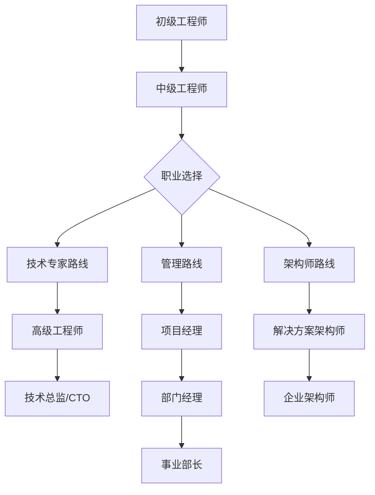

# 第二章：IT从业者现状

## 2.1 人才供需状况

### 当前IT人才规模

日本IT行业面临严重的人才短缺问题，这是制约行业发展的最大瓶颈之一。

| 指标 | 数据 | 来源/年份 |
|------|------|----------|
| 当前IT从业人员 | 约110万人 | 2024年估算 |
| 2025年预计缺口 | 约36万人 | 经济产业省 |
| 2030年预计缺口 | **79万人** | 经济产业省 |
| 2040年预计缺口 | 超过100万人 | 业界预测 |

### 人才结构性问题

**主要问题**：
1. **传统IT人才过剩**：从事老旧系统维护的人才较多
2. **新兴技术人才短缺**：AI、机器学习、云架构等领域人才严重不足
3. **年龄结构老化**：40岁以上从业者占比超过50%
4. **女性从业者比例低**：仅占约20%，远低于欧美国家

### 人才缺口的原因

- **少子高龄化**：劳动力人口持续减少
- **IT教育滞后**：大学计算机专业毕业生数量不足
- **行业吸引力不足**：相比金融、咨询等行业薪资竞争力较弱
- **技术更新快**：现有人才技能更新速度跟不上需求

---

## 2.2 薪资水平分析

### 整体薪资概况

根据多个薪资调查平台的数据，日本IT工程师的薪资水平如下：

| 数据来源 | 平均年收 | 备注 |
|---------|---------|------|
| Glassdoor | 700万日元 | 全经验级别 |
| Payscale | 490万日元 | 偏保守估计 |
| DODA | 460万日元 | 日本本土调查 |
| Levels.fyi | 815万日元 | 偏向大企业 |
| **综合估算** | **550-600万日元** | **约4-4.5万美元** |

> 💡 **注意**：日本IT工程师平均薪资约为美国的40-50%，但生活成本也相对较低。

### 按经验级别划分的薪资

#### 软件工程师（Software Engineer）

| 经验级别 | 年收范围 | 月薪（税前） | 美元等值 |
|---------|---------|-------------|---------|
| 初级（0-2年） | 400-550万日元 | 33-46万日元 | $30-41K |
| 中级（3-5年） | 600-850万日元 | 50-71万日元 | $45-64K |
| 高级（6-10年） | 900-1200万日元 | 75-100万日元 | $68-90K |
| 资深/专家（10年+） | 1300-1500万日元 | 108-125万日元 | $98-113K |

#### 机器学习工程师（ML Engineer）

| 经验级别 | 年收范围 | 备注 |
|---------|---------|------|
| 初级（2-3年） | 500-650万日元 | 需要日语能力 |
| 中级（4-7年） | 700-950万日元 | 90%职位需要日语 |
| 高级（8-11年） | 1000-1300万日元 | 高需求领域 |
| 专家（12年+） | 1400-1600万日元 | 稀缺人才 |

#### DevOps工程师

| 经验级别 | 年收范围 |
|---------|---------|
| 初级-中级 | 600-950万日元 |
| 高级 | 1000万日元以上 |

### 按编程语言划分的薪资

| 编程语言 | 平均年收（日元） | 平均年收（美元） |
|---------|----------------|----------------|
| iOS开发 | 721万 | $72,194 |
| Ruby | 531万 | $53,128 |
| Golang | 517万 | $51,652 |
| Android | 387万 | $38,730 |
| Python | 360万 | $36,021 |
| JavaScript | 339万 | $33,859 |
| PHP | 336万 | $33,625 |
| SQL | 318万 | $31,815 |
| Java | 236万 | $23,623 |

> 📊 **趋势**：移动开发（iOS/Android）和现代语言（Go、Ruby）薪资较高，传统企业语言（Java）薪资相对较低。

### 按企业类型划分的薪资

| 企业类型 | 平均年收 | 特点 |
|---------|---------|------|
| 外资IT企业 | 800-1500万日元 | 薪资最高，竞争激烈 |
| 大型SIer | 600-1000万日元 | 稳定，福利好 |
| 互联网企业 | 550-900万日元 | 股权激励多 |
| 中小型SIer | 400-650万日元 | 薪资较低 |
| SES派遣公司 | 350-550万日元 | 薪资最低 |

### 与其他国家的薪资对比

| 国家 | IT工程师平均年收（美元） | 相对日本 |
|------|------------------------|---------|
| 美国 | $110,000 | 2.4倍 |
| 新加坡 | $75,000 | 1.6倍 |
| 澳大利亚 | $85,000 | 1.8倍 |
| **日本** | **$45,000** | **基准** |
| 韩国 | $50,000 | 1.1倍 |
| 中国（一线城市） | $40,000 | 0.9倍 |
| 印度 | $15,000 | 0.3倍 |

---

## 2.3 技能需求变化

### 最受欢迎的技术技能（2024-2025）

#### 编程语言需求排名

1. **Python** - AI/ML、数据分析
2. **JavaScript/TypeScript** - Web前端
3. **Java** - 企业系统（需求下降）
4. **Go** - 云原生、微服务
5. **Rust** - 系统编程（需求上升）
6. **Kotlin** - Android开发
7. **Swift** - iOS开发
8. **C#** - 游戏、企业应用

#### 热门技术领域

| 技术领域 | 需求增长率 | 平均薪资 |
|---------|-----------|---------|
| AI/机器学习 | ⬆️ +45% | 700-1200万日元 |
| 云架构（AWS/Azure/GCP） | ⬆️ +38% | 650-1100万日元 |
| DevOps/SRE | ⬆️ +32% | 700-1000万日元 |
| 网络安全 | ⬆️ +28% | 650-950万日元 |
| 数据工程 | ⬆️ +25% | 600-900万日元 |
| 区块链 | ⬆️ +15% | 700-1000万日元 |
| 传统系统维护 | ⬇️ -10% | 400-600万日元 |

### 认证与资格

日本IT行业重视资格认证，常见的有：

**国家资格**：
- 基本情报技术者（FE）- 入门级
- 应用情报技术者（AP）- 中级
- 数据库专门家（DB）- 高级
- 网络专门家（NW）- 高级
- 情报安全专门家（SC）- 高级
- 系统架构师（SA）- 最高级

**国际认证**：
- AWS认证（Solutions Architect等）
- Azure认证
- Google Cloud认证
- CISSP（网络安全）
- PMP（项目管理）

> 💡 **提示**：拥有AWS/Azure等云认证可使薪资提升10-20%

---

## 2.4 工作文化特点

### 工作时间与加班文化

日本IT行业的工作文化正在经历变革：

| 方面 | 传统模式 | 现代趋势 |
|------|---------|---------|
| 标准工作时间 | 9:00-18:00 | 弹性工作制增加 |
| 月平均加班时间 | 30-50小时 | 20-30小时（逐渐减少） |
| 加班费 | 不一定支付 | 法律要求更严格 |
| 年假使用率 | 50-60% | 70-80%（提升中） |

**加班文化的变化**：
- 政府推行"工作方式改革"（働き方改革）
- 大企业开始严格控制加班时间
- 外资企业和互联网企业加班较少
- SIer和派遣公司加班仍较多

### 远程办公趋势

COVID-19疫情加速了远程办公的普及：

| 企业类型 | 远程办公普及率 | 政策 |
|---------|--------------|------|
| 外资IT企业 | 80-100% | 完全远程或混合 |
| 互联网企业 | 60-80% | 混合办公为主 |
| 大型SIer | 40-60% | 部分远程 |
| 中小SIer | 20-40% | 仍以出勤为主 |
| 客户现场派遣 | 0-10% | 必须现场 |

### 职业发展路径

**典型职业路径**：
1. **技术专家路线**：深耕技术，成为某领域专家
2. **管理路线**：转向项目管理、团队管理
3. **架构师路线**：系统设计、技术决策
4. **创业/自由职业**：独立接项目或创业

---

## 本章小结

日本IT行业面临严重的人才短缺，预计2030年缺口达79万人。IT工程师平均年收约550-600万日元（4-4.5万美元），虽低于欧美但在日本属于中上水平。AI、云计算、DevOps等新兴技术领域需求旺盛，薪资较高。工作文化正在改善，远程办公逐渐普及。

**关键数据回顾**：
- 2030年人才缺口：79万人
- 平均年收：550-600万日元
- AI/ML工程师薪资：700-1200万日元
- 外资企业远程办公率：80-100%

---

*下一章：雇佣关系与行业结构*
