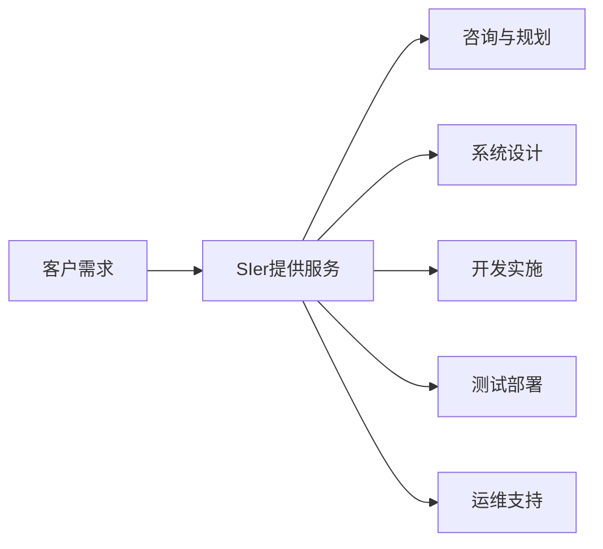
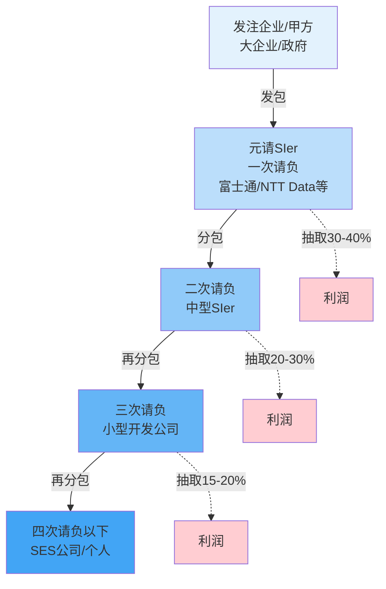
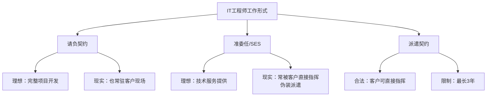
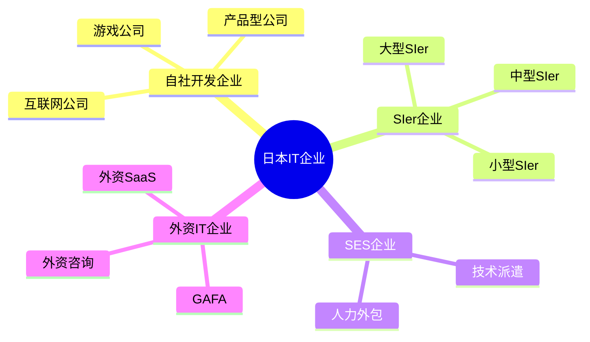
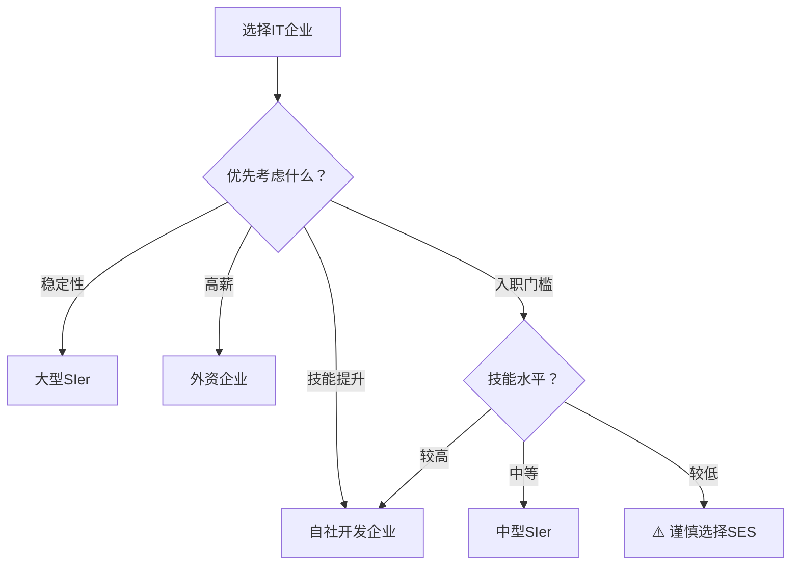

# 第三章：雇佣关系与行业结构

## 3.1 SIer（系统集成商）体系

### 什么是SIer？

**SIer**（System Integrator，系统集成商）是日本IT行业的核心概念。SIer是指专门从事系统集成业务的企业，为客户提供从咨询、规划、设计、开发、实施到维护的全方位IT服务。



**SIer的主要业务**：
- IT咨询与战略规划
- 系统需求分析与设计
- 软件开发与定制
- 系统集成与实施
- 项目管理
- 运维与技术支持

### SIer的类型

| 类型 | 特点 | 代表企业 |
|------|------|---------|
| **制造商系SIer** | 母公司为IT设备制造商 | 富士通、NEC、日立 |
| **用户系SIer** | 源自大企业IT部门独立 | NTT Data、伊藤忠Techno |
| **独立系SIer** | 无特定母公司，灵活性高 | 大塚商会、OBIC |
| **外资系SIer** | 全球化运营，文化开放 | Accenture、IBM Japan |
| **咨询系SIer** | 侧重战略咨询 | 野村综合研究所 |

### 日本SIer体系的特点

1. **风险规避文化**：日本企业倾向于将IT需求外包给可信赖的第三方
2. **政府驱动**：政府IT支出为SIer创造了大量商机
3. **长期合作关系**：基于信任的长期合作伙伴关系
4. **综合服务能力**：提供一站式IT解决方案

---

## 3.2 多层外包结构（多重下請け）

### 多层外包的形成

日本IT行业最显著的特征之一就是**多层外包结构**（多重下請け），这种结构在全球IT行业中较为罕见。



### 各层级的角色与责任

| 层级 | 角色 | 主要工作 | 单价水平 | 利润率 |
|------|------|---------|---------|--------|
| **发注企业** | 甲方 | 提出需求、验收 | - | - |
| **元请（一次请负）** | 总承包商 | 需求分析、架构设计、项目管理 | 150-250万日元/人月 | 30-40% |
| **二次请负** | 分包商 | 详细设计、部分开发 | 100-150万日元/人月 | 20-30% |
| **三次请负** | 再分包商 | 编码、单元测试 | 60-100万日元/人月 | 15-20% |
| **四次请负以下** | 底层外包 | 简单编码、测试 | 40-60万日元/人月 | 5-10% |

### 多层外包的运作机制

**典型案例**：
```
某银行系统开发项目
├─ 发注方：某大型银行（预算10亿日元）
├─ 元请：NTT Data（承包8亿日元，利润2亿）
│   ├─ 二次请负：中型SIer A（承包5亿日元）
│   │   ├─ 三次请负：小型公司B（承包2亿日元）
│   │   │   └─ 四次请负：SES公司C（承包8000万日元）
│   │   │       └─ 实际工程师：月薪40-50万日元
│   │   └─ 三次请负：小型公司D（承包1.5亿日元）
│   └─ 二次请负：中型SIer E（承包2亿日元）
└─ 二次请负：中型SIer F（承包1亿日元）
```

### 多层外包的优缺点

**优点**：
- ✅ 大型项目可以快速集结人力
- ✅ 风险分散到各层级
- ✅ 灵活调配资源
- ✅ 各层级专注自己擅长的领域

**缺点**：
- ❌ 中间层层抽成，底层工程师薪资低
- ❌ 沟通链条长，信息传递失真
- ❌ 责任不明确，出问题难以追责
- ❌ 底层工程师只能接触简单工作，技能提升困难
- ❌ 项目成本高昂

---

## 3.3 三种主要契约形式

日本IT行业主要有三种契约形式，它们决定了工程师的工作方式和权利义务关系。

### 契约形式对比表

| 项目 | 请负契约（承包） | 准委任契约（SES） | 派遣契约 |
|------|----------------|-----------------|---------|
| **报酬基础** | 成果物交付 | 工作时间 | 工作时间 |
| **成果物责任** | 有 | 无 | 无 |
| **指挥命令权** | 受注方企业 | 受注方企业 | 发注方企业 |
| **工作地点** | 通常在客户现场 | 通常在客户现场 | 客户现场 |
| **法律依据** | 民法632条 | 民法656条 | 劳动者派遣法 |
| **合同期限** | 项目完成为止 | 可长期 | 最长3年 |
| **工程师感受** | 在客户处的自社办公室 | 在客户处的自社办公室 | 客户公司的员工 |

### 1. 请负契约（請負契約）

**定义**：承包方承诺完成特定工作并交付成果物，发注方支付报酬。

**特点**：
- 以成果物为导向
- 承包方承担完成责任
- 质量、成本、交期（QCD）由承包方保证
- 指挥命令权在承包方

**适用场景**：
- 完整的系统开发项目
- 有明确需求和交付标准
- 大型SIer承接的项目

**工程师视角**：
```
✅ 优点：
- 有明确的项目目标
- 可以参与完整的开发流程
- 成就感较强

❌ 缺点：
- 项目延期时加班压力大
- 需要承担交付责任
```

### 2. 准委任契约（準委任契約 / SES）

**定义**：受注方提供技术服务，按工作时间计费，不承担成果物责任。

**SES（System Engineering Service）**是准委任契约的典型形式，是日本IT行业特有的用工模式。

**特点**：
- 按工作时间（人月/人日）计费
- 不承担成果物责任
- 指挥命令权在受注方（但实际常被客户指挥）
- 工程师常驻客户现场

**适用场景**：
- 人力补充型项目
- 长期技术支持
- 客户现场开发

**工程师视角**：
```
✅ 优点：
- 工作压力相对较小
- 不承担交付责任
- 可以接触不同项目

❌ 缺点：
- 容易沦为"人力出租"
- 技能提升有限
- 归属感低
- 容易被当作"外人"
```

**SES的争议**：
- ⚠️ 常被批评为"现代IT奴隶制"
- ⚠️ 实际工作中常违法接受客户指挥（伪装派遣）
- ⚠️ 2025年政策收紧，打击滥用SES的行为

### 3. 派遣契约（派遣契約）

**定义**：派遣公司将员工派遣到客户企业，接受客户企业的指挥命令。

**特点**：
- 指挥命令权在客户企业
- 派遣期限最长3年
- 受《劳动者派遣法》严格监管
- 工资由派遣公司支付

**适用场景**：
- 短期人力需求
- 特定技能补充
- 项目高峰期支援

**工程师视角**：
```
✅ 优点：
- 可以在大企业工作
- 接触核心业务
- 相对稳定

❌ 缺点：
- 同工不同酬（比正社员低20-30%）
- 3年期限限制
- 职业发展受限
- 福利待遇差
```

### 三种契约的实际区别



---

## 3.4 SES（系统工程服务）详解

### SES的商业模式

SES公司是日本IT行业的特殊存在，其商业模式本质上是"技术人力中介"。

**SES公司的运作流程**：
```
1. 招聘IT工程师（正社员或契约社员）
2. 与客户企业签订准委任契约
3. 将工程师派遣到客户现场工作
4. 按人月单价向客户收费
5. 支付工程师固定工资
6. 赚取差价作为利润
```

**典型的收费与工资对比**：
| 工程师经验 | 客户支付单价 | 工程师月薪 | SES公司利润 | 利润率 |
|-----------|-------------|-----------|------------|--------|
| 1-2年 | 50-60万日元 | 25-30万日元 | 20-30万日元 | 40-50% |
| 3-5年 | 70-90万日元 | 35-45万日元 | 25-45万日元 | 35-50% |
| 5年以上 | 100-120万日元 | 50-60万日元 | 40-60万日元 | 40-50% |

### SES的问题点

1. **伪装派遣问题**
   - 名义上是准委任，实际接受客户指挥
   - 违反劳动者派遣法
   - 2025年政府加强监管

2. **工程师权益受损**
   - 薪资被大幅抽成
   - 技能提升困难
   - 职业发展受限
   - 频繁更换项目，缺乏归属感

3. **行业形象问题**
   - 被称为"IT土方"、"现代奴隶"
   - 降低IT行业整体吸引力
   - 优秀人才流失

### 如何识别SES公司

⚠️ **警示信号**：
- 招聘广告强调"客户现场工作"
- 公司没有自己的产品或服务
- 面试时问技能但不问项目经验
- 承诺"可以接触各种项目"
- 公司规模大但知名度低
- 员工流动率高

**常见SES公司的特征**：
- 公司名称带"システム"、"テクノロジー"、"ソリューション"
- 业务内容写"技术者派遣"、"SES事业"
- 客户名单很长但都是大企业（实际是被分包）

---

## 3.5 企业类型分析

### 四种主要企业类型

日本IT企业可以分为以下几种类型，它们的工作环境、薪资待遇和职业发展路径差异很大。



### 1. 自社开发企业（自社サービス企業）

**定义**：开发和运营自己的产品或服务的企业。

**代表企业**：
- 互联网：乐天、Yahoo Japan、LINE、Mercari
- 游戏：任天堂、索尼互动娱乐、CyberAgent
- SaaS：Freee、SmartHR、Sansan

**特点**：
| 方面 | 情况 |
|------|------|
| 薪资水平 | ⭐⭐⭐⭐ 中上（500-900万日元） |
| 技能提升 | ⭐⭐⭐⭐⭐ 优秀 |
| 工作环境 | ⭐⭐⭐⭐⭐ 现代化 |
| 加班情况 | ⭐⭐⭐⭐ 相对较少 |
| 远程办公 | ⭐⭐⭐⭐⭐ 普遍支持 |
| 职业发展 | ⭐⭐⭐⭐⭐ 路径清晰 |

**优点**：
- ✅ 参与完整产品开发周期
- ✅ 使用现代技术栈
- ✅ 团队协作氛围好
- ✅ 能看到自己工作的成果
- ✅ 股权激励机会

**缺点**：
- ❌ 竞争激烈，入职门槛高
- ❌ 创业公司风险较大
- ❌ 可能需要on-call值班

### 2. SIer企业

**定义**：为客户提供系统集成服务的企业。

#### 大型SIer（富士通、NTT Data、NEC等）

**特点**：
| 方面 | 情况 |
|------|------|
| 薪资水平 | ⭐⭐⭐⭐ 稳定（600-1000万日元） |
| 技能提升 | ⭐⭐⭐ 中等 |
| 工作稳定性 | ⭐⭐⭐⭐⭐ 非常稳定 |
| 加班情况 | ⭐⭐⭐ 项目期较多 |
| 远程办公 | ⭐⭐⭐ 部分支持 |
| 福利待遇 | ⭐⭐⭐⭐⭐ 优秀 |

**优点**：
- ✅ 工作稳定，终身雇用
- ✅ 福利待遇完善
- ✅ 大型项目经验
- ✅ 品牌知名度高
- ✅ 培训体系完善

**缺点**：
- ❌ 技术栈相对老旧
- ❌ 官僚主义严重
- ❌ 创新能力不足
- ❌ 晋升速度慢

#### 中小型SIer

**特点**：
| 方面 | 情况 |
|------|------|
| 薪资水平 | ⭐⭐⭐ 中等（400-700万日元） |
| 技能提升 | ⭐⭐ 有限 |
| 工作稳定性 | ⭐⭐⭐ 一般 |
| 加班情况 | ⭐⭐ 较多 |

**优点**：
- ✅ 入职门槛相对较低
- ✅ 可以接触多种项目

**缺点**：
- ❌ 常处于外包链底层
- ❌ 薪资增长有限
- ❌ 加班较多
- ❌ 技术债务严重

### 3. SES企业

**定义**：专门从事技术人力派遣的企业。

**特点**：
| 方面 | 情况 |
|------|------|
| 薪资水平 | ⭐⭐ 较低（350-550万日元） |
| 技能提升 | ⭐ 很难 |
| 工作稳定性 | ⭐⭐ 不稳定 |
| 加班情况 | ⭐⭐ 取决于项目 |
| 职业发展 | ⭐ 受限 |

**优点**：
- ✅ 入职门槛最低
- ✅ 可以进入大企业现场

**缺点**：
- ❌ 薪资被大幅抽成
- ❌ 技能提升困难
- ❌ 频繁更换项目
- ❌ 缺乏归属感
- ❌ 行业口碑差

⚠️ **建议**：除非别无选择，否则应避免加入纯SES企业。

### 4. 外资IT企业

**定义**：在日本设立分公司的外国IT企业。

**代表企业**：
- GAFA：Google、Apple、Meta、Amazon
- 外资咨询：Accenture、IBM、Deloitte
- 外资SaaS：Salesforce、Microsoft、Oracle

**特点**：
| 方面 | 情况 |
|------|------|
| 薪资水平 | ⭐⭐⭐⭐⭐ 最高（800-1500万日元） |
| 技能提升 | ⭐⭐⭐⭐⭐ 优秀 |
| 工作环境 | ⭐⭐⭐⭐⭐ 国际化 |
| 加班情况 | ⭐⭐⭐⭐ 较少 |
| 远程办公 | ⭐⭐⭐⭐⭐ 完全支持 |
| 工作稳定性 | ⭐⭐⭐ 取决于业绩 |

**优点**：
- ✅ 薪资最高
- ✅ 使用最新技术
- ✅ 国际化工作环境
- ✅ 英语能力提升
- ✅ 职业发展机会多

**缺点**：
- ❌ 竞争极其激烈
- ❌ 英语要求高
- ❌ 业绩压力大
- ❌ 裁员风险存在

---

## 3.6 如何选择企业类型

### 决策矩阵



### 给求职者的建议

**应届毕业生/初级工程师**：
1. 🎯 **首选**：自社开发企业（互联网、游戏、SaaS）
2. 🎯 **次选**：大型SIer（稳定，培训好）
3. ⚠️ **避免**：SES企业

**中级工程师（3-5年经验）**：
1. 🎯 **首选**：外资IT企业（高薪，技术先进）
2. 🎯 **次选**：知名自社开发企业
3. 🎯 **可选**：大型SIer（如果追求稳定）

**高级工程师（5年以上）**：
1. 🎯 **首选**：外资企业高级职位
2. 🎯 **次选**：创业公司CTO/技术负责人
3. 🎯 **可选**：自由职业（フリーランス）

---

## 本章小结

日本IT行业的雇佣关系和行业结构具有独特性，以SIer为核心的多层外包体系是最显著的特征。了解请负、准委任（SES）、派遣三种契约形式的区别至关重要。选择企业时，应优先考虑自社开发企业和外资企业，谨慎对待SES企业。

**关键要点**：
- 多层外包结构导致底层工程师薪资被抽成
- SES企业存在诸多问题，2025年政策趋严
- 自社开发企业和外资企业提供更好的职业发展
- 大型SIer稳定但创新不足

---

*下一章：外国人在日本IT就业*
