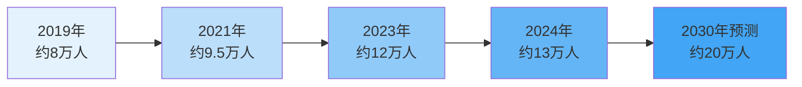
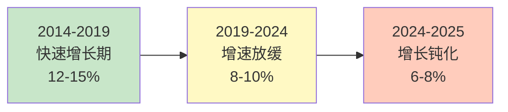
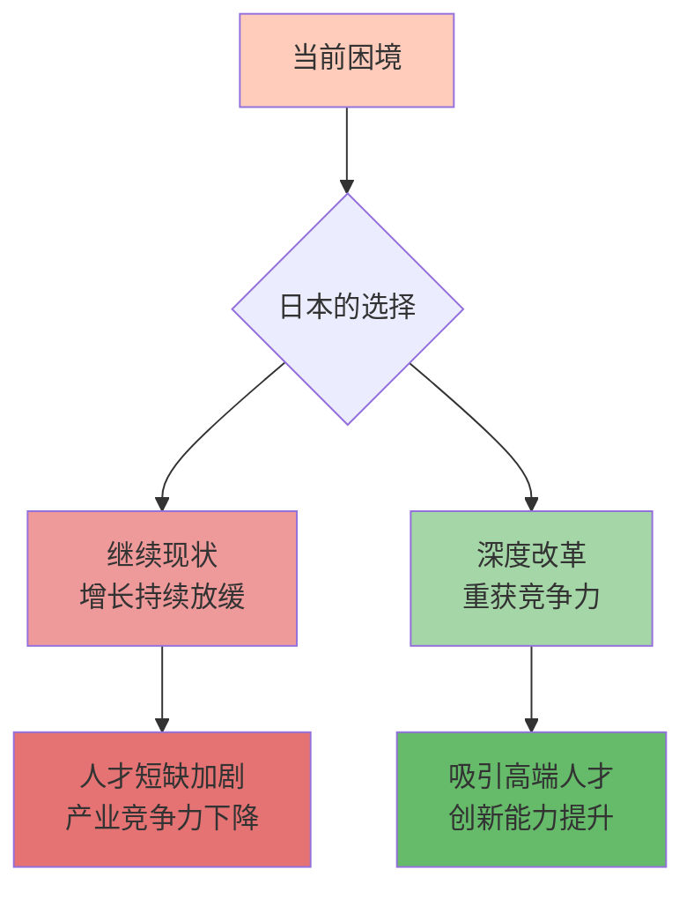
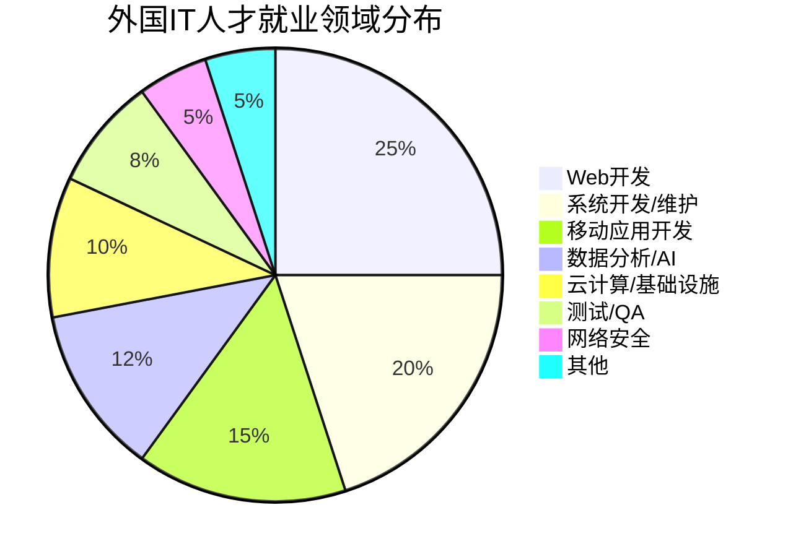
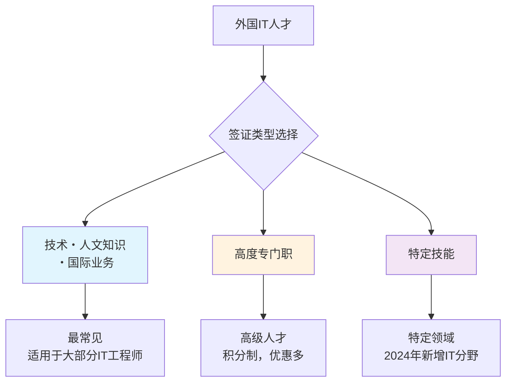
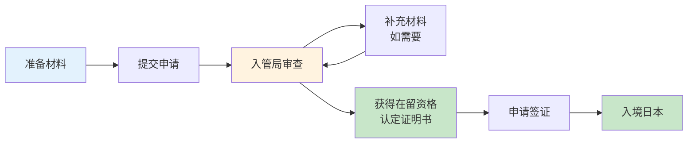
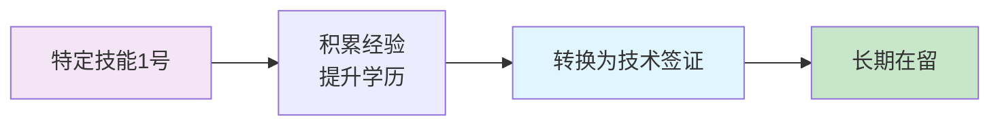
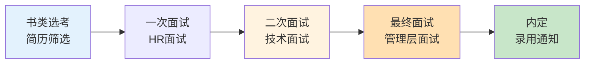

# 第四章：外国人在日本IT就业

## 章节概述

随着日本IT人才缺口的持续扩大，外国IT人才已成为日本IT行业不可或缺的重要力量。本章将全面介绍外国人在日本IT行业就业的现状、签证政策、就业渠道以及实用建议，为有意在日本IT行业发展的外国人才提供参考。

---

## 4.1 外国IT人才现状

### 4.1.1 在日外国IT工程师规模

根据日本厚生劳动省和出入国在留管理厅的统计数据：

**总体规模**
- 截至2024年，持有"技术・人文知识・国际业务"签证的外国人约**40万人**
- 其中从事IT相关工作的外国人约占**30-35%**，估计约**12-14万人**
- 外国IT人才占日本IT从业者总数的比例约**10-12%**

**增长趋势**
- 2019-2024年期间，外国IT人才数量年均增长率约**8-10%**
- 预计到2030年，外国IT人才将达到**20万人以上**
- 增长主要受日本IT人才缺口扩大和政府积极引进政策推动

### 4.1.2 主要来源国家与地区

外国IT人才的主要来源国家（按人数排序）：

| 排名 | 国家/地区 | 占比 | 特点 |
|:---:|---------|:---:|------|
| 1 | 🇨🇳 中国 | 35-40% | 最大来源国，技术水平高，日语能力相对较好 |
| 2 | 🇻🇳 越南 | 15-20% | 增长最快，年轻人才多，性价比高 |
| 3 | 🇮🇳 印度 | 10-15% | 技术实力强，英语流利，多在外资企业 |
| 4 | 🇰🇷 韩国 | 8-10% | 文化相近，日语学习快，适应能力强 |
| 5 | 🇵🇭 菲律宾 | 5-8% | 英语能力强，服务意识好 |
| 6 | 🇲🇲 缅甸 | 3-5% | 新兴来源国，增长迅速 |
| 7 | 其他 | 10-15% | 包括尼泊尔、孟加拉、印尼等 |

**地区分布特点**
- **亚洲国家占比超过95%**，其中东亚和东南亚为主
- 中国和越南合计占比超过50%
- 印度人才多集中在外资IT企业和高端技术岗位
- 越南人才增长最快，2019-2024年增长超过3倍

### 4.1.3 增长趋势与挑战分析

虽然外国IT人才在日本的总体规模持续增长，但近年来增长速度正在放缓，背后反映出日本IT行业在吸引和留住国际人才方面面临的深层次挑战。

**增长放缓的现象**

从数据来看，外国IT人才在日本的增长呈现以下特点：

| 时期 | 增长特征 | 年均增长率 |
|------|---------|:----------:|
| **2014-2019** | 快速增长期 | 12-15% |
| **2019-2024** | 增速放缓期 | 8-10% |
| **2024-2025** | 增长钝化期 | 预计6-8% |

**关键观察**：
- 十年间外国IT人才增长约3倍（从约4万增至12-14万）
- 但增速从两位数降至个位数
- 2024年后增长进一步钝化

**"拉力"因素减弱**

日本IT行业对外国人才的吸引力正在相对下降，主要体现在：

1. **薪酬竞争力不足**

| 国家/地区 | IT工程师平均年薪（美元） | 与日本差距 |
|----------|:----------------------:|:--------:|
| 🇺🇸 美国（硅谷） | $120,000-180,000 | +100-150% |
| 🇸🇬 新加坡 | $70,000-100,000 | +20-50% |
| 🇯🇵 日本 | $50,000-70,000 | 基准 |
| 🇨🇳 中国（一线城市） | $40,000-80,000 | -20%至+15% |
| 🇮🇳 印度（班加罗尔） | $20,000-50,000 | -60%至-30% |

**问题分析**：
- 日本薪资虽高于亚洲大部分国家，但远低于欧美
- 中国一线城市高端IT岗位薪资已接近或超过日本
- 考虑到生活成本和税收，实际收入优势进一步缩小
- 股权激励等长期激励机制不如欧美和中国互联网企业

2. **职业发展天花板**

⚠️ **外国IT人才面临的职业限制**：
- **语言壁垒**：管理岗位需要高水平日语（N1+商务日语）
- **文化隔阂**：难以融入核心决策层
- **晋升困难**：外国人晋升到高管的案例较少
- **技术路线受限**：核心技术岗位倾向于日本本土人才

**数据支撑**：
- 外国IT人才中，担任管理职位的比例不足**5%**
- 在日工作5年以上的外国IT人才中，约**30%**选择离开日本
- 主要流向：回国、转往欧美、转往新加坡等

3. **工作文化冲突**

| 文化特征 | 日本职场 | 外国人才期望 | 冲突程度 |
|---------|---------|------------|:-------:|
| **工作时间** | 长时间加班文化 | 工作生活平衡 | ⚠️⚠️⚠️ |
| **决策方式** | 集体决策，流程长 | 快速决策，高效执行 | ⚠️⚠️ |
| **沟通方式** | 间接、含蓄 | 直接、明确 | ⚠️⚠️ |
| **等级制度** | 严格的上下关系 | 相对扁平 | ⚠️⚠️ |
| **创新氛围** | 保守、风险规避 | 鼓励创新、容错 | ⚠️⚠️⚠️ |

**实际影响**：
- 约**40%**的外国IT人才表示难以适应日本职场文化
- 工作满意度低于预期
- 长期留日意愿下降

4. **语言壁垒持续存在**

尽管部分企业推进英语化，但现实是：
- **80%以上**的IT企业仍以日语为主要工作语言
- 技术文档、内部沟通多为日语
- 客户对接几乎必须使用日语
- 学习日语需要大量时间和精力投入

**全球人才竞争加剧**

日本不再是亚洲IT人才的首选目的地：

**竞争对手的优势**

| 国家/地区 | 对IT人才的吸引力 |
|----------|----------------|
| 🇸🇬 **新加坡** | 英语环境、高薪、税收优惠、国际化程度高 |
| 🇦🇺 **澳大利亚** | 移民政策友好、生活质量高、英语环境 |
| 🇨🇦 **加拿大** | 移民路径清晰、多元文化、科技产业发展快 |
| 🇩🇪 **德国** | 欧盟蓝卡、高薪、强大的工业基础 |
| 🇨🇳 **中国** | 本土市场巨大、创新活跃、薪资快速增长 |

**远程工作常态化的影响**

COVID-19后，远程工作成为常态，这对日本产生了负面影响：
- 外国人才可以为日本企业远程工作，无需来日本
- 全球企业可以远程雇佣日本的外国IT人才
- 地理位置的重要性下降
- 日本的"必须在日本工作"模式失去竞争力

**制度性阻力**

1. **签证制度的复杂性**
   - 申请流程繁琐，审查时间长
   - 材料要求严格，拒签率相对较高
   - 家属签证限制多
   - 永住权获取周期长（一般需10年）

2. **社会融合支持不足**
   - 外国人专门的支援服务有限
   - 住房、金融服务存在歧视
   - 子女教育选择受限
   - 社会保障体系对外国人不够友好

**深远影响分析**

这种增长放缓趋势将对日本IT行业产生深远影响：

⚠️ **负面影响**：

1. **人才短缺加剧**
   - 本土人才不足，外国人才增长放缓
   - 2030年79万人才缺口难以填补
   - 企业竞争力下降

2. **创新活力受限**
   - 缺乏多元化人才
   - 国际化视野不足
   - 新技术应用滞后

3. **产业竞争力下降**
   - 在AI、云计算等新兴领域落后
   - 难以吸引顶尖人才
   - 全球竞争中处于劣势

✅ **可能的转机**：

1. **政策调整信号**
   - 2024-2025年签证政策放宽
   - 高度人才优惠增加
   - 数字厅推动行政数字化

2. **企业战略转变**
   - 部分企业推进英语化
   - 远程工作制度完善
   - 薪资体系改革

3. **从"量变"到"质变"**
   - 从追求数量到注重质量
   - 吸引高端人才而非普通劳动力
   - 打造更具竞争力的工作环境

**未来展望**

**关键转折点**：
- 未来2-3年是关键期
- 需要在薪资、文化、制度等多方面进行系统性改革
- 否则将面临人才流失和竞争力下降的恶性循环

### 4.1.4 就业领域分布

外国IT人才在日本的主要就业领域：

**按技术领域分类**

**按企业类型分类**
- **SIer企业**：约40%（多从事系统开发和维护）
- **SES企业**：约25%（以派遣形式工作）
- **自社开发企业**：约20%（互联网企业、游戏公司等）
- **外资IT企业**：约10%（Google、Amazon、Microsoft等）
- **创业公司**：约5%（初创企业和自由职业）

### 4.1.5 薪资水平对比

外国IT人才与日本本土人才的薪资对比：

| 经验年限 | 日本本土人才 | 外国人才（日语N2+） | 外国人才（日语N3或英语） |
|:-------:|:-----------:|:------------------:|:----------------------:|
| 应届毕业生 | 300-350万日元 | 280-320万日元 | 250-300万日元 |
| 1-3年 | 400-500万日元 | 380-480万日元 | 350-450万日元 |
| 3-5年 | 500-650万日元 | 480-620万日元 | 450-580万日元 |
| 5-10年 | 650-900万日元 | 620-850万日元 | 580-800万日元 |
| 10年以上 | 900-1500万日元 | 850-1400万日元 | 800-1300万日元 |

**薪资影响因素**
1. **日语能力**：N2以上与本土人才差距较小，N3或仅英语会有10-15%差距
2. **技术能力**：高端技术人才（AI、云计算等）薪资可超过本土平均水平
3. **企业类型**：外资企业和自社开发企业薪资普遍高于SIer和SES
4. **工作地点**：东京地区薪资比地方高15-25%

---

## 4.2 签证类型与申请

### 4.2.1 主要签证类型概览

外国IT人才在日本工作主要涉及以下三种签证类型：

| 签证类型 | 适用对象 | 在留期间 | 家族带同 | 主要优势 |
|---------|---------|:-------:|:-------:|---------|
| **技术・人文知识・国际业务** | 一般IT工程师 | 5年/3年/1年 | 可 | 申请简单，适用范围广 |
| **高度专门职1号ロ** | 高级IT人才 | 5年 | 可 | 快速永住，优惠政策多 |
| **高度专门职2号** | 高度1号满3年 | 无期限 | 可 | 几乎等同永住权 |
| **特定技能1号** | 特定IT技能 | 1年（最长5年） | 不可 | 2024年新增IT分野 |

### 4.2.2 技术・人文知识・国际业务签证

这是外国IT人才最常申请的签证类型，适用于大部分IT工程师。

**申请条件**

基本要求（满足其一即可）：
1. **学历要求**
   - 大学本科以上学历（学士学位）
   - 或日本专门学校毕业（专门士学位）
   - 学历需与工作内容相关（理工科、计算机相关专业）

2. **经验要求**
   - 如无相关学历，需有**10年以上**相关工作经验
   - 部分情况下，专门学校学习年限可计入工作经验

3. **工作内容要求**
   - 从事需要理工科知识的技术工作
   - 工作内容需与学历或经验相符
   - 不能从事单纯体力劳动

4. **薪资要求**
   - 薪资水平需与日本人同等或以上
   - 一般要求年收入**300万日元以上**（应届生）
   - 有经验者建议**400万日元以上**

**申请材料清单**

| 材料类别 | 具体文件 |
|---------|---------|
| **个人材料** | 护照、照片、在留资格认定证明书申请书 |
| **学历证明** | 毕业证书、学位证书、成绩单（需认证） |
| **工作证明** | 雇佣契约书、工作内容说明书、公司营业执照 |
| **财务证明** | 公司财务报表、纳税证明 |
| **其他** | 简历、职务经历书 |

**审批流程与时间**

- **审查时间**：1-3个月（标准情况）
- **签证有效期**：首次通常为1年或3年，续签可获得5年
- **续签条件**：持续就业、无违法记录、按时纳税

**常见拒签原因**

⚠️ **需要特别注意的问题**：
1. 学历与工作内容不符（如文科背景申请IT岗位）
2. 薪资过低（低于日本人平均水平）
3. 公司经营状况不佳（财务报表有问题）
4. 工作内容描述不清晰或过于简单
5. 材料造假或信息不一致

### 4.2.3 高度专门职签证（积分制度）

高度专门职签证是日本为吸引高级人才设立的优惠签证制度，采用积分制评估。

**积分制度详解**

申请人需在"学历"、"职历"、"年收入"等项目中累计达到**70分以上**（80分以上有额外优惠）。

**积分计算表（IT人才相关部分）**

| 评分项目 | 条件 | 分数 |
|---------|------|:---:|
| **学历** | 博士学位 | 30 |
| | 硕士学位 | 20 |
| | 学士学位 | 10 |
| **职业经历** | 10年以上 | 25 |
| | 7年以上 | 15 |
| | 5年以上 | 10 |
| | 3年以上 | 5 |
| **年收入** | 1000万日元以上 | 40 |
| | 900万日元以上 | 35 |
| | 800万日元以上 | 30 |
| | 700万日元以上 | 25 |
| | 600万日元以上 | 20 |
| | 500万日元以上 | 15 |
| | 400万日元以上 | 10 |
| **年龄** | 29岁以下 | 15 |
| | 30-34岁 | 10 |
| | 35-39岁 | 5 |
| **日语能力** | N1 | 15 |
| | N2 | 10 |
| **日本学历** | 日本大学毕业 | 10 |
| **研究成果** | 发明专利、论文等 | 15-25 |
| **特别加分** | 日本政府认定的创新企业 | 10 |
| | IT相关国家资格 | 5 |

**积分计算示例**

**案例1：应届硕士毕业生**
- 硕士学位：20分
- 年龄27岁：15分
- 年收入450万日元：10分
- 日语N2：10分
- 日本大学毕业：10分
- **总分：65分**（未达标）

**案例2：有经验的工程师**
- 学士学位：10分
- 5年工作经验：10分
- 年龄32岁：10分
- 年收入650万日元：20分
- 日语N1：15分
- 技术专利1项：15分
- **总分：80分**（达标，享受额外优惠）

**案例3：高级工程师**
- 硕士学位：20分
- 8年工作经验：15分
- 年龄36岁：5分
- 年收入850万日元：30分
- 日语N2：10分
- **总分：80分**（达标）

**高度专门职优惠政策**

✅ **70分以上的优惠**：
1. **快速永住**：在日本居住3年即可申请永住权（普通需10年）
2. **配偶工作**：配偶可在日本自由工作（不受签证限制）
3. **父母带同**：可带父母来日本（需满足一定条件）
4. **家政人员**：可雇佣外国家政人员
5. **优先审查**：签证申请优先处理，约10天出结果
6. **多次入境**：5年多次往返签证

✅ **80分以上的额外优惠**：
1. **超快速永住**：在日本居住**1年**即可申请永住权
2. 其他优惠同70分

**高度专门职2号**

持有高度专门职1号满3年后，可申请高度专门职2号：
- **在留期间无限制**（几乎等同永住权）
- 可从事几乎任何合法工作
- 保留高度1号的所有优惠
- 比永住权更灵活（永住权有居住时间要求）

### 4.2.4 特定技能签证（2024年新增IT分野）

2024年，日本政府将IT领域纳入"特定技能"签证范围，为中级技能人才提供新的就业途径。

**特定技能1号（IT分野）**

**适用对象**：
- 具有特定IT技能但不满足"技术・人文知识・国际业务"学历要求的人才
- 通过日本认定的IT技能考试
- 或在日本完成IT相关培训课程

**申请条件**：
1. 通过指定的IT技能考试（如IPA的基本情報技術者試験等）
2. 日语能力达到N4以上
3. 有雇佣企业的工作offer
4. 年收入300万日元以上

**限制条件**：
- 在留期间最长5年（每次续签1年）
- 不能带家属（配偶和子女不能随同）
- 5年后需转换为其他签证类型或离开日本

**转换路径**：

**注意事项**：
- 这是2024年新增的签证类型，实际运用案例还较少
- 主要针对无法满足学历要求但有实际技能的人才
- 建议优先考虑"技术・人文知识・国际业务"签证

### 4.2.5 2025年签证政策变化

日本政府在2024-2025年对外国人才签证政策进行了多项调整：

**主要变化**

1. **高度专门职积分调整**（2024年4月实施）
   - IT相关国家资格加分从5分提高到**10分**
   - 创新企业工作加分从5分提高到**10分**
   - 年收入门槛略有下调（考虑通货膨胀）

2. **审查流程优化**（2024年7月实施）
   - 引入在线申请系统，缩短审查时间
   - 标准审查时间从3个月缩短到**1-2个月**
   - 高度人才优先审查时间缩短到**5-7天**

3. **特定技能扩大**（2024年10月实施）
   - IT领域正式纳入特定技能范围
   - 新增"特定技能2号"（可带家属，无期限限制）
   - 预计2025年将有更多IT细分领域纳入

4. **家族滞在政策放宽**（2025年预定）
   - 配偶工作限制进一步放宽
   - 子女教育支援政策加强
   - 父母带同条件简化

5. **永住申请条件调整**（2025年讨论中）
   - 考虑将一般永住申请年限从10年缩短到**7年**
   - 高度人才永住条件可能进一步放宽
   - 增加对社会贡献的评估（志愿活动、纳税额等）

**对IT人才的影响**

✅ **积极影响**：
- 申请门槛略有降低，更多人才可达到高度人才标准
- 审查时间缩短，求职和入职更顺畅
- 家族政策放宽，更适合长期发展

⚠️ **需要注意**：
- 政策仍在调整中，具体实施细节可能变化
- 建议关注出入国在留管理厅官方网站最新信息
- 申请前咨询专业行政书士或律师

---

## 4.3 就业渠道

外国人在日本IT行业求职有多种渠道，选择合适的渠道可以大大提高求职成功率。

### 4.3.1 在线求职平台

**综合型求职网站**

| 网站名称 | 特点 | 外国人友好度 | 推荐指数 |
|---------|------|:----------:|:-------:|
| **Indeed Japan** | 职位最多，覆盖面广 | ⭐⭐⭐⭐ | ⭐⭐⭐⭐⭐ |
| **リクナビNEXT** | 日本最大求职网站 | ⭐⭐⭐ | ⭐⭐⭐⭐ |
| **doda** | 职位质量高，有猎头服务 | ⭐⭐⭐ | ⭐⭐⭐⭐ |
| **マイナビ転職** | 适合年轻人和应届生 | ⭐⭐⭐ | ⭐⭐⭐⭐ |

**IT专门求职网站**

| 网站名称 | 特点 | 外国人友好度 | 推荐指数 |
|---------|------|:----------:|:-------:|
| **Green** | IT/Web专门，创业公司多 | ⭐⭐⭐⭐ | ⭐⭐⭐⭐⭐ |
| **Wantedly** | 强调企业文化，适合年轻人 | ⭐⭐⭐⭐ | ⭐⭐⭐⭐⭐ |
| **Paiza** | 通过编程测试求职 | ⭐⭐⭐⭐⭐ | ⭐⭐⭐⭐ |
| **Findy** | AI匹配，技术人才专门 | ⭐⭐⭐⭐ | ⭐⭐⭐⭐ |
| **レバテックキャリア** | IT专门，猎头服务 | ⭐⭐⭐ | ⭐⭐⭐⭐ |

**外国人专门求职网站**

| 网站名称 | 特点 | 语言支持 | 推荐指数 |
|---------|------|:-------:|:-------:|
| **GaijinPot Jobs** | 外国人专门，英语职位多 | 英语 | ⭐⭐⭐⭐ |
| **Jobs in Japan** | 外资企业多 | 英语 | ⭐⭐⭐⭐ |
| **Daijob.com** | 双语职位，外资企业 | 英语/日语 | ⭐⭐⭐⭐⭐ |
| **CareerCross** | 双语人才专门 | 英语/日语 | ⭐⭐⭐⭐ |
| **TokyoDev** | IT专门，英语环境 | 英语 | ⭐⭐⭐⭐ |

**使用技巧**

✅ **提高求职成功率的方法**：
1. **同时使用多个平台**：不同平台职位有差异，建议注册3-5个
2. **完善个人资料**：详细填写技能、项目经验、语言能力
3. **设置职位提醒**：及时获取新职位信息
4. **主动申请**：不要只等企业联系，主动投递简历
5. **定期更新简历**：保持简历活跃度，增加曝光率

### 4.3.2 猎头公司（人材紹介会社）

猎头公司可以提供更专业的求职支持，特别适合有一定经验的工程师。

**外国人专门猎头公司**

| 公司名称 | 特点 | 服务语言 |
|---------|------|:-------:|
| **Robert Walters Japan** | 外资企业职位多，高端职位 | 英语/日语 |
| **Michael Page Japan** | 国际猎头，专业度高 | 英语/日语 |
| **Hays Japan** | 欧美企业职位多 | 英语/日语 |
| **JAC Recruitment** | 日本本土猎头，双语职位 | 英语/日语/中文 |
| **RGF HR Agent** | Recruit集团，外国人支援 | 多语言 |

**IT专门猎头公司**

| 公司名称 | 特点 | 推荐对象 |
|---------|------|---------|
| **レバテック** | IT专门，职位质量高 | 有经验的工程师 |
| **ギークリー** | IT/Web/游戏专门 | IT全领域 |
| **マイナビIT AGENT** | 大型猎头，职位多 | 各层级工程师 |
| **type転職エージェント** | IT专门，关东地区强 | 东京地区求职者 |

**猎头服务的优势**

✅ **使用猎头的好处**：
1. **免费服务**：求职者无需支付费用（企业支付）
2. **职位匹配**：根据个人情况推荐合适职位
3. **简历优化**：帮助修改简历，提高通过率
4. **面试指导**：提供面试技巧和模拟面试
5. **薪资谈判**：帮助争取更好的待遇
6. **签证支援**：协助办理签证手续

⚠️ **注意事项**：
- 猎头公司主要服务有经验的工程师（1年以上经验）
- 应届生建议使用求职网站或参加校园招聘
- 可以同时与多家猎头公司合作
- 注意保护个人信息，选择正规公司

### 4.3.3 直接应聘

直接向目标企业投递简历也是有效的求职方式。

**适合直接应聘的企业类型**

1. **外资IT企业**
   - Google、Amazon、Microsoft、Apple等
   - 通常有英语招聘流程
   - 官网有专门的Career页面
   - 技术面试为主，文化适应要求相对较低

2. **日本互联网大厂**
   - 乐天（Rakuten）、LINE、Yahoo Japan、Mercari等
   - 部分职位接受英语应聘
   - 技术实力要求高
   - 薪资待遇好

3. **创业公司**
   - 通过Wantedly等平台了解企业
   - 可以直接联系创始人或HR
   - 流程相对灵活
   - 有机会获得股权激励

**直接应聘的步骤**

**提高成功率的技巧**

✅ **建议**：
1. **研究企业**：了解企业文化、技术栈、产品
2. **定制简历**：针对不同企业调整简历内容
3. **准备作品集**：GitHub项目、个人网站、技术博客
4. **LinkedIn优化**：完善LinkedIn资料，增加曝光
5. **内推机会**：通过LinkedIn联系在职员工寻求内推

### 4.3.4 校园招聘（新卒採用）

对于在日本留学的外国学生，校园招聘是进入日本IT企业的重要途径。

**日本校园招聘特点**

日本的校园招聘（新卒採用）有其独特的时间表和流程：

**招聘时间表**

| 时期 | 活动 | 说明 |
|------|------|------|
| **大三3月** | 信息解禁 | 企业开始发布招聘信息 |
| **大三3-6月** | 企业说明会 | 参加各企业的说明会 |
| **大三6-8月** | 面试开始 | 大企业开始面试 |
| **大三10月** | 内定发放 | 开始发放内定（录用通知） |
| **大四4月** | 正式入职 | 毕业后4月入职 |

**主要招聘渠道**

1. **大学就职支援中心**
   - 每个大学都有就职支援部门
   - 提供简历指导、模拟面试
   - 组织企业说明会

2. **新卒专门求职网站**
   - **リクナビ**：最大的新卒求职网站
   - **マイナビ**：第二大新卒求职网站
   - **キャリタス就活**：也很受欢迎
   - **外資就活ドットコム**：外资企业专门

3. **企业直接招聘**
   - 大企业会到大学举办说明会
   - 可以直接通过企业官网申请
   - 参加企业举办的实习（インターン）

**外国留学生的优势与挑战**

✅ **优势**：
- 多语言能力（特别是英语和母语）
- 国际化视野
- 部分企业有外国人专门招聘名额
- 技术能力往往较强

⚠️ **挑战**：
- 日语能力要求高（一般需N2以上，N1更佳）
- 需要理解日本独特的就职活动文化
- 签证问题（需要企业支持）
- 竞争激烈

**成功策略**

✅ **建议**：
1. **提前准备**：大三开始就要准备，不要等到大四
2. **参加实习**：暑期实习是获得内定的重要途径
3. **提升日语**：至少达到N2，N1更有竞争力
4. **积极参加说明会**：多参加企业说明会，了解企业文化
5. **准备自我PR**：日本面试非常重视自我介绍和志望动机
6. **利用大学资源**：充分利用大学的就职支援服务

---

## 4.4 就业建议

基于外国IT人才在日本就业的实际情况，以下是一些实用建议。

### 4.4.1 日语能力要求

日语能力是外国人在日本IT行业就业的重要因素。

**不同职位的日语要求**

| 职位类型 | 日语要求 | 说明 |
|---------|:-------:|------|
| **外资IT企业** | N3或英语流利 | 工作语言多为英语，日语要求相对较低 |
| **日本大型SIer** | N2以上 | 需要与日本客户沟通，日语要求高 |
| **互联网企业** | N2-N1 | 根据职位不同，技术岗N2可能够用 |
| **创业公司** | N3-N2 | 灵活度较高，看具体公司 |
| **SES派遣** | N2以上 | 需要在客户现场工作，沟通要求高 |

**JLPT等级与实际能力对照**

| 等级 | 能力描述 | 工作场景适用性 |
|:---:|---------|---------------|
| **N1** | 能理解各种场合的日语 | 可以参与复杂的技术讨论和商务谈判 |
| **N2** | 能理解日常场景的日语 | 可以进行基本的工作沟通，阅读技术文档 |
| **N3** | 能理解日常生活的日语 | 基本沟通可以，但工作场景可能有困难 |
| **N4-N5** | 基础日语 | 工作场景基本无法使用 |

**日语学习建议**

✅ **提升日语能力的方法**：

1. **系统学习**
   - 参加日语培训班或在线课程
   - 目标：至少达到N2水平
   - 推荐资源：日本語能力試験公式問題集、みんなの日本語

2. **技术日语**
   - 学习IT专业术语的日语表达
   - 阅读日语技术文档和博客
   - 参加日语技术交流会

3. **实践练习**
   - 与日本人进行语言交换
   - 参加日本的技术社区活动
   - 观看日语技术视频和讲座

4. **商务日语**
   - 学习敬语和商务礼仪
   - 练习邮件写作和电话沟通
   - 了解日本职场文化

**英语能力的价值**

虽然日语很重要，但英语能力同样有价值：
- 外资IT企业优先考虑英语能力
- 技术文档和国际会议多使用英语
- 英语+日语的双语人才更有竞争力
- 部分日本企业也在推进英语化

### 4.4.2 学历与技能要求

**学历要求**

日本IT行业对学历的要求：

| 学历 | 适用签证 | 就业机会 | 薪资水平 |
|------|---------|:-------:|:-------:|
| **博士** | 技术签证/高度人才 | 研发岗位、高级职位 | 高 |
| **硕士** | 技术签证/高度人才 | 各类技术岗位 | 中高 |
| **本科** | 技术签证 | 大部分技术岗位 | 中 |
| **专门学校** | 技术签证 | 技术岗位（日本学历） | 中 |
| **无学历** | 特定技能（需10年经验） | 有限 | 较低 |

**技能要求**

**基础技能**（必备）：
- 至少掌握1-2门编程语言
- 理解基本的算法和数据结构
- 熟悉版本控制工具（Git）
- 基本的数据库知识

**进阶技能**（加分项）：
- 云计算平台（AWS、Azure、GCP）
- 前端框架（React、Vue、Angular）
- 后端框架（Spring、Django、Node.js）
- DevOps工具（Docker、Kubernetes）
- 移动开发（iOS、Android、Flutter）

**热门技能**（高薪）：
- AI/机器学习（Python、TensorFlow、PyTorch）
- 数据分析（SQL、Python、R）
- 网络安全
- 区块链技术
- 云架构设计

**技能提升建议**

✅ **如何提升技能**：
1. **在线学习平台**
   - Udemy、Coursera、Pluralsight
   - 日本的Progate、ドットインストール

2. **实践项目**
   - 在GitHub上维护个人项目
   - 参与开源项目
   - 做一些实际的应用或网站

3. **技术认证**
   - AWS认证、Azure认证
   - 日本的IPA资格（基本情報技術者、応用情報技術者）
   - Oracle、Cisco等厂商认证

4. **持续学习**
   - 关注技术博客和新闻
   - 参加技术社区和Meetup
   - 阅读技术书籍

### 4.4.3 面试准备

日本IT企业的面试有其独特的文化和流程。

**面试流程**

典型的面试流程（3-4轮）：

**各轮面试重点**

1. **书类选考（简历筛选）**
   - 学历、工作经验
   - 技能匹配度
   - 日语能力

2. **一次面试（HR面试）**
   - 自我介绍（自己紹介）
   - 志望动机（志望動機）
   - 职业规划
   - 日语沟通能力

3. **二次面试（技术面试）**
   - 技术能力测试
   - 编程题目
   - 项目经验讨论
   - 技术深度考察

4. **最终面试（管理层面试）**
   - 文化适应性
   - 长期发展意愿
   - 薪资谈判
   - 入职时间确认

**日本面试的特殊要求**

⚠️ **需要特别注意**：

1. **自我介绍（自己紹介）**
   - 准备1分钟和3分钟两个版本
   - 包括：姓名、学历、工作经验、技能、志望动机
   - 用日语流利表达

2. **志望动机（志望動機）**
   - 为什么选择这家公司？
   - 为什么选择这个职位？
   - 你能为公司带来什么？
   - 需要深入研究公司，给出具体理由

3. **逆质问（反向提问）**
   - 面试最后会问"你有什么问题吗？"
   - 准备3-5个有深度的问题
   - 不要问官网上能查到的基本信息
   - 不要一开始就问薪资和休假

4. **礼仪和着装**
   - 穿正装（スーツ）
   - 提前10-15分钟到达
   - 鞠躬礼仪（入室、退室时）
   - 名片交换礼仪

**技术面试准备**

✅ **技术面试常见题型**：

1. **算法题**
   - 数据结构（数组、链表、树、图）
   - 排序和搜索算法
   - 动态规划
   - 推荐练习平台：LeetCode、AtCoder

2. **系统设计**
   - 设计一个Web应用
   - 数据库设计
   - API设计
   - 性能优化

3. **项目经验**
   - 详细介绍过去的项目
   - 遇到的技术难题和解决方案
   - 团队协作经验
   - 使用STAR法则（Situation、Task、Action、Result）

4. **技术知识**
   - 编程语言特性
   - 框架和工具使用
   - 最佳实践
   - 最新技术趋势

### 4.4.4 文化适应与职场建议

成功在日本IT行业工作，不仅需要技术能力，还需要理解和适应日本的职场文化。

**日本职场文化特点**

1. **等级制度（上下関係）**
   - 尊重前辈和上司
   - 使用敬语（敬語）
   - 注意职场礼仪

2. **团队协作（チームワーク）**
   - 强调团队和谐
   - 避免过于突出个人
   - 重视集体决策（稟議制度）

3. **加班文化**
   - 虽然在改善，但加班仍较普遍
   - 不要比上司先下班（传统观念）
   - IT行业相对灵活，特别是外资和创业公司

4. **报告・联络・相谈（報連相）**
   - 及时向上司报告工作进展
   - 重要事项要联络相关人员
   - 遇到问题要主动商量

5. **饮み会（聚餐文化）**
   - 公司聚餐是重要的社交活动
   - 有助于建立人际关系
   - 但参与度因公司而异

**文化适应建议**

✅ **如何更好地适应**：

1. **学习日本礼仪**
   - 鞠躬的角度和时机
   - 名片交换方式
   - 邮件和电话礼仪
   - 会议室座位顺序

2. **理解沟通方式**
   - 日本人倾向间接表达
   - "検討します"（考虑一下）可能是委婉拒绝
   - 注意读懂"空气"（察言观色）
   - 避免直接冲突

3. **工作态度**
   - 准时上班（提前5-10分钟）
   - 认真对待每个任务
   - 主动承担责任
   - 展现学习意愿

4. **建立人际关系**
   - 主动与同事交流
   - 参加公司活动
   - 午餐时间是社交机会
   - 尊重但不必完全放弃自己的文化

**常见文化冲突与应对**

| 文化冲突 | 原因 | 应对方法 |
|---------|------|---------|
| **加班压力** | 日本加班文化 | 选择工作生活平衡好的公司；外资企业相对灵活 |
| **决策缓慢** | 集体决策制度 | 理解流程，提前准备，耐心等待 |
| **沟通间接** | 文化差异 | 学习日本式沟通，注意言外之意 |
| **等级森严** | 传统职场文化 | 尊重等级，但IT行业相对扁平 |
| **语言障碍** | 日语能力不足 | 持续学习，多用日语沟通 |

**职业发展建议**

✅ **长期发展策略**：

1. **技术路线 vs 管理路线**
   - **技术专家路线**：深耕技术，成为领域专家
   - **管理路线**：需要更强的日语和沟通能力
   - 外国人更适合技术路线或在外资企业发展管理路线

2. **跳槽策略**
   - 日本传统上不鼓励频繁跳槽
   - 但IT行业相对开放
   - 建议在一家公司至少工作2-3年
   - 跳槽可以显著提升薪资（20-30%）

3. **永住权规划**
   - 一般需要在日本居住10年
   - 高度人才可缩短到1-3年
   - 永住权后职业选择更自由
   - 可以自由换工作，不受签证限制

4. **持续学习**
   - IT技术更新快，需要持续学习
   - 参加技术社区和会议
   - 考取相关认证
   - 关注行业趋势

**薪资谈判技巧**

💰 **如何争取更好的待遇**：

1. **了解市场行情**
   - 通过求职网站了解同类职位薪资
   - 咨询猎头公司
   - 参考同行经验

2. **谈判时机**
   - 最好在获得offer后谈判
   - 或在年度评估时提出
   - 跳槽时是最好的涨薪机会

3. **谈判策略**
   - 准备充分的理由（技能、经验、市场行情）
   - 不要只谈薪资，也可谈其他福利
   - 保持礼貌和专业
   - 如果通过猎头，让猎头帮忙谈判

4. **其他福利**
   - 住房补贴（住宅手当）
   - 交通费（通勤手当）
   - 远程办公选项
   - 签证支持
   - 搬家费用

**生活建议**

🏠 **在日本生活的实用建议**：

1. **住房**
   - 东京房租较高，可考虑郊区
   - 公司附近或沿线找房
   - 使用房屋中介（不動産）
   - 注意初期费用（礼金、敷金、仲介手数料）

2. **交通**
   - 公共交通发达，不一定需要车
   - 购买通勤定期券（定期券）
   - 自行车是便利的交通工具

3. **医疗保险**
   - 加入国民健康保险或社会保险
   - 医疗费用自付30%
   - 选择方便的医院和诊所

4. **银行账户**
   - 入职后尽快开设银行账户
   - 推荐：三菱UFJ、三井住友、みずほ
   - 部分银行有英语服务

5. **手机通信**
   - 三大运营商：docomo、au、SoftBank
   - 格安SIM更便宜：楽天モバイル、UQ mobile
   - 需要在留卡和银行账户

**心理健康**

🧠 **保持身心健康**：

1. **应对压力**
   - 工作压力大时及时寻求帮助
   - 利用公司的EAP（员工援助计划）
   - 保持工作生活平衡

2. **社交网络**
   - 加入外国人社区
   - 参加技术Meetup
   - 保持与家人朋友的联系
   - 培养兴趣爱好

3. **语言学习**
   - 持续提升日语能力
   - 参加语言交换活动
   - 不要因语言障碍而自卑

4. **文化冲突**
   - 理解文化差异是正常的
   - 保持开放心态
   - 寻找平衡点
   - 必要时寻求专业咨询

---

## 本章总结

外国人在日本IT行业就业既有机会也有挑战。随着日本IT人才缺口的扩大和政府政策的支持，外国IT人才的需求持续增长。

**关键要点回顾**：

✅ **机会**：
- 日本IT人才缺口大，外国人才需求旺盛
- 签证政策逐步放宽，高度人才有优惠
- 薪资水平合理，生活质量高
- 多种就业渠道，求职相对容易

⚠️ **挑战**：
- 日语能力是重要门槛（建议N2以上）
- 需要适应日本职场文化
- 签证申请需要满足一定条件
- 职业发展可能受语言限制

**成功要素**：
1. **扎实的技术能力**
2. **足够的日语水平**（至少N2）
3. **文化适应能力**
4. **持续学习的态度**
5. **良好的沟通能力**

**行动建议**：

对于**准备来日本的IT人才**：
- 提前学习日语，至少达到N2
- 提升技术能力，准备作品集
- 了解日本职场文化
- 研究目标企业和行业
- 准备充分的求职材料

对于**已在日本的IT人才**：
- 持续提升日语和技术能力
- 积极融入职场文化
- 建立人际网络
- 规划长期职业发展
- 考虑永住权申请

---

**相关资源**

📚 **官方网站**：
- 出入国在留管理厅：https://www.moj.go.jp/isa/
- 日本情报处理推进机构（IPA）：https://www.ipa.go.jp/
- 厚生劳动省：https://www.mhlw.go.jp/

🔍 **求职网站**：
- Indeed Japan：https://jp.indeed.com/
- Green：https://www.green-japan.com/
- Wantedly：https://www.wantedly.com/
- Daijob.com：https://www.daijob.com/

📖 **学习资源**：
- 日本語能力試験：https://www.jlpt.jp/
- Progate：https://prog-8.com/
- AtCoder：https://atcoder.jp/

---

*本章完成于2024年12月*

**下一章预告**：第五章将探讨日本IT行业的机会与热门领域，包括AI、云计算、数据分析等新兴技术领域的发展机会。
