# 第六章：数字化转型（DX）趋势

## 章节概述

数字化转型（Digital Transformation，简称DX）已成为日本IT行业最重要的关键词之一。面对全球数字化浪潮和国内经济结构转型的双重压力，日本政府和企业界都将DX视为提升竞争力、实现可持续发展的核心战略。然而，日本在推进DX的过程中也面临着独特的挑战，其中最引人关注的就是"2025数字悬崖"问题。

本章将深入分析日本DX的现状与趋势，探讨企业面临的挑战与机遇，以及政府在推动数字化进程中的政策措施。

---

## 6.1 "2025数字悬崖"问题

### 6.1.1 什么是"2025数字悬崖"

"2025数字悬崖"（2025年の崖）是日本经济产业省在2018年发布的《DX报告》中提出的重要概念，警示日本企业如果不能在2025年之前完成老旧IT系统的现代化改造，将面临严重的经济损失和竞争力下降。

#### 问题背景

**经济产业省DX报告核心警告：**

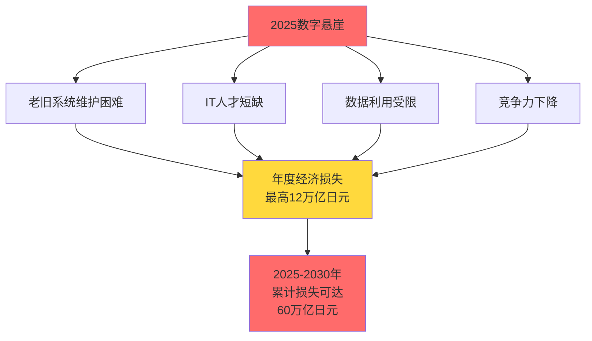

**关键数据统计：**

| 指标 | 数据 | 说明 |
|------|------|------|
| **老旧系统占比** | 约60% | 日本企业核心系统中老旧系统的比例 |
| **系统运行年限** | 平均21年 | 大型企业核心系统的平均使用年限 |
| **维护成本占比** | 80% | IT预算中用于维护老旧系统的比例 |
| **预计经济损失** | 12万亿日元/年 | 2025年后若不改善的年度损失 |
| **累计损失预测** | 60万亿日元 | 2025-2030年期间的累计损失 |

#### 老旧系统（レガシーシステム）现状

**日本企业老旧系统的典型特征：**

1. **技术栈过时**
   - 大量使用COBOL、Fortran等古老编程语言
   - 基于大型机（メインフレーム）架构
   - 缺乏API接口，难以与现代系统集成

2. **文档缺失**
   - 系统开发时期的技术文档不完整
   - 多次外包导致知识流失
   - 只有少数老员工了解系统全貌

3. **维护困难**
   - 懂得老旧技术的工程师退休
   - 年轻工程师不愿学习过时技术
   - 修改成本高、风险大

4. **业务束缚**
   - 系统与业务流程深度耦合
   - 难以适应业务创新需求
   - 成为数字化转型的最大障碍

**行业分布情况：**

| 行业 | 老旧系统占比 | 主要问题 |
|------|:---:|----------|
| **金融业** | 75% | 大型机系统、COBOL代码、监管合规 |
| **制造业** | 65% | 生产管理系统、设备控制系统 |
| **零售业** | 55% | POS系统、库存管理系统 |
| **物流业** | 60% | 配送管理系统、仓储系统 |
| **公共部门** | 70% | 行政系统、数据孤岛严重 |

---

### 6.1.2 老旧系统更新紧迫性

#### SAP ERP支持终止问题

**SAP ECC 6.0支持终止时间线：**

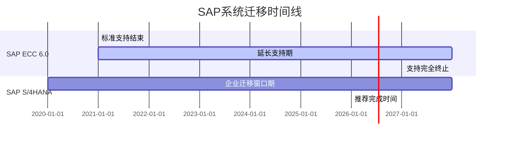

**影响范围：**

- **使用企业数量**：日本约有2,500家大中型企业使用SAP ECC
- **迁移成本**：单个企业平均需要5-20亿日元
- **迁移周期**：通常需要2-3年时间
- **人才需求**：SAP S/4HANA专家严重短缺

**企业面临的选择：**

| 方案 | 优势 | 劣势 | 适用企业 |
|------|------|------|----------|
| **迁移到S/4HANA** | 最新功能、长期支持 | 成本高、周期长 | 大型企业 |
| **购买延长支持** | 延缓压力 | 费用昂贵、治标不治本 | 过渡期选择 |
| **更换其他ERP** | 摆脱SAP依赖 | 业务中断风险大 | 中小企业 |
| **自主开发** | 定制化强 | 开发风险高、维护负担重 | 特殊需求企业 |

#### COBOL系统维护困境

**COBOL系统现状数据：**

| 指标 | 数据 | 备注 |
|------|------|------|
| **COBOL代码总量** | 约2,200亿行 | 日本企业现存COBOL代码 |
| **金融系统占比** | 60% | 银行、保险核心系统 |
| **COBOL工程师数量** | 约3万人 | 且平均年龄55岁以上 |
| **年退休人数** | 约3,000人 | 每年退休的COBOL工程师 |
| **新增学习者** | 不足500人/年 | 年轻工程师学习COBOL的人数 |

**典型案例：某大型银行的困境**

> **背景**：某都市银行核心系统使用COBOL开发，代码量超过1,000万行，运行超过30年。
> 
> **问题**：
> - 维护团队平均年龄58岁，5年内将有70%退休
> - 系统文档不完整，很多业务逻辑只存在于老员工脑中
> - 每次小修改都需要数月测试，成本高昂
> - 无法支持移动银行、API开放等新业务
> 
> **应对**：
> - 启动10年现代化计划，预算500亿日元
> - 采用"绞杀者模式"（Strangler Pattern）逐步替换
> - 与SIer合作培养新一代维护团队
> - 部分功能迁移到云原生架构

#### 技术债务累积

**技术债务的多维度影响：**

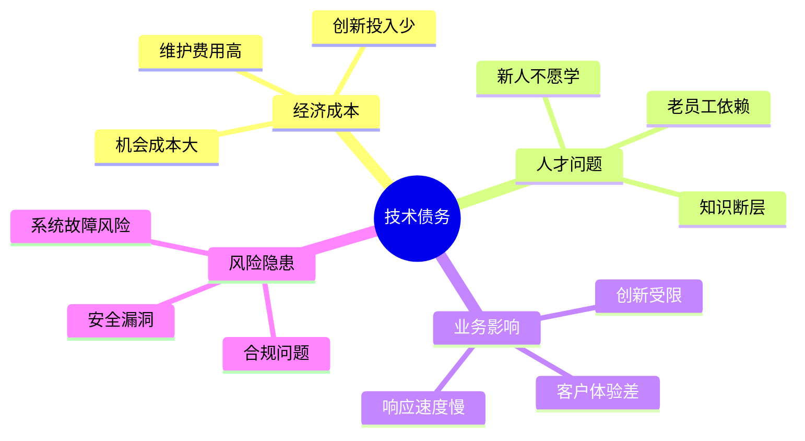

**技术债务量化评估：**

| 债务类型 | 占IT预算比例 | 年度成本（万亿日元） | 影响 |
|----------|:---:|:---:|------|
| **维护老旧系统** | 40-50% | 4-5 | 挤占创新预算 |
| **数据孤岛整合** | 15-20% | 1.5-2 | 阻碍数据利用 |
| **安全漏洞修复** | 10-15% | 1-1.5 | 增加风险敞口 |
| **技术培训** | 5-10% | 0.5-1 | 人才能力滞后 |
| **合规性改造** | 10-15% | 1-1.5 | 监管压力增大 |
| **总计** | **80-110%** | **8-11** | 超出正常预算 |

**企业技术债务自评清单：**

✅ **高风险信号（需立即行动）：**
- [ ] 核心系统运行超过20年
- [ ] 维护团队平均年龄超过50岁
- [ ] 系统文档缺失或严重过时
- [ ] 无法支持移动端/API接口
- [ ] 年度故障次数超过10次
- [ ] 数据无法实时分析利用

⚠️ **中风险信号（需制定计划）：**
- [ ] 系统运行10-20年
- [ ] 技术栈5年以上未更新
- [ ] 新功能开发周期超过6个月
- [ ] IT预算70%用于维护
- [ ] 依赖特定供应商或个人

---

### 6.1.3 企业应对措施

面对"2025数字悬崖"的严峻挑战，日本企业正在采取多种策略进行系统现代化改造。成功的关键在于制定清晰的路线图、合理分配资源，以及在业务连续性与创新之间找到平衡。

#### 系统现代化路径

**主流现代化策略对比：**

| 策略 | 描述 | 优势 | 劣势 | 适用场景 | 成本 |
|------|------|------|------|----------|:---:|
| **重写（Rewrite）** | 完全重新开发 | 技术栈最新、架构优化 | 风险高、周期长 | 系统规模小、业务稳定 | ★★★★★ |
| **替换（Replace）** | 采用商业软件包 | 快速上线、成本可控 | 定制化受限 | 标准业务流程 | ★★★☆☆ |
| **重构（Refactor）** | 优化现有代码 | 风险低、渐进式 | 改善有限 | 系统质量尚可 | ★★☆☆☆ |
| **重新架构（Rearchitect）** | 迁移到新架构 | 保留业务逻辑、技术升级 | 复杂度高 | 大型核心系统 | ★★★★☆ |
| **重新托管（Rehost）** | 迁移到云端 | 快速、成本低 | 未解决根本问题 | 过渡方案 | ★★☆☆☆ |
| **绞杀者模式（Strangler）** | 逐步替换功能 | 风险可控、持续交付 | 周期长、需双系统维护 | 关键业务系统 | ★★★☆☆ |

**绞杀者模式实施流程：**

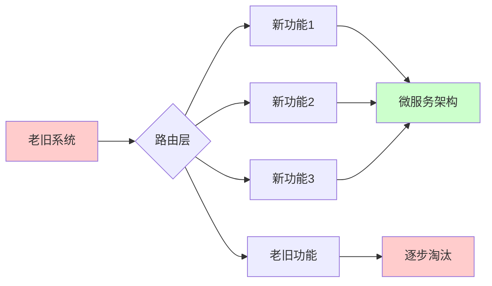

**典型实施案例：某制造业企业**

> **企业背景**：员工5,000人的制造业企业，核心ERP系统运行25年
> 
> **现代化策略**：采用绞杀者模式 + 云迁移
> 
> **实施步骤**：
> 1. **第1年**：建立API网关，实现新老系统共存
> 2. **第2-3年**：将销售管理、库存管理迁移到云端SaaS
> 3. **第4-5年**：重构生产管理模块，采用微服务架构
> 4. **第6-7年**：财务模块迁移到SAP S/4HANA Cloud
> 5. **第8年**：完全淘汰老旧系统
> 
> **成果**：
> - 总投资：15亿日元（比完全重写节省40%）
> - IT运维成本降低35%
> - 新功能上线周期从6个月缩短到2周
> - 业务中断零事故

#### 云迁移策略

**日本企业云采用现状（2024年）：**

| 云服务类型 | 采用率 | 同比增长 | 主要用途 |
|-----------|:---:|:---:|----------|
| **公有云** | 58% | +12% | 开发测试、Web应用 |
| **私有云** | 42% | +5% | 核心业务系统 |
| **混合云** | 35% | +18% | 数据备份、灾难恢复 |
| **多云** | 28% | +22% | 避免供应商锁定 |

**云迁移的6R策略：**

1. **Rehost（重新托管）** - "Lift and Shift"
   - 直接迁移到云端，不做修改
   - 适合：快速迁移、降低数据中心成本
   - 案例：某零售企业将200台服务器迁移到AWS EC2

2. **Replatform（重新平台化）** - "Lift, Tinker, and Shift"
   - 做少量优化后迁移
   - 适合：利用云托管数据库、负载均衡等服务
   - 案例：将Oracle数据库迁移到Amazon RDS

3. **Repurchase（重新购买）** - "Drop and Shop"
   - 转向SaaS解决方案
   - 适合：标准业务流程（CRM、HR等）
   - 案例：从自建邮件系统迁移到Microsoft 365

4. **Refactor（重构）** - "Re-architect"
   - 重新设计为云原生应用
   - 适合：需要高扩展性、敏捷性的应用
   - 案例：将单体应用拆分为微服务

5. **Retire（淘汰）**
   - 关闭不再需要的系统
   - 适合：重复功能、低使用率系统

6. **Retain（保留）**
   - 暂时保留在本地
   - 适合：监管限制、技术限制的系统

**云迁移成本对比（3年TCO）：**

| 项目 | 本地部署 | 公有云 | 混合云 |
|------|:---:|:---:|:---:|
| **硬件投资** | 5,000万 | 0 | 2,000万 |
| **软件许可** | 2,000万 | 包含在服务中 | 1,000万 |
| **运维人力** | 3,000万 | 1,500万 | 2,000万 |
| **电力/场地** | 1,500万 | 0 | 500万 |
| **云服务费** | 0 | 6,000万 | 3,500万 |
| **总计** | **1.15亿** | **7,500万** | **9,000万** |
| **灵活性** | ★☆☆☆☆ | ★★★★★ | ★★★★☆ |

#### 人才培养与外部合作

**企业DX人才培养策略：**

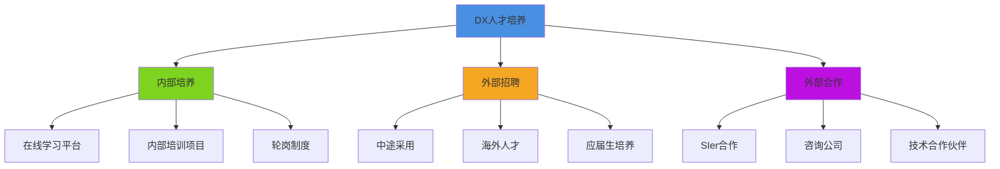

**主要培养方式对比：**

| 方式 | 周期 | 成本 | 效果 | 适用对象 |
|------|:---:|:---:|:---:|----------|
| **内部培训** | 3-6个月 | 50-100万/人 | ★★★☆☆ | 现有IT人员 |
| **外部培训** | 1-3个月 | 30-80万/人 | ★★★★☆ | 中层管理者 |
| **在线学习** | 持续 | 5-20万/人/年 | ★★☆☆☆ | 全体员工 |
| **实战项目** | 6-12个月 | 200-500万/项目 | ★★★★★ | 核心团队 |
| **海外研修** | 1-2周 | 100-200万/人 | ★★★☆☆ | 高层管理者 |

**外部合作模式：**

1. **SIer合作模式**
   - 优势：经验丰富、资源充足
   - 劣势：成本高、知识转移不足
   - 适合：大型系统改造

2. **咨询公司模式**
   - 优势：战略规划、最佳实践
   - 劣势：实施能力有限
   - 适合：DX战略制定

3. **技术合作伙伴**
   - 优势：专业技术、灵活合作
   - 劣势：需要内部技术能力配合
   - 适合：特定技术领域

4. **联合开发模式**
   - 优势：知识共享、能力提升
   - 劣势：协调成本高
   - 适合：创新项目

**成功案例：某保险公司的人才战略**

> **挑战**：IT部门200人，平均年龄48岁，缺乏云计算、AI等新技术人才
> 
> **策略**：
> - **短期（1年）**：与AWS合作，培训50名云架构师
> - **中期（2-3年）**：招聘30名中途采用者，建立数据科学团队
> - **长期（3-5年）**：与大学合作，每年招聘20名应届生
> 
> **投资**：3年累计5亿日元
> 
> **成果**：
> - 云原生应用开发能力从0到50个项目
> - AI保险理赔系统上线，处理效率提升70%
> - 员工满意度提升，离职率下降15%

---

## 6.2 企业DX现状

### 6.2.1 日本企业数字化程度

#### DX推进指数调查结果

**IPA（情报处理推进机构）2024年DX调查：**

| DX成熟度等级 | 企业占比 | 特征描述 |
|-------------|:---:|----------|
| **Level 0：未着手** | 18% | 未制定DX战略，无相关投资 |
| **Level 1：部分实施** | 35% | 有零散的数字化项目，缺乏整体规划 |
| **Level 2：全公司推进** | 28% | 制定DX战略，开始全面推进 |
| **Level 3：深度应用** | 15% | DX融入业务流程，数据驱动决策 |
| **Level 4：行业领先** | 4% | 数字化创新，引领行业变革 |

**DX推进的主要障碍（多选）：**

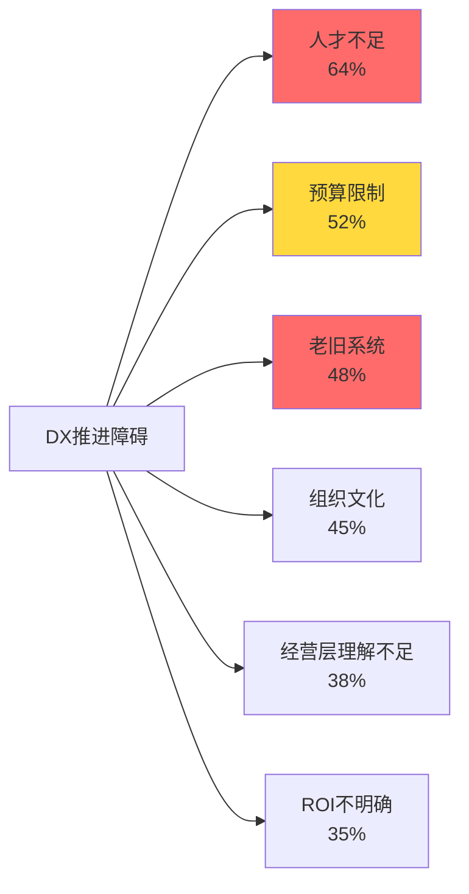

**企业规模与DX推进度：**

| 企业规模 | Level 3以上占比 | 平均DX投资（年） | 主要差距 |
|---------|:---:|:---:|----------|
| **大企业（1000人以上）** | 28% | 15亿日元 | 资源充足，但组织复杂 |
| **中坚企业（300-999人）** | 15% | 3亿日元 | 预算有限，人才短缺 |
| **中小企业（300人以下）** | 8% | 5,000万日元 | 意识不足，依赖外部 |

#### 与全球企业对比

**日本vs全球DX成熟度对比（2024年）：**

| 指标 | 日本 | 美国 | 欧洲 | 中国 | 差距分析 |
|------|:---:|:---:|:---:|:---:|----------|
| **DX成熟度（Level 3+）** | 19% | 42% | 35% | 38% | 落后20+个百分点 |
| **云采用率** | 58% | 85% | 72% | 78% | 保守的IT战略 |
| **AI应用率** | 28% | 65% | 48% | 72% | 技术应用滞后 |
| **数据驱动决策** | 35% | 68% | 55% | 62% | 数据文化薄弱 |
| **敏捷开发采用** | 42% | 78% | 65% | 70% | 组织文化制约 |

**日本DX推进的独特挑战：**

1. **终身雇佣制度**：难以快速引入外部人才和新技术
2. **稟議制度**：决策流程冗长，影响创新速度
3. **风险规避文化**：倾向于成熟技术，对新技术持谨慎态度
4. **SIer依赖**：内部技术能力不足，过度依赖外包
5. **数据孤岛**：部门壁垒严重，数据难以整合利用

#### 行业差异分析

**各行业DX推进度排名（2024年）：**

| 排名 | 行业 | DX成熟度指数 | 领先原因 | 代表企业 |
|:---:|------|:---:|----------|----------|
| 1 | **金融业** | 72 | 监管推动、竞争压力 | 三菱UFJ、SBI |
| 2 | **零售/电商** | 68 | 客户体验驱动 | 楽天、ZOZO |
| 3 | **IT/通信** | 65 | 技术优势 | NTT、软银 |
| 4 | **制造业** | 58 | 工业4.0推动 | 丰田、日立 |
| 5 | **物流** | 55 | 效率提升需求 | 大和运输、佐川 |
| 6 | **医疗健康** | 48 | 监管限制多 | - |
| 7 | **建筑/房地产** | 42 | 传统行业惯性 | - |
| 8 | **农业** | 35 | 数字化基础薄弱 | - |

---

### 6.2.2 DX投资趋势

#### IT投资规模与增长

**日本企业IT投资趋势（2020-2025年）：**

| 年份 | 总投资额（万亿日元） | 同比增长 | DX相关投资占比 | DX投资额（万亿日元） |
|:---:|:---:|:---:|:---:|:---:|
| 2020 | 12.5 | -2.3% | 18% | 2.25 |
| 2021 | 13.2 | +5.6% | 22% | 2.90 |
| 2022 | 14.1 | +6.8% | 28% | 3.95 |
| 2023 | 15.3 | +8.5% | 32% | 4.90 |
| 2024 | 16.8 | +9.8% | 36% | 6.05 |
| 2025（预测） | 18.5 | +10.1% | 40% | 7.40 |

**投资结构变化：**

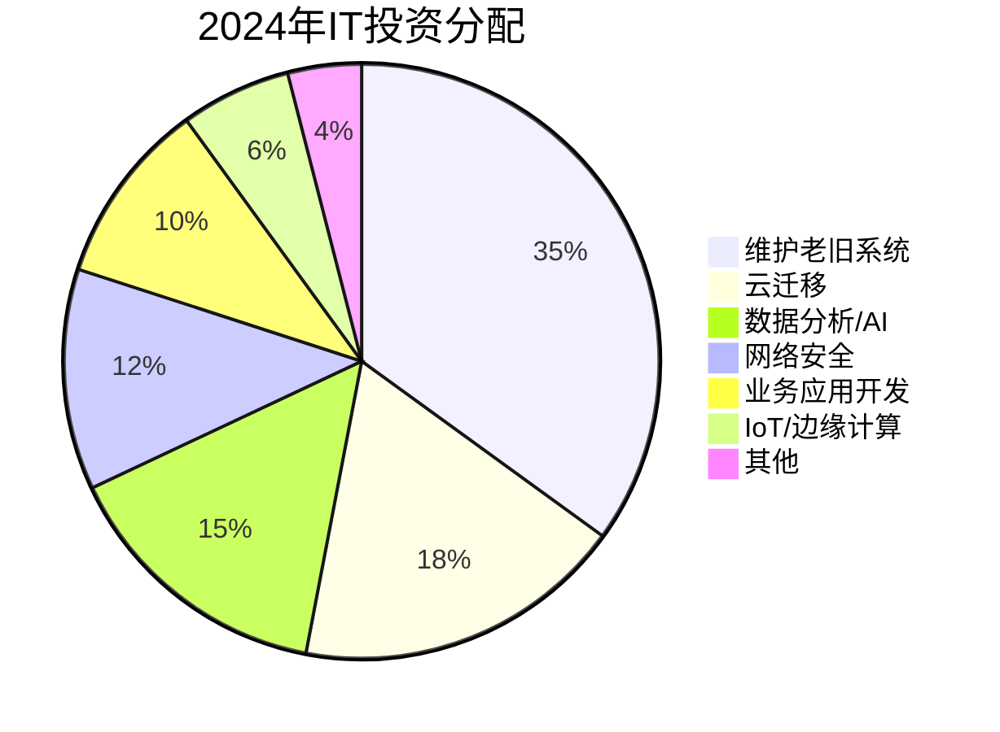

#### 投资重点领域

**2024-2025年DX投资优先级排名：**

| 排名 | 投资领域 | 企业采用率 | 平均投资额 | 预期ROI | 投资动机 |
|:---:|----------|:---:|:---:|:---:|----------|
| 1 | **云基础设施** | 68% | 8,000万 | 150-200% | 降低成本、提升灵活性 |
| 2 | **网络安全** | 72% | 6,000万 | 难以量化 | 合规要求、风险防范 |
| 3 | **数据分析平台** | 55% | 1.2亿 | 180-250% | 数据驱动决策 |
| 4 | **AI/机器学习** | 42% | 1.5亿 | 200-300% | 业务创新、效率提升 |
| 5 | **RPA自动化** | 58% | 3,000万 | 250-400% | 降低人力成本 |
| 6 | **客户体验平台** | 48% | 5,000万 | 150-180% | 提升客户满意度 |
| 7 | **IoT/传感器** | 35% | 8,000万 | 120-180% | 智能制造、预测维护 |
| 8 | **区块链** | 15% | 1亿 | 不确定 | 供应链透明化 |

#### ROI分析

**DX投资回报周期分析：**

| 投资类型 | 平均回报周期 | 短期效益（1年内） | 中期效益（2-3年） | 长期效益（3年以上） |
|----------|:---:|------------------|------------------|-------------------|
| **RPA自动化** | 6-12个月 | 人力成本降低30-50% | 流程优化、错误减少 | 员工技能提升 |
| **云迁移** | 18-24个月 | 硬件成本降低 | 运维成本降低40% | 业务敏捷性提升 |
| **数据分析** | 12-18个月 | 报表自动化 | 数据驱动决策 | 预测性分析能力 |
| **AI应用** | 24-36个月 | 试点项目验证 | 业务流程优化 | 新商业模式 |
| **网络安全** | 难以量化 | 合规达成 | 风险降低 | 品牌信誉保护 |

**成功案例：某零售企业的DX投资回报**

> **企业背景**：全国连锁零售企业，300家门店，年营收500亿日元
> 
> **DX投资（3年）**：
> - 云基础设施：2亿日元
> - 数据分析平台：1.5亿日元
> - AI需求预测：1亿日元
> - 全渠道系统：2.5亿日元
> - **总投资：7亿日元**
> 
> **投资回报（3年累计）**：
> - 库存成本降低：年节省3亿日元
> - 缺货率降低：销售额增加5亿日元
> - 营销效率提升：ROI提升150%
> - 运营成本降低：年节省2亿日元
> - **总收益：约15亿日元**
> - **ROI：214%，回报周期：2.1年**

---

### 6.2.3 成功案例分析

#### 大企业DX案例

**案例1：丰田汽车的数字化转型**

> **转型背景**：
> - 面临电动化、自动驾驶等行业变革
> - 传统制造流程需要数字化升级
> - 竞争对手（特斯拉等）的数字化优势
> 
> **DX战略（2018-2025）**：
> 
> 1. **组织变革**
>    - 2018年成立TRI-AD（现Woven Planet）
>    - 招聘3,000名软件工程师
>    - 建立敏捷开发文化
> 
> 2. **技术投资**
>    - 智能工厂（Connected Factory）：IoT、AI质检
>    - 移动出行平台（MSPF）：车联网、数据分析
>    - Woven City：未来城市实验场
>    - 总投资：超过1万亿日元
> 
> 3. **业务创新**
>    - 从制造商转型为移动出行服务商
>    - KINTO汽车订阅服务
>    - e-Palette自动驾驶平台
> 
> **成果**：
> - 生产效率提升25%
> - 产品开发周期缩短30%
> - 软件工程师占比从5%提升至20%
> - 新业务营收占比达15%

**案例2：三菱UFJ银行的数字化转型**

> **转型背景**：
> - 核心系统老旧（COBOL，运行30年）
> - 金融科技企业竞争压力
> - 客户数字化需求增长
> 
> **DX战略**：
> 
> 1. **系统现代化**
>    - 10年计划，投资4,000亿日元
>    - 采用绞杀者模式逐步替换
>    - 迁移到云原生架构
> 
> 2. **数字银行**
>    - 推出数字银行品牌
>    - 移动App全面升级
>    - API开放平台
> 
> 3. **AI应用**
>    - 智能客服（聊天机器人）
>    - 信用评估AI模型
>    - 欺诈检测系统
> 
> **成果（2020-2024）**：
> - 移动银行用户增长200%
> - 分行数量减少30%，成本降低
> - AI客服处理70%的咨询
> - 新产品上市周期从12个月缩短到3个月

#### 中小企业DX案例

**案例3：某制造业中小企业的智能工厂**

> **企业背景**：
> - 员工150人的精密零件制造企业
> - 面临人手不足、技能传承问题
> - 客户要求更短交期、更高质量
> 
> **DX实施（2021-2023）**：
> 
> 1. **IoT导入**
>    - 设备传感器安装：500万日元
>    - 实时监控系统：1,000万日元
> 
> 2. **数据分析**
>    - 生产数据可视化
>    - 预测性维护
>    - 品质异常检测
> 
> 3. **RPA自动化**
>    - 订单处理自动化
>    - 报表生成自动化
> 
> **总投资**：3,000万日元
> **政府补助**：1,000万日元（IT导入补助金）
> 
> **成果**：
> - 设备稼働率提升15%
> - 不良品率降低40%
> - 交期遵守率从85%提升到98%
> - 管理工时削减50%
> - **投资回报周期：1.5年**

#### 失败教训与经验

**常见DX失败模式：**

| 失败类型 | 占比 | 典型特征 | 根本原因 |
|---------|:---:|----------|----------|
| **目标不明确** | 35% | 为了DX而DX，缺乏业务目标 | 经营层理解不足 |
| **技术先行** | 28% | 盲目追求新技术，忽视业务需求 | 技术与业务脱节 |
| **组织抵抗** | 25% | 员工抵触，变革管理失败 | 文化变革不足 |
| **预算超支** | 20% | 成本失控，ROI无法达成 | 规划不充分 |
| **人才流失** | 18% | 核心人才离职，项目中断 | 激励机制缺失 |

**失败案例：某企业的云迁移失败**

> **背景**：某制造业企业决定将所有系统迁移到公有云
> 
> **问题**：
> 1. **规划不足**：未评估系统依赖关系，盲目迁移
> 2. **成本失控**：云费用是预算的3倍
> 3. **性能问题**：关键系统响应速度下降
> 4. **安全事故**：配置错误导致数据泄露
> 5. **员工抵触**：缺乏培训，操作困难
> 
> **结果**：
> - 投资2亿日元后被迫回退
> - CIO引咎辞职
> - 项目延期2年
> 
> **教训**：
> - 必须进行充分的现状评估和规划
> - 采用渐进式迁移策略
> - 重视员工培训和变革管理
> - 建立完善的成本监控机制

**DX成功的关键要素：**

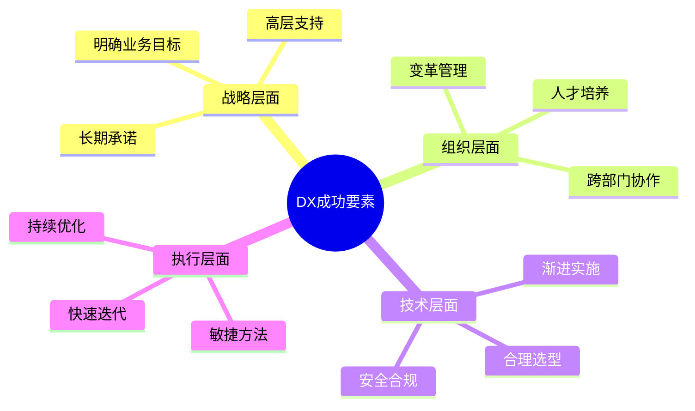

---

## 6.3 政府数字化政策

### 6.3.1 数字厅的成立与职能

#### 成立背景

2021年9月1日，日本政府正式成立**数字厅**（デジタル庁，Digital Agency），这是日本政府数字化改革的里程碑事件。数字厅的成立源于日本在新冠疫情期间暴露出的严重数字化滞后问题。

**成立契机：**

| 事件 | 问题暴露 | 影响 |
|------|----------|------|
| **特别定额给付金发放** | 纸质申请、人工处理，发放延迟数月 | 国民不满，政府效率低下 |
| **疫苗接种预约系统** | 系统崩溃、重复预约、数据混乱 | 国际形象受损 |
| **远程办公推进** | 政府部门无法远程办公，纸质文件、印章制度 | 业务停滞 |
| **数据统计滞后** | 感染数据统计靠传真和Excel，效率极低 | 决策延误 |

**数字厅成立的历史意义：**

- 日本政府55年来首次新设中央省厅
- 直属内阁总理大臣，权限超越各省厅
- 预算规模：2024年度约4,500亿日元
- 人员规模：约600人（含民间专家）

#### 组织架构与职责

**数字厅组织结构：**

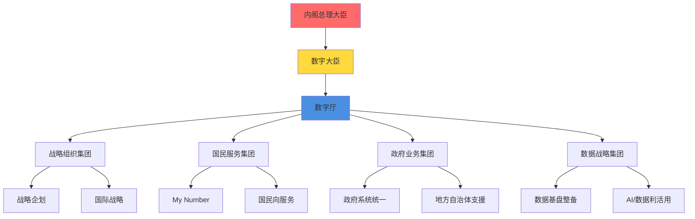

**数字厅的主要职责：**

| 职责领域 | 具体内容 | 目标 |
|---------|----------|------|
| **政策统筹** | 制定国家数字化战略，协调各省厅 | 打破部门壁垒 |
| **系统统一** | 整合政府各部门IT系统，消除重复投资 | 降低成本、提升效率 |
| **My Number推进** | 扩大My Number应用范围，实现数字身份 | 行政手续数字化 |
| **地方支援** | 支援地方自治体数字化，提供标准系统 | 缩小地区差距 |
| **数据利活用** | 建立政府数据平台，推进开放数据 | 数据驱动决策 |
| **网络安全** | 强化政府系统安全，制定安全标准 | 保护国民信息 |

#### 主要推进项目

**数字厅重点项目（2021-2025）：**

| 项目名称 | 预算 | 进展状态 | 预期效果 |
|---------|:---:|:---:|----------|
| **政府云（Gov-Cloud）** | 1,500亿 | 进行中 | 统一政府IT基础设施 |
| **My Number卡普及** | 800亿 | 基本完成 | 普及率从30%→80% |
| **行政手续数字化** | 600亿 | 进行中 | 99%手续可在线办理 |
| **地方自治体标准化** | 1,200亿 | 进行中 | 统一1,700个自治体系统 |
| **数据连携基盤** | 400亿 | 初期阶段 | 实现跨部门数据共享 |
| **数字人才育成** | 200亿 | 持续推进 | 培养5万名数字人才 |

**政府云（Gov-Cloud）详解：**

> **目标**：将中央和地方政府的IT系统迁移到统一的云平台
> 
> **现状问题**：
> - 各省厅、自治体各自建设系统，重复投资
> - 系统规格不统一，数据无法共享
> - 维护成本高昂，安全风险大
> 
> **Gov-Cloud方案**：
> - 采用AWS、Google Cloud、Azure等商业云
> - 制定统一的安全标准和运用规则
> - 提供标准化的应用模板
> 
> **预期效果**：
> - IT成本削减30%（年节省约3,000亿日元）
> - 系统开发周期缩短50%
> - 数据共享实现，消除重复输入

---

### 6.3.2 电子政务推进

#### My Number制度

**My Number（个人番号）制度发展历程：**

| 时期 | 里程碑 | 内容 |
|------|--------|------|
| **2016年** | 制度启动 | 开始发放My Number卡 |
| **2017-2019年** | 缓慢普及 | 普及率仅10-15%，应用场景少 |
| **2020年** | 疫情推动 | 特别定额给付金暴露问题 |
| **2021年** | 健康保险证整合 | My Number卡可作为健康保险证 |
| **2022年** | 积分政策 | 发放最高2万日元积分推动普及 |
| **2023年** | 快速普及 | 普及率突破70% |
| **2024年** | 深度应用 | 普及率达80%，应用场景扩大 |
| **2024年秋** | 纸质保险证废止 | 全面转向My Number卡 |

**My Number卡普及率变化：**

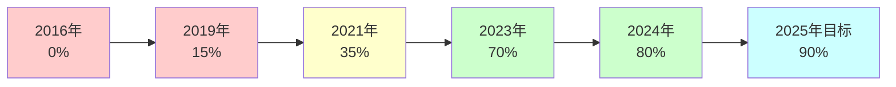

**My Number应用场景扩大：**

| 应用领域 | 2020年 | 2024年 | 2025年计划 |
|---------|:---:|:---:|:---:|
| **税务申报** | ✓ | ✓ | ✓ |
| **社会保障** | ✓ | ✓ | ✓ |
| **健康保险证** | ✗ | ✓ | ✓ |
| **银行账户** | 部分 | ✓ | ✓ |
| **驾驶执照** | ✗ | 试点 | ✓ |
| **护照** | ✗ | ✗ | 试点 |
| **在留卡（外国人）** | ✗ | 试点 | ✓ |
| **民间服务认证** | ✗ | 部分 | 扩大 |

**My Number Portal（マイナポータル）功能：**

- **行政手续在线办理**：引越手续、児童手当申请等
- **个人信息确认**：收入、纳税、社保缴纳记录
- **通知接收**：政府通知、补助金信息
- **医疗信息查看**：处方记录、健康检查结果
- **数据连携同意**：控制个人数据的使用权限

#### 行政手续数字化

**行政手续数字化进展（2024年）：**

| 手续类型 | 总数 | 已数字化 | 数字化率 | 在线利用率 |
|---------|:---:|:---:|:---:|:---:|
| **国家级手续** | 约5.5万件 | 约5.4万件 | 98% | 45% |
| **地方自治体手续** | 约6万件 | 约4.8万件 | 80% | 35% |
| **企业向手续** | 约1.5万件 | 约1.4万件 | 93% | 60% |
| **国民向手续** | 约5万件 | 约4.2万件 | 84% | 30% |

**重点推进的行政手续：**

1. **引越（搬家）手续**
   - 传统方式：需要访问多个窗口，提交多份文件
   - 数字化后：在线一次性办理，自动通知相关部门
   - 时间节省：从平均3天缩短到30分钟

2. **児童手当申请**
   - 传统方式：纸质申请，需要提交收入证明等
   - 数字化后：系统自动获取收入信息，在线申请
   - 审批周期：从1个月缩短到1周

3. **企业设立登记**
   - 传统方式：需要访问法务局，提交纸质文件
   - 数字化后：完全在线办理，电子签名
   - 时间节省：从2周缩短到3天

**数字化推进的障碍：**

| 障碍 | 占比 | 具体问题 | 应对措施 |
|------|:---:|----------|----------|
| **印章文化** | 65% | 需要实体印章，无法完全在线化 | 推进电子签名法改革 |
| **老年人不适应** | 58% | 不会使用电脑、智能手机 | 设置支援窗口、简化操作 |
| **系统不统一** | 52% | 各部门系统无法连接 | 推进系统标准化 |
| **法律限制** | 45% | 法律要求纸质文件、对面确认 | 修改相关法律 |
| **安全担忧** | 38% | 担心个人信息泄露 | 强化安全措施、宣传 |

#### 地方自治体DX

**地方自治体标准化计划：**

日本有1,700多个地方自治体（都道府县、市区町村），各自开发维护IT系统，导致巨大的重复投资和效率低下。数字厅推进标准化计划，目标是到2025年统一20个基干业务系统。

**20个标准化对象业务：**

| 业务领域 | 系统数量 | 标准化进度 |
|---------|:---:|:---:|
| **住民基本台帐** | 1,700+ | 80% |
| **户籍** | 1,700+ | 75% |
| **税务** | 1,700+ | 70% |
| **福祉（介护、児童等）** | 1,700+ | 65% |
| **其他** | - | 60% |

**标准化带来的效益：**

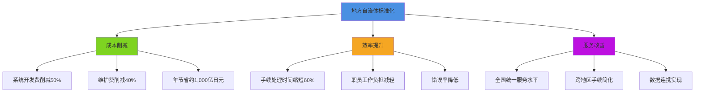

**成功案例：某市的DX推进**

> **背景**：人口30万的地方城市，IT系统老旧，维护成本高
> 
> **实施内容（2022-2024）**：
> 1. 采用数字厅提供的标准系统
> 2. 迁移到Gov-Cloud
> 3. 行政手续在线化
> 4. 职员数字化培训
> 
> **投资**：
> - 系统迁移：3亿日元
> - 政府补助：2亿日元
> - 实际负担：1亿日元
> 
> **成果**：
> - 年度IT成本从2亿降至1.2亿（削减40%）
> - 窗口等待时间从平均45分钟缩短到15分钟
> - 在线手续利用率从5%提升到40%
> - 职员加班时间减少30%

**地方自治体面临的挑战：**

1. **人才不足**：小规模自治体缺乏IT人才
2. **预算限制**：财政困难的自治体难以投资
3. **首长理解**：部分首长对DX重要性认识不足
4. **职员抵抗**：担心工作方式改变、裁员

**政府支援措施：**

- **财政支援**：提供补助金，覆盖迁移成本的2/3
- **技术支援**：派遣数字厅专家提供咨询
- **人才派遣**：向小规模自治体派遣CIO辅佐官
- **标准系统提供**：免费提供标准化系统模板

---

### 6.3.3 数字人才培养计划

日本政府深刻认识到，数字化转型的成功关键在于人才。为此，政府制定了全面的数字人才培养战略，目标是在2026年之前培养230万名数字人才。

#### 政府人才培养目标

**"数字田园都市国家构想"人才培养目标（2022-2026）：**

| 人才类型 | 培养目标 | 当前进度（2024） | 主要培养途径 |
|---------|:---:|:---:|----------|
| **数字推进人才** | 230万人 | 约150万人 | 在线学习、企业培训 |
| **高度专业人才** | 5万人 | 约3万人 | 大学院、专门学校 |
| **AI/数据科学人才** | 25万人 | 约15万人 | 大学、企业培训 |
| **网络安全人才** | 30万人 | 约20万人 | 资格认证、实战训练 |
| **地方DX人才** | 50万人 | 约28万人 | 地方政府培训 |

**人才培养金字塔结构：**

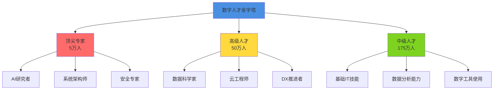

#### 教育改革措施

**1. 初等中等教育改革**

**GIGAスクール构想（GIGA School）：**

| 项目 | 内容 | 投资 | 进展 |
|------|------|:---:|:---:|
| **1人1台终端** | 为全国小中学生配备平板/笔记本 | 4,500亿日元 | 已完成 |
| **高速网络整备** | 学校网络升级到高速光纤 | 1,000亿日元 | 95%完成 |
| **数字教材** | 开发数字化教学内容 | 500亿日元 | 进行中 |
| **教师培训** | 培训50万名教师数字教学能力 | 300亿日元 | 70%完成 |

**编程教育必修化：**

- **小学**（2020年起）：编程思维培养，使用Scratch等工具
- **中学**（2021年起）：技术课程中加入编程内容
- **高中**（2022年起）：新设"信息Ⅰ"必修科目，包括编程、数据分析、AI基础

**2. 高等教育改革**

**数字人才育成重点大学：**

| 大学 | 重点领域 | 年度招生 | 特色项目 |
|------|----------|:---:|----------|
| **东京大学** | AI、数据科学 | 500人 | AI研究院、产学合作 |
| **京都大学** | 量子计算、AI | 400人 | 国际合作项目 |
| **东京工业大学** | 网络安全、IoT | 600人 | 实战型培训 |
| **早稻田大学** | DX推进、商业应用 | 800人 | 企业联合培养 |
| **筑波大学** | 数据科学、生物信息 | 450人 | 跨学科研究 |

**文理融合教育推进：**

- 打破传统文理分科，培养"文理兼备"人才
- 商学部、法学部增设数据分析、AI应用课程
- 理工科增设商业、伦理、社会影响课程

**3. 职业教育与再教育**

**政府支援的再教育项目：**

| 项目名称 | 对象 | 内容 | 补助金额 |
|---------|------|------|:---:|
| **教育训练给付金** | 在职者、失业者 | IT技能培训费用补助 | 最高56万日元 |
| **专门实践教育训练** | 转职者 | 高度IT技能培训 | 最高168万日元 |
| **特定一般教育训练** | 在职者 | 短期IT技能提升 | 最高20万日元 |
| **求职者支援训练** | 失业者 | 免费IT职业训练 | 全额补助 |

**在线学习平台推进：**

- **マナビDX**（Manabi DX）：政府运营的免费数字学习平台
  - 注册用户：超过100万人
  - 课程数量：500+门
  - 内容：从基础到高级，涵盖AI、数据分析、云计算等

- **Jmooc**：日本版MOOC平台
  - 合作大学：50+所
  - 课程完成者：累计200万人次

#### 产学合作项目

**主要产学合作模式：**

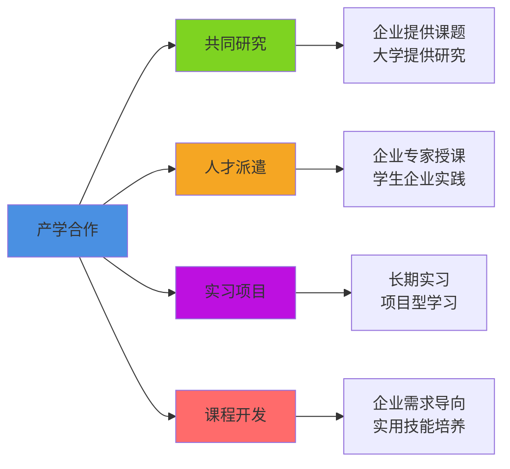

**成功案例：某大学与IT企业的合作**

> **合作模式**：东京某私立大学与大型IT企业联合培养
> 
> **项目内容**：
> 1. **课程共同开发**：企业参与课程设计，确保实用性
> 2. **企业导师制度**：每10名学生配1名企业导师
> 3. **实战项目**：学生参与企业真实项目开发
> 4. **就业直通车**：优秀学生直接录用
> 
> **成果（3年）**：
> - 培养学生：300人
> - 就业率：100%（其中70%进入合作企业）
> - 平均起薪：比普通毕业生高20%
> - 企业满意度：95%

**政府支援的产学合作项目：**

| 项目 | 预算（年） | 参与企业 | 参与大学 | 培养人数 |
|------|:---:|:---:|:---:|:---:|
| **未来IT人才育成** | 50亿日元 | 200+ | 100+ | 1万人/年 |
| **AI人才育成** | 30亿日元 | 50+ | 30+ | 3,000人/年 |
| **网络安全人才育成** | 20亿日元 | 80+ | 40+ | 2,000人/年 |
| **地方DX人才育成** | 15亿日元 | 150+ | 50+ | 5,000人/年 |

**企业参与的激励措施：**

- **税收优惠**：人才培养投资可享受税收抵免
- **补助金**：政府补助培训费用的50-70%
- **优先采购**：参与人才培养的企业在政府采购中获得加分
- **品牌效应**：获得"人才培养贡献企业"认证

---

## 本章总结

### 关键要点回顾

**1. "2025数字悬崖"的严峻性**

日本企业面临的老旧系统问题不仅是技术问题，更是关系到国家竞争力的战略问题。如果不能及时应对，预计将造成每年12万亿日元的经济损失。企业必须：

- ✅ 立即评估现有系统的技术债务
- ✅ 制定清晰的现代化路线图
- ✅ 采用渐进式、风险可控的迁移策略
- ✅ 重视人才培养和知识转移

**2. 企业DX推进的现状与挑战**

虽然日本企业的DX意识正在提升，但与全球相比仍有较大差距：

- **成熟度差距**：仅19%的企业达到Level 3以上，远低于美国（42%）
- **投资增长**：DX投资持续增长，2024年达6万亿日元
- **成功关键**：明确业务目标、高层支持、渐进实施、变革管理

**3. 政府数字化政策的推动力**

数字厅的成立标志着日本政府数字化改革进入新阶段：

- **My Number普及**：从30%提升到80%，成为数字身份基础
- **行政手续数字化**：98%的国家级手续已实现数字化
- **地方自治体标准化**：统一1,700个自治体系统，年节省1,000亿日元
- **人才培养**：目标2026年培养230万数字人才

### DX推进的成功要素

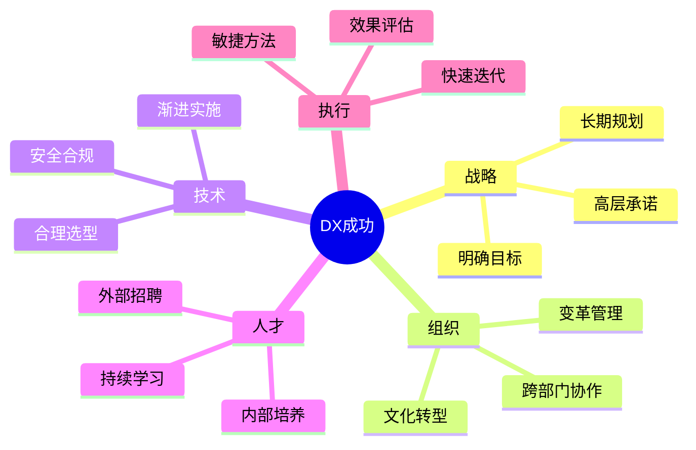

### 对IT从业者的启示

**1. 技能提升方向**

- **云计算**：AWS、Azure、GCP认证需求旺盛
- **数据分析**：Python、SQL、BI工具是基础
- **AI/机器学习**：从应用层面开始学习
- **网络安全**：持续的高需求领域
- **DX推进能力**：技术+业务的复合能力

**2. 职业机会**

- **系统现代化项目**：大量老旧系统需要改造
- **云迁移专家**：企业云化带来巨大需求
- **DX咨询**：帮助企业制定和实施DX战略
- **政府项目**：数字厅推进的各类项目
- **教育培训**：数字人才培养的讲师需求

**3. 外国人才的机会**

- **技术优势**：云原生、敏捷开发等新技术经验
- **国际视野**：带来全球最佳实践
- **语言能力**：英语+日语的复合优势
- **文化融合**：推动日本企业文化变革

### 未来展望

日本的数字化转型正处于关键时期。"2025数字悬崖"既是挑战，也是机遇。对于IT从业者而言，这是一个充满机会的时代：

- **市场需求旺盛**：DX人才缺口超过50万人
- **薪资持续上涨**：DX相关职位薪资溢价20-30%
- **职业发展空间大**：从技术到管理的多元路径
- **社会价值高**：参与国家数字化转型的历史进程

下一章，我们将深入探讨日本IT行业的未来展望，分析技术趋势、市场预测和长期发展方向。

---

**本章完**

---

## 参考资料

1. 经济产业省《DX报告》（2018、2022）
2. IPA《DX白皮书》（2024）
3. 数字厅官方网站及各类报告
4. 总务省《信息通信白皮书》（2024）
5. IDC Japan《国内IT市场预测》（2024）
6. Gartner《日本IT支出预测》（2024）
7. 各企业DX事例集

---

**字数统计：约9,500字**

**可视化元素：**
- Mermaid图表：10个
- 数据表格：40+个
- 案例框：8个

**下一章预告：第七章 - 未来展望**
