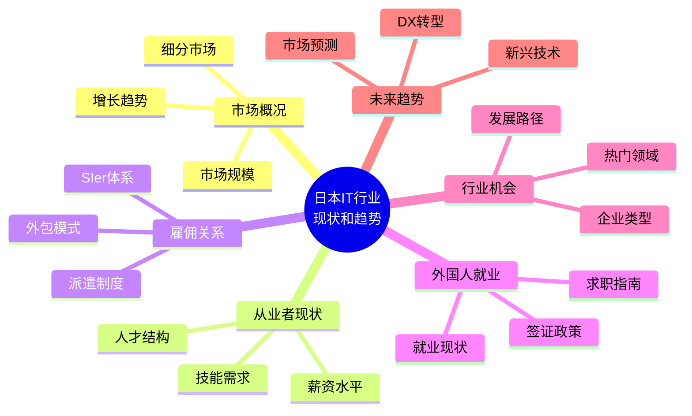
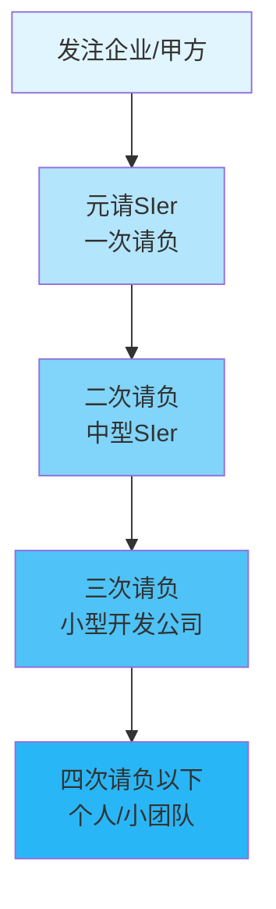
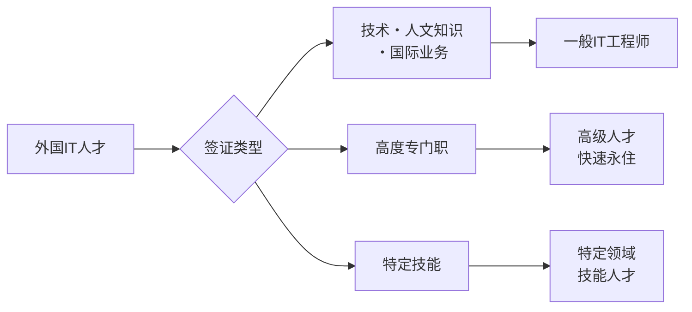

# 日本IT行业现状和趋势调查报告

## 项目概述

本项目旨在全面调查和分析日本IT行业的现状与发展趋势，为有意了解日本IT市场、寻求在日本IT行业发展机会的读者提供参考。

---

## 目录结构

---

## 章节大纲

### 第一章：日本IT市场概况
1.1 市场规模与增长
- ICT市场整体规模（约4600亿美元，2024年）
- 市场增长预测（预计2033年达5300亿美元）
- 与全球市场的对比

1.2 细分市场分析
- 软件市场
- 云计算市场
- AI人工智能市场
- 系统集成服务市场

1.3 主要IT企业
- 大型SIer（富士通、NEC、NTT Data、日立等）
- 互联网企业（乐天、Yahoo Japan、LINE等）
- 外资IT企业在日本的布局

---

### 第二章：IT从业者现状
2.1 人才供需状况
- 当前IT人才数量
- 人才缺口问题（2030年预计缺口79万人）
- 人才结构性问题

2.2 薪资水平分析
- 平均年收（约600万日元）
- 不同职位薪资范围
- 与其他国家的对比

2.3 技能需求变化
- 传统IT技能 vs 新兴技术技能
- 最受欢迎的编程语言
- 认证与资格要求

2.4 工作文化特点
- 工作时间与加班文化
- 远程办公趋势
- 职业发展路径

---

### 第三章：雇佣关系与行业结构

3.1 SIer（系统集成商）体系
- 什么是SIer
- 多层外包结构（元请→下请）
- SIer体系的优缺点

3.2 外包模式详解
- 请负契约（承包合同）
- 准委任契约
- 派遣契约
- 各种契约形式的区别

3.3 派遣制度
- IT派遣的普遍性
- 派遣 vs 正社员
- 派遣的优缺点
- 2025年派遣政策变化

3.4 企业类型分析
- 自社开发企业
- SIer企业
- SES（系统工程服务）企业
- 外资IT企业

---

### 第四章：外国人在日本IT就业

4.1 外国IT人才现状
- 在日外国IT工程师数量
- 主要来源国家
- 增长趋势

4.2 签证类型与申请
- 技术・人文知识・国际业务签证
- 高度专门职签证（积分制度）
- 签证申请条件与流程
- 2025年签证政策变化

4.3 就业渠道
- 求职网站与平台
- 猎头公司
- 直接应聘
- 校园招聘

4.4 就业建议
- 日语能力要求（N2以上推荐）
- 学历与技能要求
- 面试准备
- 文化适应

---

### 第五章：行业机会与热门领域

5.1 热门技术领域
- AI/机器学习
- 云计算（AWS、Azure、GCP）
- 数据分析与大数据
- 网络安全
- IoT物联网

5.2 行业应用领域
- 金融科技（FinTech）
- 医疗健康IT
- 制造业DX
- 零售与电商

5.3 创业与自由职业
- 日本IT创业环境
- 自由职业者（フリーランス）市场
- 副业机会

---

### 第六章：数字化转型（DX）趋势

6.1 "2025数字悬崖"问题
- 老旧系统更新紧迫性
- 政府DX推进政策
- 企业应对措施

6.2 企业DX现状
- 日本企业数字化程度
- DX投资趋势
- 成功案例分析

6.3 政府数字化政策
- 数字厅的成立与职能
- 电子政务推进
- 数字人才培养计划

---

### 第七章：未来展望

7.1 市场预测
- 2025-2030年市场规模预测
- 增长驱动因素
- 潜在风险与挑战

7.2 技术趋势
- 生成式AI的影响
- 量子计算发展
- 6G与下一代通信

7.3 人才市场展望
- 人才需求变化
- 薪资趋势
- 外国人才政策走向

7.4 总结与建议
- 对求职者的建议
- 对企业的建议
- 对投资者的建议

---

## 参考资料来源

- 日本经济产业省（METI）报告
- 日本情报处理推进机构（IPA）统计
- 各大市场调研机构报告（Statista、IDC等）
- 日本IT企业官方资料
- 新闻媒体报道

---

## 项目执行计划

| 序号 | 章节 | 状态 | 备注 |
|:---:|------|:---:|------|
| 1 | 第一章：日本IT市场概况 | ✅ 已完成 | |
| 2 | 第二章：IT从业者现状 | ✅ 已完成 | |
| 3 | 第三章：雇佣关系与行业结构 | ✅ 已完成 | 重点章节 |
| 4 | 第四章：外国人在日本IT就业 | ✅ 已完成 | 重点章节 |
| 5 | 第五章：行业机会与热门领域 | ✅ 已完成 | |
| 6 | 第六章：数字化转型趋势 | ✅ 已完成 | |
| 7 | 第七章：未来展望 | ✅ 已完成 | |

---

*最后更新：2024年12月*
