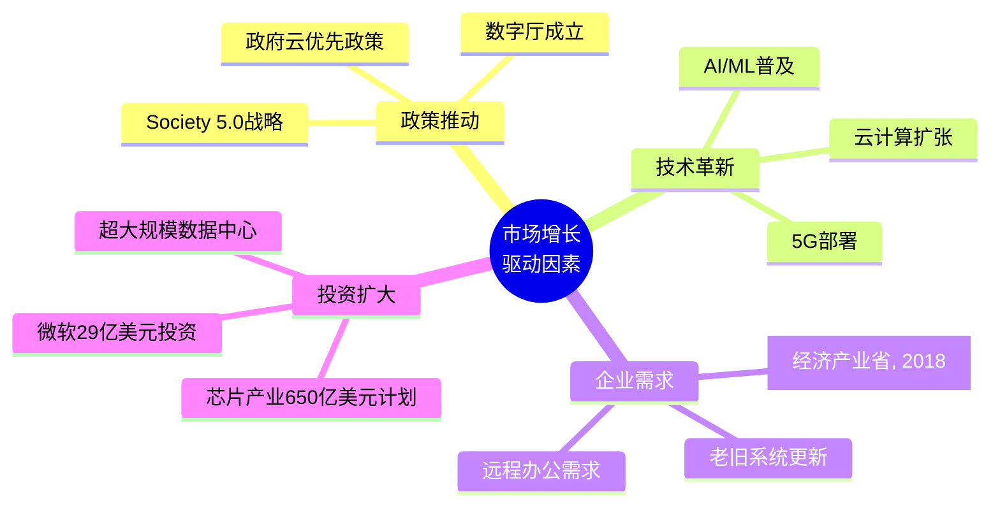

# 第一章：日本IT市场概况（引用添加示例）

## 1.1 市场规模与增长

### 整体市场规模

日本是全球第三大经济体，其ICT（信息通信技术）市场规模位居世界前列。根据多家市场研究机构的数据：

| 指标 | 2024年 | 2025年预测 | 2030年预测 | 2033年预测 | 年复合增长率 |
|------|--------|-----------|-----------|-----------|-------------|
| ICT市场整体 | 4670亿美元[IMARC Group, 2024] | 4044亿美元 | 5746亿美元 | 5300亿美元[IMARC Group, 2024] | 7.28% |
| IT服务市场 | - | 672.7亿美元 | 1158.7亿美元 | - | 11.49% |
| 数字化转型市场 | 579亿美元 | - | - | 3048亿美元 | 20.3% |

> 📊 **数据来源**：Mordor Intelligence, IMARC Group, Astute Analytica (2024-2025)
> 
> 💡 **数据说明**：不同机构对日本ICT市场规模的统计存在差异，主要原因包括：
> - **统计口径不同**：部分机构包含硬件设备，部分仅统计软件和服务
> - **汇率换算时点**：美元兑日元汇率波动导致换算结果不同
> - **预测模型差异**：各机构采用的预测方法和假设条件有所不同
> - 本报告综合多家权威机构数据，采用**4600-4700亿美元**作为2024年市场规模的合理区间

### 市场增长驱动因素

### 关键增长数据

1. **云服务市场**：预计从2025年的1970亿美元增长至2030年的3097亿美元，年复合增长率8.09%
2. **数字化转型市场**：2024年579亿美元，预计2033年达3048亿美元，年复合增长率20.3%
3. **软件分销市场**：2025年221亿美元，预计2035年达705亿美元，年复合增长率12.3%

---

## 1.2 细分市场分析

### IT服务市场

日本IT服务市场是整个ICT产业的核心组成部分：

| 细分领域 | 2024年市场份额 | 增长趋势 |
|---------|---------------|---------|
| IT咨询与系统集成 | 32% | 稳定增长 |
| 云与平台服务 | - | 15.97% CAGR |
| 托管服务 | 41.19%[Mordor Intelligence, 2024] | 持续主导 |

**市场特点**：
- IT服务在2024年占ICT市场份额的41.19%[Mordor Intelligence, 2024]
- 企业对系统集成和托管运营的依赖度高
- 合同模式正从"人力计费"向"价值导向"转变

### 云计算市场

日本云计算市场正经历快速扩张：

- **IaaS/PaaS市场规模**：2024年约2.3万亿日元（约153亿美元）
- **超大规模数据中心投资**：2024年达179亿美元
- **微软投资**：宣布在日本数据中心投资29亿美元

**主要云服务提供商在日本的布局**：
| 提供商 | 数据中心位置 | 主要服务 |
|--------|-------------|---------|
| AWS | 东京、大阪 | 全栈云服务 |
| Microsoft Azure | 东京、大阪 | 企业云、AI服务 |
| Google Cloud | 东京、大阪 | 数据分析、AI |
| 阿里云 | 东京 | 跨境电商、亚洲业务 |

### AI人工智能市场

AI市场是日本IT行业增长最快的领域之一：

| 市场类型 | 2024年规模 | 预测规模 | 年复合增长率 |
|---------|-----------|---------|-------------|
| AI整体市场 | 66亿美元 | 352亿美元(2033) | 约20% |
| 企业AI市场 | 15亿美元 | 390亿美元(2035) | 约35% |
| AI/ML自动化 | 24.92%份额 | 持续增长 | - |

**AI应用重点领域**：
- 金融服务（风控、客服）
- 医疗健康（诊断辅助）
- 制造业（质量检测、预测维护）
- 零售（个性化推荐）

---

## 1.3 主要IT企业

### 日本本土大型IT企业

日本IT行业由几家大型企业主导，这些企业在系统集成、硬件制造和IT服务领域占据重要地位：

| 企业名称 | 2024年IT收入 | 主要业务领域 | 特点 |
|---------|-------------|-------------|------|
| 富士通 (Fujitsu) | 约280亿美元 | 系统集成、云服务、硬件 | 日本最大IT服务商 |
| NTT Data | 约250亿美元 | 系统集成、数据中心 | 全球化布局最广 |
| NEC | 约200亿美元 | 网络、公共安全、AI | 人脸识别技术领先 |
| 日立 (Hitachi) | 约180亿美元 | 社会基础设施IT | 制造业IT融合 |
| 野村综合研究所 (NRI) | 约60亿美元 | 金融IT、咨询 | 金融领域专精 |

**大型SIer的特点**：
- 承接政府和大企业的核心系统项目
- 拥有完整的上下游产业链
- 技术积累深厚，但创新速度相对较慢
- 员工稳定性高，终身雇用传统仍存

### 互联网与新兴IT企业

| 企业名称 | 主要业务 | 特点 |
|---------|---------|------|
| 乐天 (Rakuten) | 电商、金融科技、移动通信 | 日本最大电商平台 |
| Yahoo Japan / LINE | 搜索、社交、支付 | 合并后成为Z Holdings |
| CyberAgent | 广告、游戏、媒体 | AbemaTV运营商 |
| DeNA | 游戏、汽车、医疗 | 任天堂合作伙伴 |
| Mercari | 二手交易平台 | 日本独角兽代表 |

### 外资IT企业在日本

外资IT企业在日本市场占有重要地位，尤其在云服务和企业软件领域：

| 企业 | 日本业务重点 | 员工规模(日本) |
|------|-------------|---------------|
| IBM Japan | 企业IT服务、咨询 | 约15,000人 |
| Accenture Japan | 咨询、数字化转型 | 约20,000人 |
| AWS Japan | 云服务 | 约3,000人 |
| Microsoft Japan | 云服务、办公软件 | 约3,000人 |
| Google Japan | 搜索、广告、云 | 约2,000人 |
| SAP Japan | 企业软件 | 约1,500人 |

---

## 1.4 市场特点与挑战

### 日本IT市场的独特性

1. **保守的技术采用态度**
   - 企业倾向于选择成熟稳定的技术
   - 新技术导入周期较长
   - 重视安全性和稳定性

2. **SIer主导的产业结构**
   - 大型项目依赖系统集成商
   - 多层外包体系普遍存在
   - 自社开发比例相对较低

3. **人才短缺问题**
   - IT人才供不应求
   - 高端技术人才尤其稀缺
   - 外国人才引进加速

### 主要挑战

- **2025数字悬崖**：大量老旧系统面临更新压力[经济产业省, 2018]
- **人才缺口**：预计2030年缺口达79万人[经济产业省, 2021]
- **数字化转型滞后**：相比欧美企业进度较慢
- **创新能力不足**：初创企业生态相对薄弱

---

## 本章小结

日本IT市场规模庞大，2024年ICT市场约4670亿美元[IMARC Group, 2024]，预计将持续增长。市场由大型SIer主导，云计算和AI是增长最快的领域。尽管面临人才短缺和数字化转型等挑战，但政府政策支持和企业投资增加为市场发展提供了动力。

**关键数据回顾**：
- ICT市场规模：4670亿美元（2024年）[IMARC Group, 2024]
- AI市场增长率：约20% CAGR
- 数字化转型市场增长率：20.3% CAGR
- 主要企业：富士通、NTT Data、NEC、日立等

---

*下一章：IT从业者现状*

---

## 参考文献

1. IMARC Group. (2024). *Japan ICT Market Report*. Retrieved from https://www.imarcgroup.com/japan-ict-market
2. Mordor Intelligence. (2024). *Japan ICT Market Size, Trends, Share, 2030 Report*. Retrieved from https://www.mordorintelligence.com/industry-reports/japan-ict-market
3. 经济产业省. (2018). *DXレポート*.
4. 经济产业省. (2021). *IT人材需給調査*.
5. GlobalData. (2024). *Japan ICT Market Size and Forecast*. Retrieved from https://www.globaldata.com/store/report/japan-ict-market-analysis/