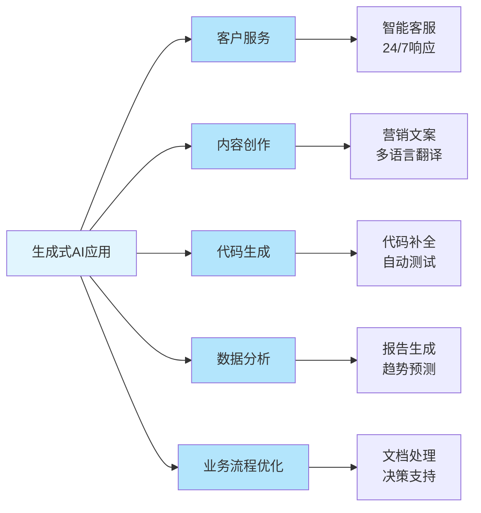
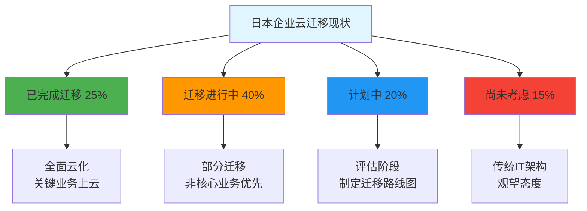
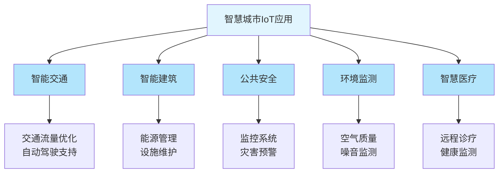
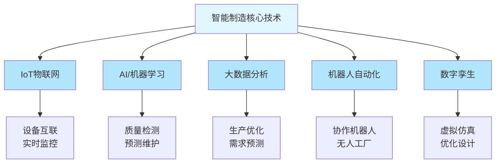
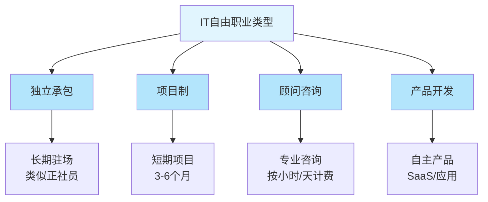

# 第五章：行业机会与热门领域

随着数字化转型（DX）的深入推进和新兴技术的快速发展，日本IT行业正在经历深刻的变革。本章将深入分析当前最具发展潜力的技术领域、行业应用场景，以及创业与自由职业的机会，为求职者、从业者和投资者提供全面的市场洞察。

---

## 5.1 热门技术领域

日本IT市场正在经历技术驱动的结构性变革。以下五大技术领域不仅市场规模庞大，而且增长迅速，代表着未来5-10年的核心发展方向。

### 5.1.1 AI/机器学习

#### 市场规模与增长

人工智能（AI）和机器学习已成为日本IT行业最炙手可热的领域。根据最新市场研究数据：

| 指标 | 数据 |
|------|------|
| **2024年市场规模** | 89亿美元 |
| **2029年预测规模** | 279亿美元 |
| **年复合增长率（CAGR）** | 25.7% |
| **企业采用率** | 约40%（2024年） |
| **预计采用率** | 超过70%（2027年） |

这一增长速度在所有技术领域中位居首位，反映出AI技术在日本企业中的快速渗透。

#### 生成式AI热潮

2023年以来，以ChatGPT为代表的生成式AI（Generative AI）在日本掀起了新一轮技术革命：

**企业应用现状：**
- **大型企业**：超过60%的日本大型企业已开始试验或部署生成式AI
- **中小企业**：约25%的中小企业正在探索生成式AI应用
- **投资规模**：2024年日本企业在生成式AI上的投资预计超过2000亿日元

**主要应用场景：**

**典型应用案例：**

1. **三菱UFJ银行**：部署生成式AI辅助客户咨询，处理效率提升40%
2. **NTT Data**：开发企业级生成式AI平台，服务超过500家客户
3. **乐天集团**：利用生成式AI优化商品描述和营销内容，转化率提升25%

#### 传统机器学习应用

除了生成式AI，传统机器学习在以下领域持续发挥重要作用：

| 应用领域 | 具体应用 | 市场需求 |
|---------|---------|---------|
| **预测分析** | 需求预测、库存优化、价格预测 | ⭐⭐⭐⭐⭐ |
| **图像识别** | 质量检测、安防监控、医疗影像 | ⭐⭐⭐⭐⭐ |
| **自然语言处理** | 文本分类、情感分析、机器翻译 | ⭐⭐⭐⭐ |
| **推荐系统** | 电商推荐、内容推荐、个性化服务 | ⭐⭐⭐⭐ |
| **异常检测** | 欺诈检测、设备故障预测、网络安全 | ⭐⭐⭐⭐⭐ |

#### 人才需求与技能要求

AI/机器学习领域的人才需求呈现爆发式增长：

**需求现状：**
- **职位增长**：2024年AI相关职位数量同比增长180%
- **薪资水平**：AI工程师平均年收800-1200万日元，高级专家可达1500-2000万日元
- **人才缺口**：预计到2027年，日本将面临约12万AI人才的缺口

**核心技能要求：**

| 技能类别 | 具体技能 | 重要程度 |
|---------|---------|---------|
| **编程语言** | Python、R、Julia | ⭐⭐⭐⭐⭐ |
| **机器学习框架** | TensorFlow、PyTorch、Scikit-learn | ⭐⭐⭐⭐⭐ |
| **深度学习** | CNN、RNN、Transformer、GAN | ⭐⭐⭐⭐ |
| **数据处理** | Pandas、NumPy、SQL、Spark | ⭐⭐⭐⭐⭐ |
| **云平台** | AWS SageMaker、Azure ML、GCP AI | ⭐⭐⭐⭐ |
| **MLOps** | 模型部署、监控、版本管理 | ⭐⭐⭐⭐ |
| **数学基础** | 线性代数、概率统计、优化理论 | ⭐⭐⭐⭐ |

**热门认证：**
- Google Cloud Professional ML Engineer
- AWS Certified Machine Learning - Specialty
- Microsoft Azure AI Engineer Associate
- 日本ディープラーニング協会（JDLA）认证

#### 发展趋势

**短期趋势（2024-2026）：**
1. 生成式AI的企业级应用加速落地
2. AI伦理和监管框架逐步完善
3. 小型化、轻量化模型需求增加
4. 多模态AI（文本+图像+语音）成为主流

**中长期趋势（2027-2030）：**
1. AGI（通用人工智能）研究取得突破
2. AI与IoT、5G深度融合
3. 边缘AI计算能力大幅提升
4. AI驱动的自动化决策系统普及

---

### 5.1.2 云计算

#### 市场规模与增长

云计算已成为日本企业数字化转型的核心基础设施。市场数据显示：

| 指标 | 数据 |
|------|------|
| **2025年市场规模** | 314亿美元 |
| **2030年预测规模** | 698亿美元 |
| **年复合增长率（CAGR）** | 17.3% |
| **企业云采用率** | 约65%（2024年） |
| **公有云占比** | 55% |
| **私有云占比** | 30% |
| **混合云占比** | 15% |

#### 主要云服务商市场份额

日本云计算市场呈现"三强争霸"格局：

| 云服务商 | 市场份额 | 主要优势 | 典型客户 |
|---------|---------|---------|---------|
| **AWS** | 约35% | 服务最全面、生态最成熟 | 索尼、丰田、KDDI |
| **Microsoft Azure** | 约25% | 企业集成、混合云方案 | 三菱商事、日立、NTT |
| **Google Cloud** | 约15% | AI/ML能力、数据分析 | 乐天、DeNA、Mercari |
| **日本本土云** | 约15% | 本地化服务、合规性 | 政府机构、金融机构 |
| **其他** | 约10% | 特定行业解决方案 | 各行业企业 |

**日本本土云服务商：**
- **NTT Communications（Arcstar Universal One）**
- **富士通（FUJITSU Cloud）**
- **NEC（NEC Cloud IaaS）**
- **さくらインターネット（Sakura Cloud）**

#### 企业云迁移趋势

日本企业的云迁移正在加速，但相比欧美仍显保守：

**迁移阶段分布（2024年）：**

**迁移驱动因素：**

| 驱动因素 | 重要性 | 说明 |
|---------|-------|------|
| **成本优化** | ⭐⭐⭐⭐⭐ | 减少硬件投资和维护成本 |
| **业务敏捷性** | ⭐⭐⭐⭐⭐ | 快速响应市场变化 |
| **可扩展性** | ⭐⭐⭐⭐ | 弹性资源配置 |
| **灾难恢复** | ⭐⭐⭐⭐⭐ | 提高业务连续性 |
| **创新能力** | ⭐⭐⭐⭐ | 快速采用新技术 |
| **远程办公支持** | ⭐⭐⭐⭐ | COVID-19后的新常态 |

**迁移障碍：**
1. **安全顾虑**（68%企业担忧）：数据主权、合规性问题
2. **技术债务**（55%）：老旧系统难以迁移
3. **技能缺口**（62%）：缺乏云架构和运维人才
4. **成本不确定性**（45%）：担心云成本失控
5. **组织阻力**（38%）：传统IT部门的抵触

#### 云计算人才需求

云计算专业人才在日本市场供不应求：

**需求现状：**
- **职位增长**：2024年云计算相关职位同比增长120%
- **薪资水平**：云架构师平均年收700-1100万日元，DevOps工程师600-900万日元
- **人才缺口**：预计到2027年，日本将面临约8万云计算人才的缺口

**核心技能要求：**

| 技能类别 | 具体技能 | 重要程度 |
|---------|---------|---------|
| **云平台** | AWS、Azure、GCP | ⭐⭐⭐⭐⭐ |
| **容器技术** | Docker、Kubernetes | ⭐⭐⭐⭐⭐ |
| **基础设施即代码** | Terraform、CloudFormation、Ansible | ⭐⭐⭐⭐ |
| **CI/CD** | Jenkins、GitLab CI、GitHub Actions | ⭐⭐⭐⭐ |
| **监控与日志** | Prometheus、Grafana、ELK Stack | ⭐⭐⭐⭐ |
| **网络与安全** | VPC、IAM、安全组配置 | ⭐⭐⭐⭐⭐ |
| **编程语言** | Python、Go、Shell脚本 | ⭐⭐⭐⭐ |

**热门认证：**
- AWS Certified Solutions Architect（Professional/Associate）
- Microsoft Azure Solutions Architect Expert
- Google Cloud Professional Cloud Architect
- Kubernetes认证（CKA、CKAD）

#### 发展趋势

**短期趋势（2024-2026）：**
1. 多云战略成为主流，避免供应商锁定
2. 云原生应用开发加速
3. FinOps（云成本优化）受到重视
4. 边缘计算与云计算融合

**中长期趋势（2027-2030）：**
1. 无服务器架构（Serverless）成为标准
2. 量子云计算服务商业化
3. 绿色云计算（碳中和）成为竞争要素
4. AI驱动的云资源自动优化

---

### 5.1.3 数据分析与大数据

#### 市场规模与重要性

在数据驱动决策的时代，数据分析和大数据技术已成为企业核心竞争力：

| 指标 | 数据 |
|------|------|
| **2024年市场规模** | 约120亿美元 |
| **2030年预测规模** | 约280亿美元 |
| **年复合增长率（CAGR）** | 15.2% |
| **企业数据战略采用率** | 约55%（2024年） |

#### 主要应用场景

**业务智能（BI）与可视化：**
- **工具**：Tableau、Power BI、Looker、Qlik
- **应用**：销售分析、运营监控、财务报表
- **市场需求**：⭐⭐⭐⭐⭐

**大数据处理：**
- **技术栈**：Hadoop、Spark、Kafka、Flink
- **应用**：日志分析、实时流处理、数据仓库
- **市场需求**：⭐⭐⭐⭐

**数据科学与高级分析：**
- **工具**：Python（Pandas、NumPy）、R、SQL
- **应用**：预测建模、客户细分、风险评估
- **市场需求**：⭐⭐⭐⭐⭐

**数据工程：**
- **技术**：ETL/ELT、数据管道、数据湖
- **工具**：Airflow、dbt、Snowflake、Databricks
- **市场需求**：⭐⭐⭐⭐⭐

#### 人才需求与技能

**职位类型与薪资：**

| 职位 | 平均年收 | 主要职责 |
|------|---------|---------|
| **数据科学家** | 700-1200万日元 | 建模、算法开发、业务洞察 |
| **数据工程师** | 650-1000万日元 | 数据管道、ETL、基础设施 |
| **数据分析师** | 500-800万日元 | 报表、可视化、业务分析 |
| **BI工程师** | 550-850万日元 | BI工具开发、仪表板设计 |

**核心技能要求：**
- SQL（必备）
- Python或R（数据科学）
- 数据可视化工具
- 统计学和数学基础
- 业务理解能力
- 沟通与讲故事能力

#### 发展趋势

1. **实时分析需求增加**：从批处理到流处理
2. **自助式BI普及**：业务人员直接使用分析工具
3. **数据治理重要性提升**：数据质量、隐私保护
4. **AI与数据分析融合**：AutoML、增强分析

---

### 5.1.4 网络安全

#### 市场规模与增长

随着网络威胁日益严峻，网络安全已成为企业的首要关注：

| 指标 | 数据 |
|------|------|
| **2024年市场规模** | 180亿美元 |
| **2033年预测规模** | 433亿美元 |
| **年复合增长率（CAGR）** | 10.3% |
| **企业安全投资占IT预算** | 平均12-15% |

#### 威胁态势

**日本面临的主要网络威胁：**

| 威胁类型 | 严重程度 | 趋势 |
|---------|---------|------|
| **勒索软件攻击** | ⭐⭐⭐⭐⭐ | ↗️ 持续上升 |
| **供应链攻击** | ⭐⭐⭐⭐ | ↗️ 快速增长 |
| **钓鱼攻击** | ⭐⭐⭐⭐⭐ | → 保持高位 |
| **DDoS攻击** | ⭐⭐⭐ | → 稳定 |
| **内部威胁** | ⭐⭐⭐⭐ | ↗️ 逐渐增加 |
| **IoT设备攻击** | ⭐⭐⭐⭐ | ↗️ 快速增长 |

**2024年重大安全事件：**
- 日本多家医疗机构遭勒索软件攻击，导致业务中断
- 某大型制造企业供应链被渗透，造成数据泄露
- 政府机构网站遭DDoS攻击，服务暂时中断

#### 合规要求

日本企业面临日益严格的安全合规要求：

**主要法规与标准：**
1. **个人信息保护法**（改正版2022年施行）
2. **サイバーセキュリティ基本法**（网络安全基本法）
3. **NISC（内閣サイバーセキュリティセンター）指南**
4. **金融机关向けFISC安全标准**
5. **医疗信息系统安全管理指南**

**国际标准：**
- ISO 27001（信息安全管理体系）
- SOC 2（服务组织控制）
- PCI DSS（支付卡行业数据安全标准）

#### 安全人才紧缺

网络安全是日本IT行业人才缺口最严重的领域之一：

**需求现状：**
- **人才缺口**：预计到2027年，日本将面临约20万网络安全人才的缺口
- **职位增长**：2024年安全相关职位同比增长150%
- **薪资水平**：安全工程师平均年收750-1300万日元，CISO可达2000万日元以上

**核心技能要求：**

| 技能领域 | 具体技能 | 重要程度 |
|---------|---------|---------|
| **网络安全基础** | TCP/IP、防火墙、IDS/IPS | ⭐⭐⭐⭐⭐ |
| **渗透测试** | Kali Linux、Metasploit、Burp Suite | ⭐⭐⭐⭐ |
| **安全运营** | SIEM、SOC、事件响应 | ⭐⭐⭐⭐⭐ |
| **云安全** | AWS Security、Azure Security、IAM | ⭐⭐⭐⭐ |
| **应用安全** | OWASP Top 10、代码审计、漏洞扫描 | ⭐⭐⭐⭐ |
| **合规与治理** | ISO 27001、风险评估、政策制定 | ⭐⭐⭐⭐ |
| **威胁情报** | 威胁狩猎、恶意软件分析 | ⭐⭐⭐ |

**热门认证：**
- CISSP（Certified Information Systems Security Professional）
- CEH（Certified Ethical Hacker）
- CompTIA Security+
- 情報処理安全確保支援士（日本国家资格）
- CISM（Certified Information Security Manager）

#### 发展趋势

**短期趋势（2024-2026）：**
1. 零信任架构（Zero Trust）加速部署
2. AI驱动的威胁检测与响应
3. 云原生安全工具普及
4. 供应链安全受到重视

**中长期趋势（2027-2030）：**
1. 量子加密技术商业化
2. 自动化安全运营（SOAR）成为标准
3. 隐私增强技术（PETs）广泛应用
4. 安全即服务（SECaaS）模式成熟

---

### 5.1.5 IoT物联网

#### 市场规模与增长

物联网正在推动日本制造业和智慧城市的数字化转型：

| 指标 | 数据 |
|------|------|
| **2024年市场规模** | 604亿美元[Mordor Intelligence, 2024] |
| **2033年预测规模** | 1860亿美元[Mordor Intelligence, 2024] |
| **年复合增长率（CAGR）** | 13.3%[Mordor Intelligence, 2024] |
| **连接设备数量** | 约15亿台（2024年）[总务省, 2024] |
| **预计设备数量** | 超过40亿台（2030年）[总务省, 2024] |

这使日本成为全球第三大IoT市场，仅次于中国和美国。

#### 主要应用领域

**工业IoT（IIoT）：**

日本作为制造业强国，工业IoT应用最为广泛：

| 应用场景 | 具体应用 | 市场规模（2024） |
|---------|---------|----------------|
| **智能工厂** | 设备监控、预测性维护、质量控制 | 约200亿美元 |
| **供应链管理** | 物流追踪、库存优化、需求预测 | 约80亿美元 |
| **能源管理** | 智能电网、能耗监控、优化调度 | 约60亿美元 |
| **设备即服务** | 远程监控、按使用付费模式 | 约40亿美元 |

**典型案例：**
- **日立制作所**：Lumada平台连接超过100万台工业设备
- **三菱电机**：e-F@ctory解决方案应用于全球500+工厂
- **小松制作所**：KOMTRAX系统监控全球60万台工程机械

**智慧城市：**

日本政府大力推进"Society 5.0"智慧社会建设：

**智慧城市试点项目：**
- **东京**：5G+IoT智能交通系统
- **大阪**：关西超级城市构想
- **福冈**：IoT推进Lab实证实验
- **札幌**：雪国型智慧城市

**消费级IoT：**
- **智能家居**：市场规模约50亿美元（2024年）
- **可穿戴设备**：健康监测、运动追踪
- **智能汽车**：车联网、自动驾驶辅助

#### 技术栈与人才需求

**核心技术：**

| 技术层 | 关键技术 | 重要程度 |
|-------|---------|---------|
| **感知层** | 传感器、RFID、摄像头 | ⭐⭐⭐⭐⭐ |
| **网络层** | 5G、LoRaWAN、NB-IoT、Wi-Fi 6 | ⭐⭐⭐⭐⭐ |
| **平台层** | AWS IoT、Azure IoT、Google Cloud IoT | ⭐⭐⭐⭐ |
| **应用层** | 数据分析、可视化、业务集成 | ⭐⭐⭐⭐⭐ |
| **安全** | 设备认证、数据加密、安全更新 | ⭐⭐⭐⭐⭐ |

**人才需求：**
- **IoT架构师**：平均年收800-1200万日元
- **嵌入式工程师**：平均年收650-950万日元
- **IoT数据工程师**：平均年收700-1000万日元

**核心技能：**
- 嵌入式系统开发（C/C++、Python）
- 无线通信协议（MQTT、CoAP、HTTP）
- 云平台IoT服务
- 数据处理与分析
- 网络安全

#### 发展趋势

**短期趋势（2024-2026）：**
1. 5G+IoT应用加速落地
2. 边缘计算能力增强
3. AI与IoT深度融合（AIoT）
4. 低功耗广域网（LPWAN）普及

**中长期趋势（2027-2030）：**
1. 数字孪生技术成熟
2. 6G网络支持超大规模IoT
3. 自主IoT系统（自我优化、自我修复）
4. IoT与区块链结合（设备身份、数据溯源）

---

### 5.1.6 热门技术领域总结

以下是五大热门技术领域的综合对比：

| 技术领域 | 市场规模（2024） | CAGR | 人才缺口 | 平均年收 | 入门难度 |
|---------|----------------|------|---------|---------|---------|
| **AI/机器学习** | 89亿美元 | 25.7% | 约12万人 | 800-1200万 | ⭐⭐⭐⭐ |
| **云计算** | 314亿美元 | 17.3% | 约8万人 | 700-1100万 | ⭐⭐⭐ |
| **数据分析** | 120亿美元 | 15.2% | 约6万人 | 650-1000万 | ⭐⭐⭐ |
| **网络安全** | 180亿美元 | 10.3% | 约20万人 | 750-1300万 | ⭐⭐⭐⭐ |
| **IoT物联网** | 604亿美元 | 13.3% | 约5万人 | 700-1000万 | ⭐⭐⭐⭐ |

**选择建议：**
- **追求高增长**：选择AI/机器学习
- **追求稳定需求**：选择云计算或网络安全
- **追求市场规模**：选择IoT物联网
- **追求入门容易**：选择数据分析或云计算
- **追求高薪**：选择AI或网络安全

---

## 5.2 行业应用领域

技术的价值最终体现在行业应用中。以下四大行业正在经历深刻的数字化转型，为IT人才提供了丰富的机会。

### 5.2.1 金融科技（FinTech）

#### 市场规模与增长

日本金融科技市场正在快速发展：

| 指标 | 数据 |
|------|------|
| **2024年市场规模** | 92亿美元 |
| **2033年预测规模** | 302亿美元 |
| **年复合增长率（CAGR）** | 14.1% |
| **FinTech企业数量** | 约400家（2024年） |
| **风险投资额** | 约1200亿日元（2024年） |

#### 主要细分领域

**数字支付：**

日本正在从现金社会向无现金社会转型：

| 支付方式 | 市场份额 | 代表企业/服务 |
|---------|---------|-------------|
| **现金** | 约60%（持续下降） | - |
| **信用卡** | 约25% | JCB、三井住友、VISA |
| **电子货币** | 约8% | Suica、PASMO、nanaco |
| **QR码支付** | 约7%（快速增长） | PayPay、LINE Pay、楽天Pay |

**无现金化目标：**
- 政府目标：2025年无现金支付比例达到40%
- 当前进展：2024年约32%
- 推动因素：政府补贴、商家优惠、便利性提升

**区块链与加密货币：**

日本是全球最早承认比特币合法地位的国家之一：

- **加密货币交易所**：约30家持牌交易所
- **监管框架**：金融厅（FSA）严格监管
- **企业应用**：供应链溯源、跨境支付、数字身份
- **CBDC研究**：日本银行推进数字日元试验

**典型企业：**
- **bitFlyer**：日本最大加密货币交易所
- **Coincheck**：用户友好型交易平台
- **LayerX**：企业级区块链解决方案

**保险科技（InsurTech）：**

- **市场规模**：约15亿美元（2024年）
- **主要创新**：AI核保、按需保险、健康数据驱动定价
- **代表企业**：justInCase、SOMPO Light Vortex

**财富管理科技（WealthTech）：**

- **机器人投顾**：WealthNavi、THEO、楽天ラップ
- **用户数**：超过100万人（2024年）
- **管理资产**：约1.5万亿日元

**监管科技（RegTech）：**

- **应用**：反洗钱（AML）、了解客户（KYC）、合规报告
- **需求驱动**：监管要求日益严格
- **技术**：AI、机器学习、自然语言处理

#### 人才需求

**职位类型与技能：**

| 职位 | 平均年收 | 核心技能 |
|------|---------|---------|
| **FinTech工程师** | 700-1100万日元 | 金融知识+技术能力 |
| **区块链开发者** | 800-1300万日元 | Solidity、智能合约 |
| **数据科学家** | 750-1200万日元 | 风险建模、欺诈检测 |
| **合规工程师** | 650-1000万日元 | 法规理解+技术实现 |

**必备知识：**
- 金融业务理解
- 安全与合规意识
- 数据分析能力
- 用户体验设计

#### 发展趋势

1. **嵌入式金融**（Embedded Finance）：非金融企业提供金融服务
2. **开放银行**（Open Banking）：API驱动的金融生态
3. **DeFi探索**：去中心化金融应用研究
4. **ESG金融科技**：可持续金融解决方案

---

### 5.2.2 医疗健康IT

#### 市场规模与增长

老龄化社会推动医疗健康IT快速发展：

| 指标 | 数据 |
|------|------|
| **2024年市场规模** | 292亿美元[Mordor Intelligence, 2024] |
| **2033年预测规模** | 558亿美元[Mordor Intelligence, 2024] |
| **年复合增长率（CAGR）** | 7.5%[Mordor Intelligence, 2024] |
| **65岁以上人口比例** | 约29%（2024年）[总务省, 2024] |
| **医疗IT投资占比** | 约3-4%（逐年提升）[厚生劳动省, 2024] |

#### 主要应用领域

**电子病历（EHR）与医疗信息系统：**

| 系统类型 | 普及率 | 主要功能 |
|---------|-------|---------|
| **电子病历** | 约57%（2024年） | 病历数字化、信息共享 |
| **处方系统** | 约75% | 电子处方、药物管理 |
| **影像管理** | 约80% | PACS、影像存储与传输 |
| **医院信息系统** | 约90%（大型医院） | 综合管理、业务流程 |

**政府推进计划：**
- **目标**：2030年全国医疗机构EHR普及率达到90%
- **投资**：政府补贴中小医疗机构数字化
- **标准化**：推进医疗数据交换标准（HL7 FHIR）

**远程医疗（Telemedicine）：**

COVID-19疫情加速了远程医疗的普及：

- **2020年前**：远程医疗受到严格限制
- **2020年4月**：临时放宽限制
- **2022年**：永久性制度化
- **2024年**：约30%的诊所提供远程医疗服务

**应用场景：**
- 在线问诊与处方
- 慢性病管理
- 心理健康咨询
- 偏远地区医疗支持

**代表企业：**
- **MICIN**：オンライン診療システム
- **メドレー**：CLINICS远程医疗平台
- **LINEヘルスケア**：LINE平台集成

**AI医疗诊断：**

AI正在革新医疗诊断流程：

| 应用领域 | 技术 | 准确率 | 应用状态 |
|---------|------|-------|---------|
| **影像诊断** | 深度学习、CNN | 90%+ | 广泛应用 |
| **病理诊断** | 图像识别 | 85%+ | 试点应用 |
| **疾病预测** | 机器学习 | 75-85% | 研究阶段 |
| **药物研发** | AI模拟 | - | 加速中 |

**典型案例：**
- **富士胶片**：AI辅助肺癌检测系统
- **Preferred Networks**：AI病理诊断
- **NEC**：AI视网膜病变检测

**健康管理与可穿戴设备：**

- **市场规模**：约40亿美元（2024年）
- **主要设备**：智能手表、健康手环、血压计、血糖仪
- **数据应用**：健康监测、疾病预警、保险定价

**代表产品：**
- Apple Watch（心电图、血氧监测）
- Fitbit（运动与睡眠追踪）
- オムロン（智能血压计）

#### 人才需求

**职位类型与技能：**

| 职位 | 平均年收 | 核心技能 |
|------|---------|---------|
| **医疗IT工程师** | 600-950万日元 | 医疗系统开发、HL7标准 |
| **医疗AI研究员** | 800-1400万日元 | 深度学习、医学影像处理 |
| **医疗数据分析师** | 650-1000万日元 | 统计分析、流行病学 |
| **医疗合规专家** | 700-1100万日元 | 医疗法规、个人信息保护 |

**特殊要求：**
- 医疗业务理解
- 严格的数据安全意识
- 合规与伦理考量
- 跨学科沟通能力

#### 发展趋势

1. **精准医疗**：基因组数据驱动的个性化治疗
2. **医疗数据互联互通**：打破信息孤岛
3. **AI辅助诊疗标准化**：监管框架完善
4. **预防医学**：从治疗到预防的转变

---

### 5.2.3 制造业DX

#### 市场规模与重要性

日本作为制造业强国，制造业数字化转型是国家战略重点：

| 指标 | 数据 |
|------|------|
| **智能制造市场规模（2024）** | 99.8亿美元 |
| **2033年预测规模** | 370亿美元 |
| **年复合增长率（CAGR）** | 15.7% |
| **制造业DX投资** | 约3万亿日元/年（2024年） |
| **智能工厂普及率** | 约35%（2024年） |

#### 工业4.0与智能制造

**核心技术应用：**

**主要应用场景：**

| 应用场景 | 技术方案 | 效益 |
|---------|---------|------|
| **预测性维护** | IoT传感器+AI预测 | 停机时间减少30-50% |
| **质量控制** | 机器视觉+深度学习 | 缺陷检测率提升至99%+ |
| **生产优化** | 大数据分析+优化算法 | 生产效率提升15-25% |
| **供应链管理** | 区块链+IoT追踪 | 库存成本降低20-30% |
| **能源管理** | AI优化+实时监控 | 能耗降低10-20% |

#### 典型企业案例

**大型制造企业DX实践：**

1. **丰田汽车**
   - **项目**：Toyota Production System（TPS）数字化
   - **技术**：IoT、AI、大数据
   - **成果**：生产周期缩短20%，质量提升15%

2. **日立制作所**
   - **平台**：Lumada工业IoT平台
   - **应用**：连接100万+设备，服务1000+客户
   - **成果**：帮助客户平均提升生产效率18%

3. **三菱电机**
   - **解决方案**：e-F@ctory智能工厂
   - **覆盖**：全球500+工厂
   - **技术**：边缘计算+AI+数字孪生

4. **发那科（FANUC）**
   - **产品**：FIELD system（工业IoT平台）
   - **特色**：机器人+CNC+AI集成
   - **应用**：智能化无人工厂

#### 中小企业DX挑战与支持

**中小制造企业面临的挑战：**

| 挑战 | 占比 | 主要原因 |
|------|------|---------|
| **资金不足** | 68% | DX投资回报周期长 |
| **人才缺乏** | 72% | 难以招聘和培养DX人才 |
| **技术选择困难** | 55% | 不知道选择什么技术 |
| **老旧设备** | 63% | 设备不支持数字化改造 |
| **组织阻力** | 48% | 员工抵触变革 |

**政府支持政策：**
- **ものづくり補助金**（制造业补助金）：最高1000万日元
- **IT導入補助金**（IT导入补助金）：最高450万日元
- **DX投資促進税制**：税收优惠
- **中小企業デジタル化応援隊**：专家咨询支持

#### 人才需求

**职位类型与技能：**

| 职位 | 平均年收 | 核心技能 |
|------|---------|---------|
| **制造业DX顾问** | 750-1200万日元 | 制造业知识+DX规划 |
| **工业IoT工程师** | 700-1100万日元 | IoT平台+嵌入式系统 |
| **生产数据分析师** | 650-1000万日元 | 数据分析+制造业务 |
| **机器人工程师** | 700-1150万日元 | 机器人编程+AI |

**必备知识：**
- 制造业流程理解（TPS、精益生产）
- 工业自动化技术
- 数据分析与优化
- 项目管理能力

#### 发展趋势

**短期趋势（2024-2026）：**
1. 中小企业DX加速，政府补贴力度加大
2. 5G+工业IoT应用落地
3. 协作机器人（Cobot）普及
4. 数字孪生技术商业化

**中长期趋势（2027-2030）：**
1. 完全自主的智能工厂
2. AI驱动的自适应生产系统
3. 供应链全链条数字化
4. 绿色制造与碳中和目标整合

---

### 5.2.4 零售与电商

#### 市场规模与增长

日本零售业正在经历线上线下融合的深刻变革：

| 指标 | 数据 |
|------|------|
| **电商市场规模（2024）** | 约22万亿日元[经济产业省, 2024] |
| **电商渗透率** | 约9.5%（持续增长）[经济产业省, 2024] |
| **零售IT投资** | 约1.5万亿日元/年[经济产业省, 2024] |
| **全渠道零售采用率** | 约45%（2024年）[经济产业省, 2024] |

#### 主要应用领域

**全渠道零售（Omnichannel）：**

线上线下融合成为零售业主流趋势：

| 应用场景 | 技术方案 | 代表企业 |
|---------|---------|---------|
| **线上下单店内取货** | 库存管理系统+移动应用 | ユニクロ、無印良品 |
| **店内体验线上购买** | AR试穿+电商平台 | ZOZOTOWN、楽天 |
| **移动支付** | QR码+NFC | PayPay、楽天Pay |
| **会员数据统一** | CRM+CDP平台 | セブン&アイ、イオン |

**典型案例：**

1. **优衣库（UNIQLO）**
   - **技术**：RFID标签、自助结账、库存实时同步
   - **成果**：结账时间缩短70%，库存准确率99%+

2. **7-Eleven**
   - **系统**：第七代POS系统+AI需求预测
   - **应用**：商品推荐、动态定价、库存优化
   - **成果**：缺货率降低30%，废弃率降低15%

**无人零售与自动化：**

- **无人便利店**：试点项目（东京、大阪）
- **自动结账**：AI摄像头识别商品
- **智能货架**：电子价签、库存监控
- **配送机器人**：最后一公里配送

**电商平台技术：**

| 技术领域 | 应用 | 重要性 |
|---------|------|-------|
| **推荐系统** | 个性化商品推荐 | ⭐⭐⭐⭐⭐ |
| **搜索优化** | AI搜索、图像搜索 | ⭐⭐⭐⭐⭐ |
| **动态定价** | 实时价格优化 | ⭐⭐⭐⭐ |
| **欺诈检测** | 交易安全、账户保护 | ⭐⭐⭐⭐⭐ |
| **物流优化** | 路径规划、仓储管理 | ⭐⭐⭐⭐⭐ |

**主要电商平台：**
- **楽天市场**：日本最大综合电商平台
- **Amazon Japan**：全球电商巨头
- **Yahoo! Shopping**：综合购物平台
- **ZOZOTOWN**：时尚电商领导者
- **Mercari**：二手交易平台

#### 消费者数据分析

**数据驱动的零售决策：**

- **客户细分**：RFM分析、行为聚类
- **需求预测**：时间序列分析、机器学习
- **价格优化**：弹性分析、竞争对手监控
- **营销效果评估**：A/B测试、归因分析

**隐私保护挑战：**
- 个人信息保护法合规
- Cookie限制影响
- 第一方数据重要性提升
- 隐私增强技术（PETs）应用

#### 物流科技

日本物流业面临劳动力短缺，科技成为解决方案：

| 技术 | 应用 | 效益 |
|------|------|------|
| **自动化仓储** | AGV、机器人拣选 | 效率提升50%+ |
| **配送优化** | AI路径规划 | 配送成本降低20% |
| **无人配送** | 配送机器人、无人机 | 试点阶段 |
| **物流可视化** | IoT追踪、实时监控 | 透明度提升 |

**代表企业：**
- **ヤマト運輸**：智能物流系统
- **佐川急便**：AI配送优化
- **Amazon**：自动化仓储中心

#### 人才需求

**职位类型与技能：**

| 职位 | 平均年收 | 核心技能 |
|------|---------|---------|
| **电商平台工程师** | 650-1000万日元 | Web开发、微服务架构 |
| **零售数据科学家** | 700-1150万日元 | 数据分析、推荐算法 |
| **全渠道系统架构师** | 750-1200万日元 | 系统集成、业务理解 |
| **物流优化工程师** | 650-950万日元 | 运筹优化、算法设计 |

#### 发展趋势

1. **社交电商**：SNS+电商融合
2. **直播带货**：实时互动购物
3. **订阅模式**：从交易到关系
4. **可持续零售**：环保包装、碳足迹追踪

---

## 5.3 创业与自由职业

日本IT行业的创业生态和自由职业市场正在快速发展，为IT人才提供了多元化的职业选择。

### 5.3.1 日本IT创业环境

#### 创业生态概况

近年来，日本政府大力推动创业，IT创业环境显著改善：

| 指标 | 数据 |
|------|------|
| **2024年创业融资总额** | 约7800亿日元 |
| **风险投资市场规模** | 200亿美元（2024年） |
| **预计2033年规模** | 858亿美元 |
| **独角兽企业数量** | 约10家（2024年） |
| **创业企业数量** | 约2000家（IT相关） |

#### 政府支持政策

**"创业五年计划"（2022-2027）：**

日本政府制定了雄心勃勃的创业支持计划：

| 政策目标 | 具体内容 |
|---------|---------|
| **创业数量** | 5年内创业数量翻倍 |
| **独角兽企业** | 培育100家独角兽企业 |
| **创业投资** | 风险投资规模10倍增长 |
| **创业教育** | 大学创业教育普及 |

**具体支持措施：**

1. **资金支持**
   - 创业补助金：最高1000万日元
   - 政府引导基金：投资早期创业企业
   - 税收优惠：天使投资税收减免

2. **制度改革**
   - 简化公司注册流程
   - 放宽外国人创业签证
   - 股权激励税制优化

3. **基础设施**
   - 创业孵化器和加速器
   - 共享办公空间
   - 创业社区活动

#### 融资环境

**融资阶段与金额：**

| 融资阶段 | 平均融资额 | 主要投资方 |
|---------|-----------|-----------|
| **种子轮** | 3000万-1亿日元 | 天使投资人、孵化器 |
| **A轮** | 3-10亿日元 | VC、CVC |
| **B轮** | 10-30亿日元 | VC、战略投资者 |
| **C轮及以后** | 30亿日元以上 | PE、大型VC |

**主要投资机构：**
- **VC**：JAFCO、Globis Capital、WiL
- **CVC**：Sony Innovation Fund、KDDI Open Innovation Fund
- **政府基金**：産業革新投資機構（JIC）

#### 热门创业领域

**2024年投资热点：**

| 领域 | 投资占比 | 代表企业 |
|------|---------|---------|
| **SaaS** | 25% | SmartHR、freee、Sansan |
| **生成式AI** | 20% | Sakana AI、Stability AI Japan |
| **FinTech** | 15% | PayPay、Paidy、Kyash |
| **HealthTech** | 12% | MICIN、メドレー |
| **物流科技** | 10% | Hacobu、GROUND |
| **其他** | 18% | 各细分领域 |

**成功案例：**

1. **Mercari（メルカリ）**
   - **领域**：二手交易平台
   - **估值**：超过5000亿日元
   - **成就**：日本首家独角兽企业之一

2. **SmartHR**
   - **领域**：HR SaaS
   - **估值**：超过1000亿日元
   - **客户**：超过50,000家企业

3. **Preferred Networks**
   - **领域**：AI/深度学习
   - **估值**：超过3500亿日元
   - **应用**：制造业、医疗、自动驾驶

#### 创业挑战

**主要障碍：**

| 挑战 | 严重程度 | 应对策略 |
|------|---------|---------|
| **人才招聘困难** | ⭐⭐⭐⭐⭐ | 股权激励、远程工作 |
| **市场规模有限** | ⭐⭐⭐⭐ | 早期国际化 |
| **风险规避文化** | ⭐⭐⭐⭐ | 改变社会认知 |
| **退出渠道少** | ⭐⭐⭐ | IPO、M&A增加 |
| **监管复杂** | ⭐⭐⭐ | 监管沙盒机制 |

#### 外国人创业机会

**外国人创业签证：**

日本政府为吸引外国创业者，推出了多种签证选项：

| 签证类型 | 适用对象 | 主要条件 |
|---------|---------|---------|
| **经营・管理签证** | 公司经营者 | 资本金500万日元以上 |
| **高度专门职签证** | 高技能创业者 | 积分70分以上 |
| **特定活动签证** | 创业准备期 | 6个月-1年准备期 |
| **スタートアップビザ** | 创业试验 | 特定自治体支持 |

**创业支持城市：**
- **东京**：最完善的创业生态
- **福冈**：外国人创业特区
- **大阪**：关西创新中心
- **名古屋**：制造业创业支持

**外国人创业优势：**
1. 国际视野和跨文化经验
2. 海外市场资源和网络
3. 多语言能力
4. 创新思维和灵活性

**挑战：**
1. 语言和文化障碍
2. 本地商业网络有限
3. 融资渠道相对狭窄
4. 法律和行政手续复杂

---

### 5.3.2 自由职业者（フリーランス）市场

#### 市场规模与增长

日本IT自由职业市场正在快速扩大：

| 指标 | 数据 |
|------|------|
| **IT自由职业者数量** | 约50万人（2024年） |
| **市场规模** | 约2.5万亿日元（2024年） |
| **年增长率** | 约8-10% |
| **平均年收** | 700-900万日元 |
| **高收入者（1000万+）** | 约25% |

#### 自由职业类型

**主要工作模式：**

**职位类型与收入：**

| 职位类型 | 月单价范围 | 年收入范围 | 需求程度 |
|---------|-----------|-----------|---------|
| **Web开发** | 60-100万日元 | 720-1200万 | ⭐⭐⭐⭐⭐ |
| **移动应用开发** | 70-110万日元 | 840-1320万 | ⭐⭐⭐⭐⭐ |
| **AI/ML工程师** | 80-150万日元 | 960-1800万 | ⭐⭐⭐⭐⭐ |
| **DevOps工程师** | 70-120万日元 | 840-1440万 | ⭐⭐⭐⭐ |
| **UI/UX设计师** | 60-100万日元 | 720-1200万 | ⭐⭐⭐⭐ |
| **项目经理** | 80-130万日元 | 960-1560万 | ⭐⭐⭐⭐ |
| **技术顾问** | 100-200万日元 | 1200-2400万 | ⭐⭐⭐⭐ |

#### 主要平台与中介

**自由职业匹配平台：**

| 平台名称 | 特点 | 主要用户 |
|---------|------|---------|
| **レバテックフリーランス** | 高单价案件、专业支持 | 中高级工程师 |
| **Midworks** | 福利保障完善 | 追求稳定的自由职业者 |
| **ギークスジョブ** | 案件数量多 | 各级别工程师 |
| **フォスターフリーランス** | IT基础设施案件 | 网络、服务器工程师 |
| **クラウドワークス** | 小型项目、远程工作 | 初级到中级 |
| **ランサーズ** | 综合性平台 | 各类IT人才 |

**平台服务内容：**
- 案件匹配与推荐
- 合同谈判支持
- 收入保障（部分平台）
- 福利服务（健康保险、年金等）
- 税务咨询
- 技能提升培训

#### 自由职业 vs 正社员对比

**优势对比：**

| 维度 | 自由职业 | 正社员 |
|------|---------|--------|
| **收入潜力** | ⭐⭐⭐⭐⭐ 高单价 | ⭐⭐⭐ 稳定但有上限 |
| **工作自由度** | ⭐⭐⭐⭐⭐ 高度灵活 | ⭐⭐ 受限于公司 |
| **技能提升** | ⭐⭐⭐⭐ 多样化项目 | ⭐⭐⭐ 取决于公司 |
| **收入稳定性** | ⭐⭐ 波动较大 | ⭐⭐⭐⭐⭐ 非常稳定 |
| **福利保障** | ⭐⭐ 需自行安排 | ⭐⭐⭐⭐⭐ 完善 |
| **职业安全** | ⭐⭐ 合同制 | ⭐⭐⭐⭐ 终身雇佣 |
| **社会信用** | ⭐⭐⭐ 逐渐改善 | ⭐⭐⭐⭐⭐ 高 |

**适合自由职业的人群：**
- 技能成熟的中高级工程师
- 追求高收入和工作自由的人
- 喜欢多样化项目的人
- 有一定财务储备的人
- 自律性强、善于自我管理的人

**不适合的情况：**
- 职业生涯早期（经验不足）
- 需要稳定收入和福利
- 依赖公司培训和指导
- 风险承受能力低
- 需要贷款（如购房）

#### 税务与社会保障

**税务处理：**

| 项目 | 说明 |
|------|------|
| **所得税** | 累进税率5%-45% |
| **住民税** | 约10% |
| **消费税** | 年收入1000万以上需缴纳 |
| **确定申告** | 每年2-3月自行申报 |
| **经费扣除** | 可扣除业务相关费用 |

**社会保障：**
- **国民健康保险**：自行加入和缴纳
- **国民年金**：基础养老金
- **小规模企业共済**：退休金储蓄
- **收入保障保险**：应对疾病或事故

#### 成功要素

**关键成功因素：**

1. **专业技能**
   - 至少3-5年实战经验
   - 掌握热门技术栈
   - 持续学习和更新技能

2. **人脉网络**
   - 建立客户关系
   - 参加技术社区活动
   - 维护良好口碑

3. **商业意识**
   - 合理定价
   - 合同谈判能力
   - 时间和项目管理

4. **财务管理**
   - 应急资金储备（6个月以上）
   - 税务规划
   - 收入多元化

5. **自我营销**
   - 个人品牌建设
   - 技术博客或作品集
   - SNS活跃度

---

### 5.3.3 副业（副業）机会

#### 副业市场概况

日本政府和企业逐步解禁副业，为IT人才提供了新机会：

| 指标 | 数据 |
|------|------|
| **允许副业的企业比例** | 约55%（2024年） |
| **从事副业的IT人才** | 约30% |
| **副业平均月收入** | 5-15万日元 |
| **高收入副业者（月20万+）** | 约10% |

#### 政策变化

**副业解禁趋势：**

| 时期 | 政策变化 |
|------|---------|
| **2018年以前** | 多数企业禁止副业 |
| **2018年** | 政府发布副业推进指南 |
| **2020年** | COVID-19加速副业普及 |
| **2024年** | 过半数企业允许副业 |

**企业态度转变原因：**
1. 人才保留策略
2. 员工技能提升
3. 创新思维引入
4. 社会趋势顺应

#### 热门副业类型

**IT副业机会：**

| 副业类型 | 时间投入 | 月收入范围 | 难度 |
|---------|---------|-----------|------|
| **Web开发** | 20-40小时 | 10-30万日元 | ⭐⭐⭐ |
| **移动应用开发** | 20-40小时 | 15-40万日元 | ⭐⭐⭐⭐ |
| **技术写作** | 10-20小时 | 5-15万日元 | ⭐⭐ |
| **在线教学** | 10-20小时 | 8-20万日元 | ⭐⭐ |
| **技术咨询** | 5-15小时 | 10-30万日元 | ⭐⭐⭐⭐ |
| **开源项目** | 灵活 | 0-20万日元 | ⭐⭐⭐ |
| **SaaS产品** | 灵活 | 0-50万+日元 | ⭐⭐⭐⭐⭐ |

**具体副业方向：**

1. **接单开发**
   - 平台：クラウドワークス、ランサーズ、ココナラ
   - 项目：网站开发、小程序、系统定制
   - 优势：灵活、收入直接

2. **技术教学**
   - 平台：Udemy、Schoo、ストアカ
   - 内容：编程课程、技术讲座
   - 优势：可复用、被动收入

3. **技术写作**
   - 平台：Qiita、Zenn、note
   - 内容：技术博客、电子书
   - 优势：建立个人品牌

4. **技术咨询**
   - 方式：按小时咨询、代码审查
   - 对象：初创企业、中小企业
   - 优势：高单价、时间短

5. **产品开发**
   - 类型：SaaS、移动应用、Chrome扩展
   - 收入：订阅费、广告、一次性购买
   - 优势：长期收益、资产积累

#### 副业注意事项

**法律与合规：**

| 注意事项 | 说明 |
|---------|------|
| **公司规定** | 确认公司副业政策 |
| **竞业禁止** | 不得与本职工作冲突 |
| **工作时间** | 不得占用本职工作时间 |
| **保密义务** | 不得泄露公司机密 |
| **税务申报** | 年收入20万以上需申报 |

**时间管理：**
- 合理分配时间，避免影响本职工作
- 优先保证睡眠和健康
- 选择与本职技能相关的副业
- 设定明确的副业目标和边界

**风险控制：**
- 不要过度承诺交付时间
- 签订明确的合同
- 保留工作记录和沟通证据
- 考虑责任保险

#### 副业成功案例

**典型路径：**

1. **从副业到创业**
   - 利用业余时间开发SaaS产品
   - 积累用户和收入
   - 达到一定规模后全职创业

2. **技能变现**
   - 本职工作积累专业技能
   - 通过咨询和教学变现
   - 建立个人品牌和影响力

3. **被动收入**
   - 创作技术课程或电子书
   - 开发工具或插件
   - 持续获得收益

---

## 5.4 本章总结

### 关键要点回顾

**热门技术领域：**
- **AI/机器学习**：最高增长率（25.7%），人才需求旺盛
- **云计算**：最大市场规模，企业数字化基础
- **网络安全**：最大人才缺口（20万），高薪领域
- **数据分析**：入门相对容易，应用广泛
- **IoT物联网**：制造业和智慧城市核心技术

**行业应用领域：**
- **金融科技**：快速增长（14.1% CAGR），监管逐步完善
- **医疗健康IT**：老龄化社会驱动，政府大力支持
- **制造业DX**：日本核心优势，政府补贴力度大
- **零售电商**：全渠道融合，技术创新活跃

**创业与自由职业：**
- **创业环境**：政府支持力度加大，生态逐步完善
- **自由职业**：市场快速增长，高收入潜力
- **副业机会**：政策放开，多元化收入来源

### 职业发展建议

**对于求职者：**
1. 选择高增长技术领域，确保长期职业竞争力
2. 关注行业应用，技术与业务结合更有价值
3. 持续学习，保持技能更新
4. 建立人脉网络，参与技术社区

**对于在职者：**
1. 评估当前技能与市场需求的匹配度
2. 考虑向热门领域转型或深化
3. 探索副业机会，增加收入和经验
4. 积累专业声誉，为未来发展铺路

**对于创业者：**
1. 选择有明确市场需求的细分领域
2. 充分利用政府支持政策和资源
3. 早期注重产品市场匹配（PMF）
4. 建立核心团队，重视人才招聘

### 未来展望

日本IT行业正处于快速变革期，以下趋势值得关注：

1. **技术融合加速**：AI+IoT、云+边缘计算等
2. **行业数字化深化**：从试点到全面应用
3. **工作方式多元化**：远程、自由职业、副业并存
4. **国际化程度提升**：更多跨国合作和人才流动
5. **可持续发展**：绿色IT、ESG成为新关注点

---

## 参考文献

1. Fortune Business Insights. (2024). *Japan Artificial Intelligence Market Report*.
2. GlobalData. (2024). *Japan ICT Market Size and Forecast*.
3. Mordor Intelligence. (2024). *Japan IoT Market Report*.
4. Mordor Intelligence. (2024). *Japan FinTech Market Report*.
5. Mordor Intelligence. (2024). *Japan Healthcare IT Market Report*.
6. 经济产业省. (2024). *IT人材需給調査*.
7. 总务省. (2024). *情報通信白書*.
8. 厚生劳动省. (2024). *外国人雇用状況調査*.
9. 金融厅. (2024). *FinTech産業レポート*.
10. Venture Capital Center. (2024). *日本ベンチャーキャピタル投資動向*.
11. レバテック. (2024). *フリーランスITエンジニア単価調査*.
12. IDC Japan. (2024). *Japan Cloud Market Forecast*.

---

**下一章预告：**

第六章将深入探讨日本数字化转型（DX）的现状与趋势，包括"2025数字悬崖"问题、企业DX实践、政府数字化政策等内容，帮助读者全面理解日本IT行业的转型挑战与机遇。

---

*本章完*
