# 第七章：未来展望

## 引言

在经历了前六章对日本IT行业现状的全面分析后，本章将目光投向未来，探讨2025-2030年日本IT行业的发展趋势。从市场规模预测到技术演进方向，从人才需求变化到实用建议，本章将为读者提供一个清晰的未来图景，帮助求职者、企业和投资者做出明智的决策。

---

## 7.1 市场预测

### 7.1.1 2025-2030年市场规模预测

根据日本经济产业省、IDC Japan、Gartner等权威机构的综合预测，日本ICT市场将在未来五年保持稳定增长。

#### **整体市场规模**

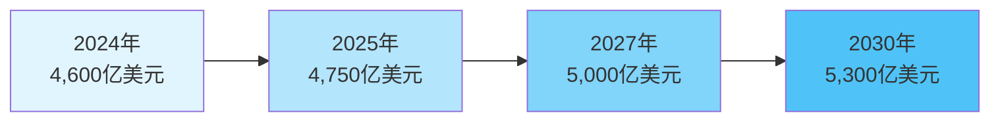

**市场规模预测表**

| 年份 | 市场规模（亿美元） | 同比增长率 | 累计增长率 |
|------|-------------------|-----------|-----------|
| 2024年 | 4,600 | - | - |
| 2025年 | 4,750 | 3.3% | 3.3% |
| 2026年 | 4,900 | 3.2% | 6.5% |
| 2027年 | 5,000 | 2.0% | 8.7% |
| 2028年 | 5,100 | 2.0% | 10.9% |
| 2029年 | 5,200 | 2.0% | 13.0% |
| 2030年 | 5,300 | 1.9% | 15.2% |

**年复合增长率（CAGR）**：2024-2030年为2.4%

#### **细分市场增长预测**

不同细分市场的增长速度存在显著差异，新兴技术领域将保持高速增长。

**各细分市场CAGR预测（2024-2030）**

| 细分市场 | 2024年规模 （亿美元） | 2030年规模 （亿美元） | CAGR | 增长驱动因素 |
|---------|------------------------|------------------------|------|-------------|
| **云计算服务** | 180 | 380 | 13.2% | DX转型、混合云需求 |
| **AI/机器学习** | 85 | 280 | 22.0% | 生成式AI普及、自动化需求 |
| **网络安全** | 95 | 185 | 11.7% | 网络威胁增加、法规要求 |
| **IoT解决方案** | 120 | 210 | 9.8% | 智能制造、智慧城市 |
| **大数据分析** | 75 | 145 | 11.6% | 数据驱动决策需求 |
| **5G/6G基础设施** | 140 | 220 | 7.8% | 通信网络升级 |
| **区块链** | 25 | 65 | 17.2% | 金融科技、供应链应用 |
| **量子计算** | 8 | 35 | 28.2% | 研发投入增加、商业化 |
| **传统IT服务** | 1,850 | 2,100 | 2.1% | 系统维护、更新需求 |
| **硬件设备** | 1,022 | 1,080 | 0.9% | 市场饱和、更新周期长 |

**高增长领域TOP 5**

1. **量子计算**（28.2% CAGR）：虽然基数小，但增长最快
2. **AI/机器学习**（22.0% CAGR）：生成式AI推动爆发式增长
3. **区块链**（17.2% CAGR）：金融和供应链应用扩大
4. **云计算服务**（13.2% CAGR）：企业上云持续推进
5. **网络安全**（11.7% CAGR）：安全威胁日益严峻

#### **市场结构变化**

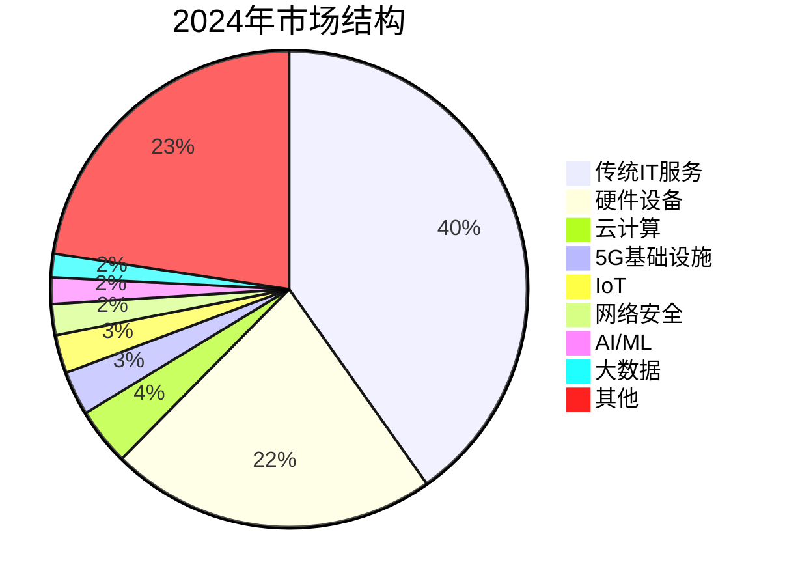

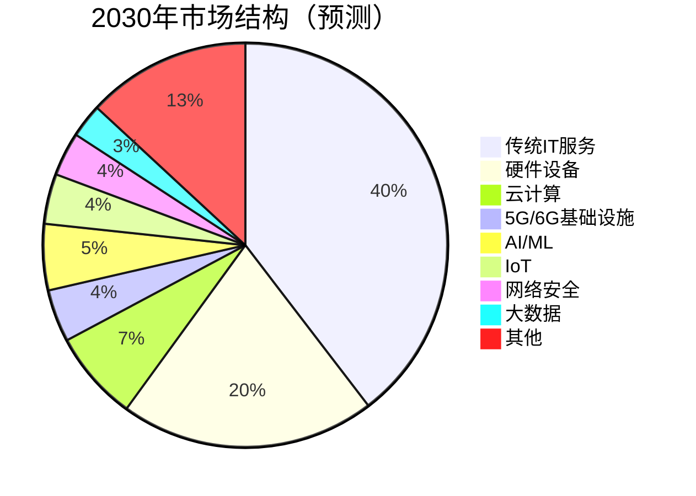

**关键变化**：
- 云计算占比从3.9%增至7.2%（+3.3个百分点）
- AI/ML占比从1.8%增至5.3%（+3.5个百分点）
- 传统IT服务和硬件占比下降，但绝对规模仍在增长

### 7.1.2 增长驱动因素

日本IT市场的增长受到多重因素推动，其中最关键的是数字化转型和政策支持。

#### **1. DX转型持续推进**

**企业DX投资预测**

| 年份 | DX投资额 （万亿日元） | 占IT总投资比例 | 实施DX企业比例 |
|------|------------------------|--------------|--------------|
| 2024年 | 6.05 | 36% | 68% |
| 2025年 | 6.80 | 39% | 73% |
| 2027年 | 8.20 | 44% | 82% |
| 2030年 | 10.50 | 50% | 90% |

**预测依据**：
- "2025数字悬崖"问题倒逼企业加速系统现代化
- 中小企业DX支援政策持续发力
- 成功案例示范效应扩大

#### **2. 政府数字化政策支持**

**数字厅重点项目投资计划（2024-2030）**

| 项目 | 投资额（亿日元） | 完成时间 | 带动市场规模 |
|------|----------------|---------|-------------|
| Gov-Cloud扩展 | 3,500 | 2027年 | 1.2万亿日元 |
| My Number 2.0 | 2,800 | 2026年 | 8,000亿日元 |
| 地方自治体系统统一 | 5,200 | 2025年 | 1.5万亿日元 |
| 数字人才培养 | 4,000 | 2030年 | - |
| 网络安全强化 | 2,500 | 持续 | 6,000亿日元 |

**政策红利**：
- 政府IT采购向国内企业倾斜
- 中小企业DX补助金（最高1,000万日元/社）
- 税收优惠（DX投资可抵扣30%税额）

#### **3. 5G/6G基础设施建设**

**通信基础设施投资时间表**

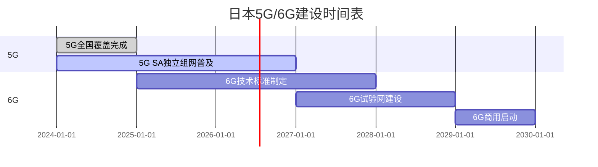

**投资规模**：
- 5G后期建设：2024-2027年，年均2,500亿日元
- 6G研发与建设：2025-2030年，累计1.8万亿日元

**带动效应**：
- 边缘计算市场：2030年达到4,500亿日元
- 智能工厂：5G应用推动市场规模达1.2万亿日元
- 远程医疗：5G支撑下市场规模达3,000亿日元

#### **4. 劳动力短缺推动自动化**

**劳动力短缺与自动化投资关系**

| 年份 | 劳动力缺口 （万人） | 自动化投资 （万亿日元） | RPA市场规模 （亿日元） |
|------|---------------------|------------------------|---------------------|
| 2024年 | 644 | 2.8 | 1,200 |
| 2025年 | 680 | 3.2 | 1,450 |
| 2027年 | 750 | 4.0 | 1,950 |
| 2030年 | 850 | 5.5 | 2,800 |

**自动化重点领域**：
- **制造业**：工业机器人、AI质检（市场规模2030年达2.5万亿日元）
- **物流业**：自动仓储、配送机器人（市场规模2030年达1.8万亿日元）
- **服务业**：RPA、聊天机器人（市场规模2030年达8,000亿日元）
- **农业**：智能农机、精准农业（市场规模2030年达5,000亿日元）

### 7.1.3 潜在风险与挑战

尽管日本IT市场前景乐观，但仍面临多重风险和挑战，需要保持警惕。

#### **1. 人才缺口持续扩大**

**IT人才供需缺口预测**

| 年份 | 人才需求 （万人） | 人才供给 （万人） | 缺口 （万人） | 缺口率 |
|------|------------------|------------------|--------------|-------|
| 2024年 | 1,133 | 489 | 644 | 56.8% |
| 2025年 | 1,165 | 485 | 680 | 58.4% |
| 2027年 | 1,220 | 470 | 750 | 61.5% |
| 2030年 | 1,280 | 430 | 850 | 66.4% |

**风险分析**：
- **供给侧问题**：少子高龄化导致劳动力总量下降，IT人才供给持续减少
- **需求侧压力**：DX转型、AI普及推动人才需求快速增长
- **结构性矛盾**：高端人才（AI、安全专家）极度短缺，传统技能人才过剩
- **国际竞争**：日本薪资水平相对较低，难以吸引和留住顶尖人才

**潜在影响**：
- 项目延期率上升（预计从目前的35%增至2030年的50%）
- 人力成本上涨（预计年均增长5-7%）
- 企业被迫外包或离岸开发（安全风险增加）
- 创新能力受限，与欧美差距扩大

#### **2. 国际竞争加剧**

**日本vs全球主要市场竞争力对比**

| 指标 | 日本 | 美国 | 中国 | 印度 | 日本排名 |
|------|------|------|------|------|---------|
| **市场规模**（2024） | 4,600亿美元 | 1.8万亿美元 | 1.2万亿美元 | 2,500亿美元 | 第3位 |
| **增长率**（CAGR） | 2.4% | 5.8% | 8.2% | 12.5% | 第4位 |
| **独角兽企业数** | 6家 | 650家 | 340家 | 68家 | 第4位 |
| **AI专利数**（2023） | 12,400件 | 45,800件 | 38,600件 | 5,200件 | 第3位 |
| **平均薪资**（美元） | 68,000 | 115,000 | 45,000 | 28,000 | 第2位 |
| **英语能力指数** | 低 | 高 | 中低 | 高 | 第4位 |

**竞争劣势**：
- **创新速度慢**：大企业决策流程长，创业生态不活跃
- **全球化程度低**：语言障碍、内向型文化限制国际扩张
- **薪资竞争力弱**：相比美国低40%，难以吸引全球顶尖人才
- **市场增速慢**：2.4%的CAGR远低于全球平均5.5%

**应对策略**：
- 聚焦细分领域（机器人、汽车电子、精密制造）建立优势
- 加强与亚洲邻国合作，构建区域生态系统
- 提升薪资水平和工作环境，吸引外国人才
- 推动企业国际化，参与全球竞争

#### **3. 经济不确定性**

**影响IT市场的宏观经济因素**

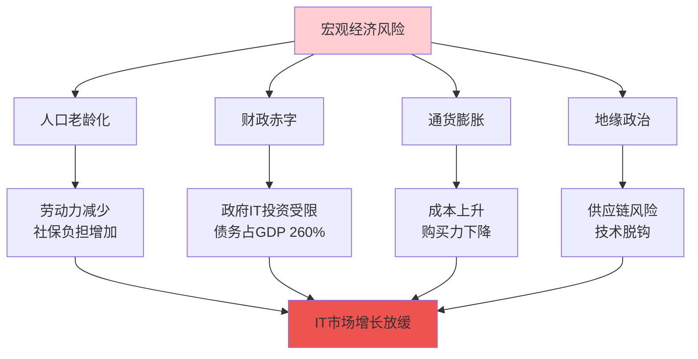

**具体风险**：

1. **人口老龄化**
   - 2030年65岁以上人口占比将达31.2%
   - 社保支出增加，挤压IT投资预算
   - 消费市场萎缩，B2C IT服务需求下降

2. **财政赤字**
   - 政府债务占GDP比例260%（全球最高）
   - 数字厅预算可能削减（2025年后增长放缓）
   - 中小企业补助金可持续性存疑

3. **通货膨胀**
   - 日元贬值推高进口IT设备成本
   - 能源价格上涨影响数据中心运营
   - 工资上涨压力增加企业IT投资负担

4. **地缘政治**
   - 中美科技竞争影响供应链（半导体、云服务）
   - 数据本地化要求增加合规成本
   - 技术出口管制限制国际合作

**情景分析**：

| 情景 | 概率 | 2030年市场规模 | 影响 |
|------|------|---------------|------|
| **乐观情景** | 25% | 5,800亿美元 | 经济复苏、改革成功 |
| **基准情景** | 50% | 5,300亿美元 | 当前趋势延续 |
| **悲观情景** | 25% | 4,600亿美元 | 经济衰退、改革停滞 |

#### **4. 技术安全风险**

**网络安全威胁趋势**

| 威胁类型 | 2023年损失 （亿日元） | 2030年预测 （亿日元） | 增长率 |
|---------|---------------------|---------------------|-------|
| 勒索软件攻击 | 850 | 2,100 | +147% |
| 数据泄露 | 1,200 | 2,800 | +133% |
| 供应链攻击 | 450 | 1,500 | +233% |
| AI驱动攻击 | 120 | 1,200 | +900% |
| IoT设备攻击 | 280 | 950 | +239% |
| **合计** | **2,900** | **8,550** | **+195%** |

**新兴安全挑战**：

1. **AI安全**
   - 生成式AI被用于钓鱼攻击、深度伪造
   - AI模型投毒、对抗样本攻击
   - AI决策的可解释性和责任归属

2. **量子威胁**
   - 量子计算机可能破解现有加密算法
   - 需要迁移到后量子密码学（PQC）
   - 预计2030年前后成为现实威胁

3. **供应链安全**
   - 开源软件漏洞（Log4j事件教训）
   - 第三方服务依赖风险
   - 硬件后门和固件攻击

4. **关键基础设施**
   - 电力、交通、医疗系统数字化带来新风险
   - 国家级APT攻击增加
   - 需要建立国家级防御体系

**应对措施**：
- 网络安全投资从2024年95亿美元增至2030年185亿美元
- 建立CSIRT（计算机安全事件响应团队）
- 推行零信任架构（Zero Trust）
- 加强国际合作和情报共享

---

## 7.2 技术趋势

### 7.2.1 生成式AI的影响

生成式AI（Generative AI）是2023年以来最具颠覆性的技术趋势，将深刻改变日本IT行业的各个方面。

#### **日本企业AI采用现状与预测**

**生成式AI采用率预测**

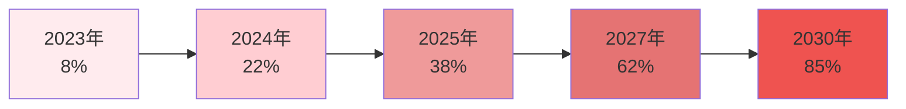

**按企业规模分类的采用率（2024年）**

| 企业规模 | 采用率 | 主要应用场景 | 平均投资额 （万日元） |
|---------|-------|------------|---------------------|
| **大企业**（1000人+） | 45% | 客服、内容生成、代码辅助 | 5,000 |
| **中型企业**（100-999人） | 18% | 营销文案、数据分析 | 800 |
| **小企业**（10-99人） | 8% | 文档生成、翻译 | 150 |
| **全体平均** | 22% | - | 1,200 |

**2030年预测**：
- 大企业采用率将达95%
- 中型企业采用率将达85%
- 小企业采用率将达70%

#### **AI对IT人才需求的影响**

**技能需求变化预测**

| 技能类别 | 2024年需求 | 2030年需求 | 变化率 | 趋势 |
|---------|-----------|-----------|-------|------|
| **AI/ML工程师** | 8.5万人 | 22万人 | +159% | ⬆️⬆️⬆️ |
| **Prompt工程师** | 0.5万人 | 5万人 | +900% | ⬆️⬆️⬆️ |
| **AI伦理专家** | 0.2万人 | 2万人 | +900% | ⬆️⬆️⬆️ |
| **数据科学家** | 6万人 | 12万人 | +100% | ⬆️⬆️ |
| **云架构师** | 5万人 | 9万人 | +80% | ⬆️⬆️ |
| **传统程序员** | 85万人 | 75万人 | -12% | ⬇️ |
| **系统运维** | 45万人 | 35万人 | -22% | ⬇️⬇️ |
| **测试工程师** | 28万人 | 18万人 | -36% | ⬇️⬇️ |

**AI辅助开发的影响**：

根据GitHub Copilot、Amazon CodeWhisperer等工具的使用数据：
- **代码编写速度**：提升40-55%
- **代码质量**：bug减少15-25%
- **学习曲线**：新手上手时间缩短30%
- **生产力提升**：整体开发效率提升25-35%

**对就业的双重影响**：

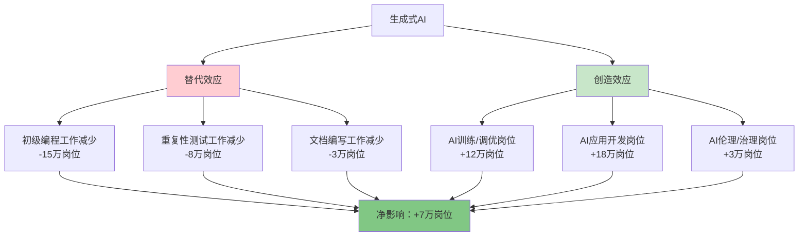

**结论**：虽然AI会替代部分初级岗位，但会创造更多高价值岗位，净效应为正。

#### **AI伦理与监管动向**

**日本AI监管框架（2024-2030）**

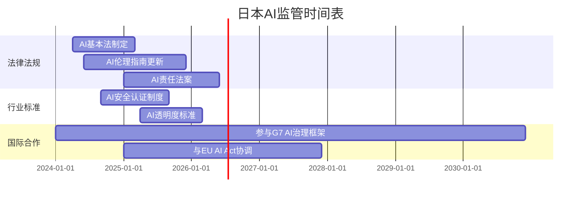

**重点监管领域**：

1. **高风险AI应用**
   - 医疗诊断AI：需要临床验证和认证
   - 金融信用评估：禁止歧视性算法
   - 招聘筛选AI：确保公平性和透明度
   - 自动驾驶：严格安全标准

2. **数据隐私保护**
   - AI训练数据的合规性审查
   - 个人信息保护法（APPI）适用于AI
   - 数据跨境传输限制

3. **知识产权**
   - AI生成内容的版权归属
   - AI训练使用版权作品的合法性
   - 预计2025年出台明确规定

4. **责任归属**
   - AI决策错误的责任主体
   - 开发者vs使用者责任划分
   - 保险和赔偿机制

**对企业的影响**：
- 合规成本增加（预计占AI投资的10-15%）
- 需要配备AI伦理官和法务团队
- 透明度要求可能限制某些AI应用
- 但长期有利于建立信任和可持续发展

### 7.2.2 量子计算发展

量子计算被视为下一代计算革命，日本政府和企业正在积极布局。

#### **日本量子计算战略**

**国家量子技术创新战略（2020-2030）**

| 阶段 | 时间 | 目标 | 投资额 |
|------|------|------|-------|
| **第一阶段** | 2020-2023 | 基础研究、人才培养 | 1,000亿日元 |
| **第二阶段** | 2024-2027 | 原型机开发、应用探索 | 2,500亿日元 |
| **第三阶段** | 2028-2030 | 商业化、产业应用 | 4,000亿日元 |
| **合计** | 2020-2030 | - | **7,500亿日元** |

**重点研发方向**：

1. **超导量子计算**
   - 理化学研究所（RIKEN）：64量子比特系统
   - 目标2027年：100量子比特
   - 目标2030年：1000量子比特

2. **光量子计算**
   - 东京大学、NTT合作研发
   - 优势：室温运行、易于扩展
   - 目标2030年：实用化光量子计算机

3. **量子退火**
   - 富士通、日立、NEC投入研发
   - 应用于组合优化问题
   - 已有商业化产品

4. **量子通信**
   - 量子密钥分发（QKD）网络建设
   - 目标2027年：东京-大阪量子通信干线
   - 目标2030年：全国量子通信网络

#### **主要研究机构与企业布局**

**量子计算生态系统**

| 机构/企业 | 类型 | 研发重点 | 量子比特数 | 商业化时间 |
|----------|------|---------|-----------|-----------|
| **理化学研究所** | 研究机构 | 超导量子计算 | 64（2024） | 2028年 |
| **东京大学** | 大学 | 光量子计算 | - | 2030年 |
| **富士通** | 企业 | 量子退火、超导 | 36（2024） | 2026年 |
| **日立** | 企业 | 量子退火 | - | 2025年 |
| **NEC** | 企业 | 超导量子计算 | - | 2027年 |
| **NTT** | 企业 | 光量子、量子通信 | - | 2028年 |
| **东芝** | 企业 | 量子密码 | - | 已商用 |
| **IBM Japan** | 外企 | 云量子计算服务 | 127（访问） | 已商用 |

**产学合作项目**：
- **Q-LEAP**（量子飞跃旗舰计划）：10年1,000亿日元
- **量子创新中心**：东京、大阪、京都设立
- **量子人才培养**：目标2030年培养1万名量子工程师

#### **商业化时间表预测**

**量子计算应用成熟度预测**

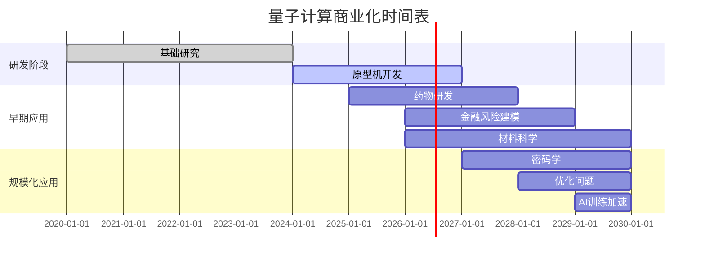

**应用领域与时间表**

| 应用领域 | 当前状态 | 预计商用时间 | 市场规模（2030） |
|---------|---------|------------|----------------|
| **药物研发** | 实验阶段 | 2027年 | 800亿日元 |
| **金融建模** | 概念验证 | 2028年 | 600亿日元 |
| **材料设计** | 实验阶段 | 2028年 | 500亿日元 |
| **密码破解/防护** | 研究阶段 | 2029年 | 1,200亿日元 |
| **物流优化** | 早期应用 | 2026年 | 400亿日元 |
| **AI训练** | 研究阶段 | 2030年 | 700亿日元 |

**对IT行业的影响**：

1. **短期（2024-2027）**
   - 量子算法研究岗位增加
   - 量子云服务开始普及
   - 后量子密码学迁移启动

2. **中期（2027-2030）**
   - 量子计算专业人才需求激增（预计5,000人）
   - 特定领域开始商业应用
   - 传统加密系统面临威胁

3. **长期（2030+）**
   - 量子计算成为主流计算范式之一
   - 催生新的软件开发范式
   - 重塑IT安全架构

**挑战与风险**：
- 技术难度高，商业化时间可能延后
- 需要极低温环境，运营成本高
- 量子人才极度短缺
- 与经典计算机的接口和集成复杂

### 7.2.3 6G与下一代通信

6G（第六代移动通信技术）被视为2030年代的关键基础设施，日本正在积极推进研发和标准制定。

#### **日本6G研发进展**

**Beyond 5G推进战略**

日本总务省于2020年启动"Beyond 5G推进战略"，目标是在6G时代占据技术制高点。

**6G技术指标目标（vs 5G）**

| 指标 | 5G | 6G目标 | 提升倍数 |
|------|-----|--------|---------|
| **峰值速率** | 20 Gbps | 1 Tbps | 50倍 |
| **延迟** | 1 ms | 0.1 ms | 10倍 |
| **连接密度** | 100万/km² | 1000万/km² | 10倍 |
| **能效** | 基准 | 100倍 | 100倍 |
| **定位精度** | 1-10m | 10cm | 10-100倍 |
| **频谱效率** | 基准 | 5-10倍 | 5-10倍 |

**6G关键技术**：

1. **太赫兹通信（THz）**
   - 频段：100 GHz - 10 THz
   - 优势：超高带宽、超高速率
   - 挑战：传播距离短、穿透力弱
   - 日本研发进展：NTT、KDDI已实现100m距离100Gbps传输

2. **空天地一体化网络**
   - 卫星通信与地面网络融合
   - 低轨卫星（LEO）星座
   - 高空平台（HAPS）
   - 日本计划：2028年发射首批6G试验卫星

3. **智能超表面（RIS）**
   - 可重构智能表面技术
   - 改善信号覆盖和质量
   - 降低能耗
   - 日本企业：NTT、三菱电机领先

4. **AI原生网络**
   - AI深度融入网络架构
   - 自优化、自修复
   - 预测性维护
   - 目标：运营成本降低50%

#### **研发投资与时间表**

**日本6G研发投资计划**

| 阶段 | 时间 | 主要任务 | 投资额（亿日元） |
|------|------|---------|----------------|
| **研究阶段** | 2020-2025 | 基础技术研究、概念验证 | 3,000 |
| **开发阶段** | 2025-2028 | 标准制定、原型开发 | 6,000 |
| **试验阶段** | 2028-2030 | 试验网建设、应用测试 | 9,000 |
| **商用准备** | 2030-2032 | 商用网络部署 | 15,000 |
| **合计** | 2020-2032 | - | **33,000** |

**6G发展时间线**

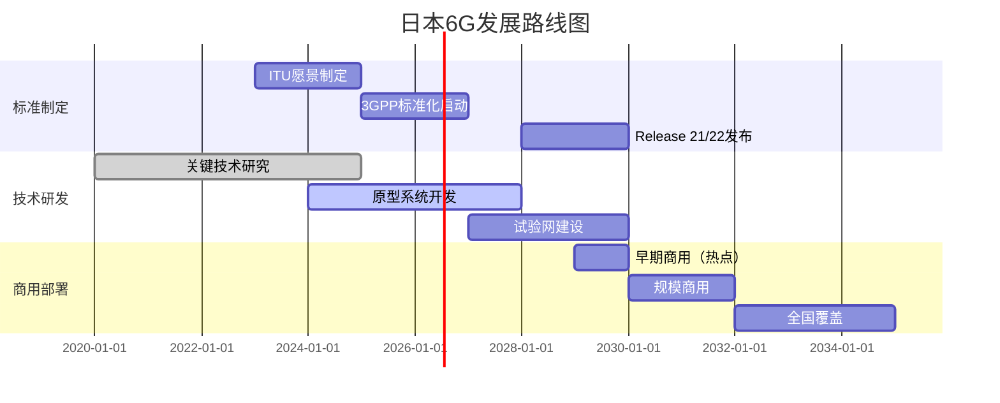

#### **主要参与机构**

**日本6G研发生态系统**

| 机构类型 | 主要参与者 | 研发重点 | 投资额 |
|---------|-----------|---------|-------|
| **运营商** | NTT Docomo、KDDI、软银 | 网络架构、应用场景 | 1.2万亿日元 |
| **设备商** | NEC、富士通、三菱电机 | 基站、终端设备 | 8,000亿日元 |
| **研究机构** | NICT、理化学研究所 | 基础技术、标准 | 2,000亿日元 |
| **大学** | 东京大学、东工大、大阪大学 | 前沿技术研究 | 1,000亿日元 |
| **芯片厂商** | 索尼、瑞萨、东芝 | 6G芯片、半导体 | 5,000亿日元 |

**国际合作**：
- **日美6G联盟**：2021年成立，共同研发和标准制定
- **日欧合作**：与欧盟Horizon Europe项目对接
- **亚太合作**：与韩国、新加坡等国技术交流

#### **6G应用场景与市场预测**

**6G十大应用场景**

| 应用场景 | 技术要求 | 市场规模（2035） | 成熟时间 |
|---------|---------|----------------|---------|
| **全息通信** | 超高带宽、低延迟 | 2.5万亿日元 | 2032年 |
| **数字孪生** | 高精度定位、实时同步 | 3.8万亿日元 | 2031年 |
| **脑机接口** | 超低延迟、高可靠 | 1.2万亿日元 | 2033年 |
| **触觉互联网** | 0.1ms延迟 | 1.8万亿日元 | 2032年 |
| **自动驾驶L5** | 高可靠、低延迟 | 5.5万亿日元 | 2030年 |
| **远程手术** | 超低延迟、高可靠 | 8,000亿日元 | 2031年 |
| **智慧城市** | 海量连接、AI融合 | 4.2万亿日元 | 2030年 |
| **工业元宇宙** | 高带宽、低延迟 | 3.5万亿日元 | 2032年 |
| **空天地一体** | 卫星通信融合 | 2.0万亿日元 | 2033年 |
| **感知通信** | 雷达通信一体化 | 1.5万亿日元 | 2034年 |

**6G市场规模预测**

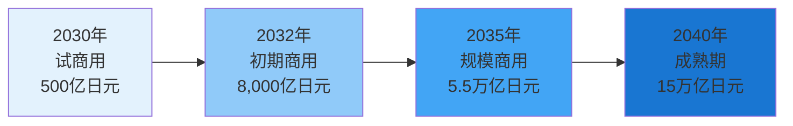

#### **对IT行业的影响**

**6G带来的产业机会**

1. **网络设备市场**
   - 6G基站、核心网设备
   - 预计2030-2035年市场规模：3.5万亿日元
   - 主要受益企业：NEC、富士通、三菱电机

2. **终端设备市场**
   - 6G智能手机、IoT设备
   - 预计2030-2035年市场规模：8万亿日元
   - 主要受益企业：索尼、夏普、京瓷

3. **芯片与半导体**
   - 6G基带芯片、射频芯片
   - 预计2030-2035年市场规模：2.8万亿日元
   - 主要受益企业：瑞萨、索尼半导体

4. **应用与服务**
   - XR（AR/VR/MR）、元宇宙、数字孪生
   - 预计2030-2035年市场规模：12万亿日元
   - 机会：内容创作、平台运营、应用开发

**人才需求**：
- **6G网络工程师**：2030年需求约2万人
- **太赫兹技术专家**：2030年需求约5,000人
- **AI网络优化工程师**：2030年需求约1.5万人
- **6G应用开发者**：2030年需求约8万人

**挑战**：
- 技术复杂度高，研发周期长
- 标准制定存在国际竞争
- 基础设施投资巨大（预计15万亿日元）
- 商业模式尚不清晰

---

## 7.3 人才市场展望

### 7.3.1 人才需求变化

未来五年，日本IT人才市场将经历深刻变革，技能需求结构将发生显著变化。

#### **2030年IT人才缺口预测**

**人才供需总体趋势**

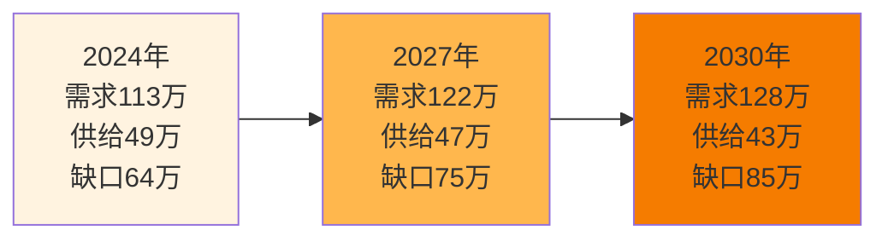

**按技能领域分类的人才缺口（2030年）**

| 技能领域 | 需求（万人） | 供给（万人） | 缺口（万人） | 缺口率 | 平均年薪（万日元） |
|---------|------------|------------|------------|-------|------------------|
| **AI/机器学习** | 22.0 | 6.5 | 15.5 | 70% | 850 |
| **网络安全** | 18.5 | 5.2 | 13.3 | 72% | 820 |
| **云计算/DevOps** | 16.0 | 6.8 | 9.2 | 58% | 750 |
| **数据科学/分析** | 12.0 | 4.5 | 7.5 | 63% | 780 |
| **IoT/嵌入式** | 10.5 | 4.2 | 6.3 | 60% | 680 |
| **区块链** | 5.5 | 1.8 | 3.7 | 67% | 800 |
| **量子计算** | 1.5 | 0.3 | 1.2 | 80% | 1,200 |
| **Web/移动开发** | 28.0 | 15.5 | 12.5 | 45% | 580 |
| **系统运维** | 14.0 | 8.5 | 5.5 | 39% | 520 |
| **传统开发** | 35.0 | 25.0 | 10.0 | 29% | 480 |
| **其他** | 65.0 | 45.7 | 19.3 | 30% | 550 |
| **合计** | **228.0** | **124.0** | **104.0** | **46%** | **650** |

注：此表包含了所有IT相关岗位，缺口85万人是指核心IT技术岗位。

**高缺口技能TOP 5**

1. **量子计算**（80%缺口率）：极度稀缺，但需求基数小
2. **网络安全**（72%缺口率）：威胁增加，需求激增
3. **AI/机器学习**（70%缺口率）：最大缺口，15.5万人
4. **区块链**（67%缺口率）：金融科技推动
5. **数据科学**（63%缺口率）：数据驱动决策需求

#### **新兴技能需求**

**2025-2030年新兴技能需求增长**

| 新兴技能 | 2024年需求 | 2030年需求 | 增长率 | 主要应用领域 |
|---------|-----------|-----------|-------|------------|
| **Prompt工程** | 5,000人 | 5万人 | +900% | AI应用开发 |
| **AI伦理/治理** | 2,000人 | 2万人 | +900% | 合规、风险管理 |
| **量子算法** | 500人 | 5,000人 | +900% | 量子计算应用 |
| **边缘计算** | 8,000人 | 5万人 | +525% | IoT、5G应用 |
| **XR开发**（AR/VR/MR） | 1.2万人 | 6万人 | +400% | 元宇宙、培训 |
| **RPA开发** | 1.5万人 | 6万人 | +300% | 业务自动化 |
| **MLOps** | 3,000人 | 1.2万人 | +300% | AI模型运维 |
| **零信任架构** | 5,000人 | 1.8万人 | +260% | 网络安全 |

**传统技能需求变化**

| 传统技能 | 2024年需求 | 2030年需求 | 变化率 | 趋势分析 |
|---------|-----------|-----------|-------|---------|
| **COBOL** | 3万人 | 1.5万人 | -50% | 老旧系统逐步淘汰 |
| **传统运维** | 45万人 | 35万人 | -22% | 云化、自动化替代 |
| **手工测试** | 28万人 | 18万人 | -36% | 自动化测试普及 |
| **桌面应用开发** | 12万人 | 8万人 | -33% | Web/移动应用替代 |
| **传统DBA** | 8万人 | 5万人 | -38% | 云数据库、自动化 |

**技能转型建议**：
- COBOL → Java/Python + 云计算
- 传统运维 → DevOps + 云架构
- 手工测试 → 自动化测试 + AI测试
- 桌面开发 → Web前端 + 移动开发
- 传统DBA → 云数据库 + 数据工程

### 7.3.2 薪资趋势

IT人才短缺将推动薪资持续上涨，特别是高需求技能领域。

#### **整体薪资增长预测**

**IT行业平均年薪趋势**

| 年份 | 平均年薪 （万日元） | 同比增长 | 与全行业 平均差距 |
|------|-------------------|---------|------------------|
| 2024年 | 598 | - | +28% |
| 2025年 | 625 | +4.5% | +30% |
| 2027年 | 680 | +4.3% | +33% |
| 2030年 | 750 | +3.4% | +38% |

**年复合增长率（CAGR）**：2024-2030年为3.9%

**按技能领域的薪资预测（2030年）**

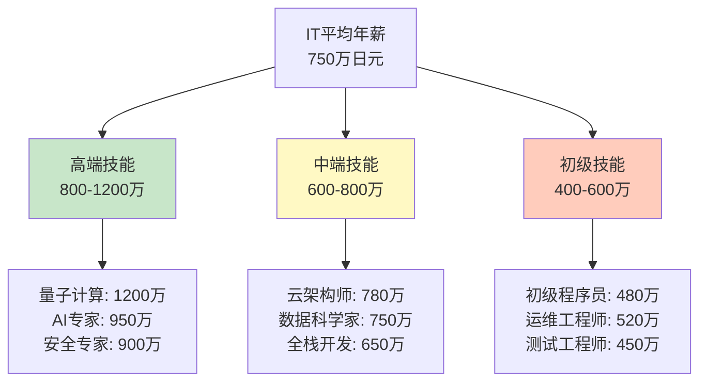

**高薪技能TOP 10（2030年预测）**

| 排名 | 技能 | 平均年薪 （万日元） | 2024年薪资 | 增长率 |
|------|------|-------------------|-----------|-------|
| 1 | 量子计算专家 | 1,200 | 850 | +41% |
| 2 | AI架构师 | 950 | 720 | +32% |
| 3 | 网络安全专家（CISO级） | 900 | 680 | +32% |
| 4 | 区块链架构师 | 850 | 650 | +31% |
| 5 | 数据科学家（高级） | 820 | 650 | +26% |
| 6 | 云架构师（多云） | 780 | 620 | +26% |
| 7 | DevOps专家 | 720 | 580 | +24% |
| 8 | AI伦理官 | 700 | - | 新兴 |
| 9 | 全栈工程师（高级） | 680 | 560 | +21% |
| 10 | IoT架构师 | 650 | 530 | +23% |

#### **按企业规模的薪资差异**

**2030年薪资预测（按企业规模）**

| 企业规模 | 平均年薪 | 初级（1-3年） | 中级（4-7年） | 高级（8年+） |
|---------|---------|-------------|-------------|------------|
| **外资大企业** | 920万 | 550万 | 850万 | 1,350万 |
| **日本大企业** | 780万 | 480万 | 720万 | 1,100万 |
| **中型企业** | 680万 | 420万 | 650万 | 950万 |
| **小型企业/创业公司** | 620万 | 400万 | 600万 | 850万 |
| **SES/派遣** | 550万 | 380万 | 530万 | 720万 |

**薪资差距分析**：
- 外资vs日企：外资高18%
- 大企业vs中小企业：大企业高15-25%
- 正社员vs派遣：正社员高27%
- 东京vs地方：东京高20-30%

#### **与全球薪资对比**

**IT人才薪资国际对比（2030年预测，美元）**

| 国家/地区 | 平均年薪 | 高级工程师 | AI专家 | 与日本差距 |
|----------|---------|-----------|--------|-----------|
| **美国** | $125,000 | $180,000 | $220,000 | +67% |
| **瑞士** | $115,000 | $165,000 | $200,000 | +53% |
| **新加坡** | $85,000 | $130,000 | $160,000 | +13% |
| **日本** | $75,000 | $110,000 | $135,000 | 基准 |
| **德国** | $72,000 | $105,000 | $130,000 | -4% |
| **韩国** | $65,000 | $95,000 | $120,000 | -13% |
| **中国** | $55,000 | $85,000 | $110,000 | -27% |
| **印度** | $35,000 | $55,000 | $75,000 | -53% |

**日本薪资竞争力分析**：
- **优势**：高于中国、印度等亚洲国家
- **劣势**：明显低于美国、欧洲发达国家
- **趋势**：差距正在缩小（2024年差距75%，2030年预计67%）
- **影响**：难以吸引顶尖全球人才，但对亚洲人才有吸引力

### 7.3.3 外国人才政策走向

为应对严重的人才短缺，日本政府正在逐步放宽外国人才引进政策，预计未来将更加开放。

#### **签证政策放宽趋势**

**技术·人文知识·国际业务签证改革**

| 改革内容 | 当前（2024） | 2027年预测 | 2030年预测 |
|---------|------------|-----------|-----------|
| **最低年薪要求** | 300万日元 | 280万日元 | 取消或大幅降低 |
| **学历要求** | 大学本科 | 专科或同等经验 | 技能认证即可 |
| **审批时间** | 1-3个月 | 2-4周 | 1-2周（在线审批） |
| **配偶工作许可** | 需单独申请 | 自动获得 | 自动获得 |
| **永住申请年限** | 10年 | 7年 | 5年 |

**高度人才积分制度优化**

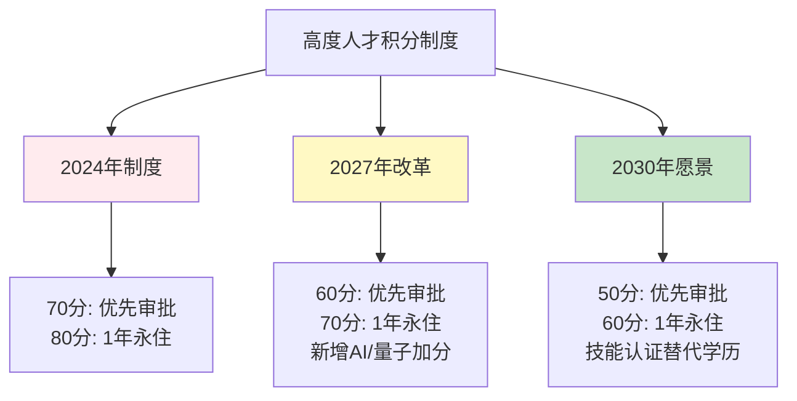

**高度人才积分表改革重点**

| 项目 | 当前积分 | 2027年预测 | 2030年预测 |
|------|---------|-----------|-----------|
| **AI/ML专业** | 学历分 | +10分 | +15分 |
| **量子计算** | 学历分 | +15分 | +20分 |
| **网络安全认证** | 无 | +10分 | +15分 |
| **日语能力** | N1: +15分 | N2: +10分 | N3: +5分（降低要求） |
| **年薪** | 1000万: +40分 | 800万: +40分 | 600万: +40分 |
| **年龄** | 29岁以下: +15分 | 34岁以下: +15分 | 39岁以下: +15分 |

**新设"数字人才"特别签证（预计2026年）**

| 特点 | 内容 |
|------|------|
| **对象** | AI、网络安全、量子计算等紧缺领域人才 |
| **年薪要求** | 500万日元以上 |
| **学历要求** | 专科以上或3年以上实务经验 |
| **审批时间** | 1周以内（在线申请） |
| **永住资格** | 3年后可申请 |
| **家属** | 配偶和子女自动获得工作/就学许可 |
| **配额** | 初期5,000人/年，逐步扩大至2万人/年 |

#### **外国人才引进目标**

**IT领域外国人才数量预测**

| 年份 | 外国IT人才 （万人） | 占IT总人才比例 | 同比增长 | 主要来源国 |
|------|-------------------|--------------|---------|-----------|
| 2024年 | 12.5 | 2.6% | - | 中国、印度、越南 |
| 2025年 | 14.2 | 2.9% | +13.6% | 中国、印度、越南 |
| 2027年 | 18.5 | 3.8% | +14.5% | 印度、越南、中国 |
| 2030年 | 25.0 | 5.5% | +10.6% | 印度、越南、菲律宾 |

**2030年目标**：外国IT人才达到25万人，占IT总人才的5.5%

**按技能领域的外国人才需求**

| 技能领域 | 2024年外国人才 | 2030年目标 | 增长率 | 重点来源 |
|---------|--------------|-----------|-------|---------|
| **AI/ML** | 1.2万人 | 4.5万人 | +275% | 印度、中国、美国 |
| **网络安全** | 0.8万人 | 3.2万人 | +300% | 印度、以色列、欧美 |
| **云计算** | 1.5万人 | 3.8万人 | +153% | 印度、中国、东南亚 |
| **数据科学** | 0.9万人 | 2.5万人 | +178% | 印度、中国、韩国 |
| **Web/移动开发** | 4.2万人 | 6.5万人 | +55% | 越南、中国、菲律宾 |
| **其他** | 3.9万人 | 4.5万人 | +15% | 多国 |

#### **日语要求变化趋势**

**企业对外国IT人才日语要求变化**

| 岗位类型 | 2024年要求 | 2030年预测 | 变化趋势 |
|---------|-----------|-----------|---------|
| **AI/ML专家** | N2-N1 | N3或英语 | ⬇️ 大幅降低 |
| **网络安全** | N2 | N3或英语 | ⬇️ 降低 |
| **后端开发** | N2-N3 | N3-N4 | ⬇️ 降低 |
| **前端开发** | N2 | N3 | ⬇️ 略降 |
| **项目经理** | N1 | N2 | ⬇️ 略降 |
| **客户支持** | N1 | N1 | ➡️ 不变 |

**推动日语要求降低的因素**：

1. **人才短缺压力**
   - 高端人才极度稀缺，不得不降低语言门槛
   - 技术能力优先于语言能力

2. **企业国际化**
   - 英语工作环境普及（大企业英语化率从15%→40%）
   - 远程工作减少面对面沟通需求
   - 文档和工具英语化

3. **技术支持**
   - AI实时翻译工具普及（准确率从70%→95%）
   - 多语言协作平台成熟
   - 自动字幕和翻译技术

4. **政策支持**
   - 政府推动企业英语化
   - 外国人才日语培训补助
   - 多语言行政服务

**日语学习支持措施**

| 措施 | 内容 | 实施时间 |
|------|------|---------|
| **企业内日语培训** | 政府补助50%费用（最高50万日元/人） | 2024年起 |
| **在线日语课程** | 免费提供N5-N3课程 | 2025年起 |
| **日语能力加薪** | N2合格者加薪5-10万日元/年 | 企业自主 |
| **工作时间学习** | 允许工作时间内学习日语（每周2-4小时） | 2026年推广 |

#### **外国人才就业支持**

**一站式支持体系（2025年建立）**

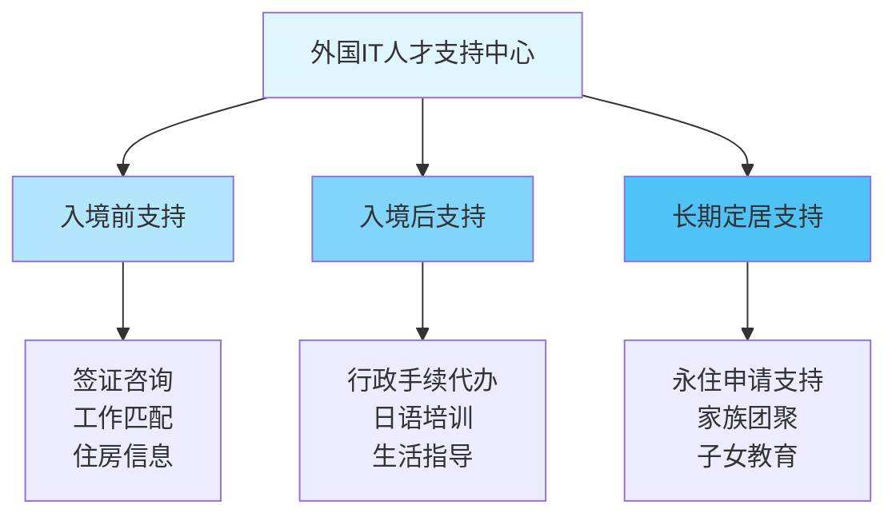

**主要支持措施**

| 支持项目 | 内容 | 预算（亿日元/年） |
|---------|------|----------------|
| **就业匹配平台** | 多语言求职网站、AI匹配 | 15 |
| **住房支援** | 保证人代行、初期费用补助 | 25 |
| **生活支援** | 多语言咨询窗口、生活指导 | 20 |
| **日语教育** | 免费/补助日语课程 | 35 |
| **家族支援** | 配偶就业、子女教育支持 | 30 |
| **法律咨询** | 签证、劳动法律咨询 | 10 |
| **合计** | - | **135** |

**地方政府吸引外国人才措施**

| 地区 | 主要措施 | 目标人数（2030） |
|------|---------|----------------|
| **东京都** | 住房补助、创业支持 | 12万人 |
| **大阪府** | 税收优惠、生活补助 | 4万人 |
| **福冈市** | 创业签证、住房支援 | 2万人 |
| **札幌市** | 低成本生活、自然环境 | 1.5万人 |
| **名古屋市** | 制造业IT人才、住房补助 | 2.5万人 |

---

## 7.4 总结与建议

经过前面章节的详细分析，本节将为不同利益相关方提供实用建议。

### 7.4.1 对求职者的建议

#### **技能发展方向**

**高优先级技能（2025-2030）**

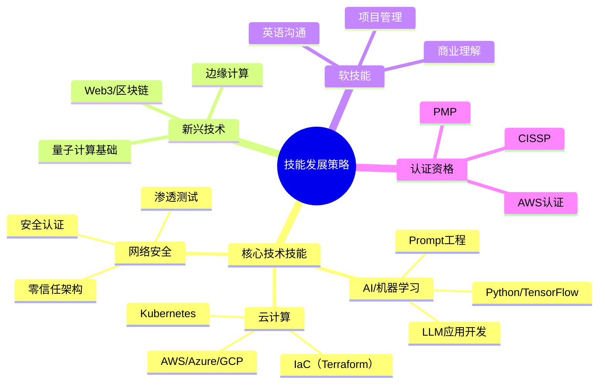

**技能学习优先级矩阵**

| 技能 | 市场需求 | 薪资水平 | 学习难度 | 综合评分 | 推荐度 |
|------|---------|---------|---------|---------|-------|
| **AI/ML** | ⭐⭐⭐⭐⭐ | ⭐⭐⭐⭐⭐ | ⭐⭐⭐⭐ | 4.7 | 🔥🔥🔥 |
| **云计算** | ⭐⭐⭐⭐⭐ | ⭐⭐⭐⭐ | ⭐⭐⭐ | 4.3 | 🔥🔥🔥 |
| **网络安全** | ⭐⭐⭐⭐⭐ | ⭐⭐⭐⭐⭐ | ⭐⭐⭐⭐ | 4.7 | 🔥🔥🔥 |
| **数据科学** | ⭐⭐⭐⭐ | ⭐⭐⭐⭐ | ⭐⭐⭐⭐ | 4.0 | 🔥🔥 |
| **DevOps** | ⭐⭐⭐⭐ | ⭐⭐⭐⭐ | ⭐⭐⭐ | 3.7 | 🔥🔥 |
| **区块链** | ⭐⭐⭐ | ⭐⭐⭐⭐ | ⭐⭐⭐⭐⭐ | 3.3 | 🔥 |
| **量子计算** | ⭐⭐ | ⭐⭐⭐⭐⭐ | ⭐⭐⭐⭐⭐ | 3.0 | 🔥 |

#### **职业规划建议**

**按经验阶段的发展路径**

**1. 初级阶段（0-3年）**

| 目标 | 具体行动 | 时间投入 |
|------|---------|---------|
| **打好基础** | 精通1-2门编程语言（Python/Java） | 每天2-3小时 |
| **云计算入门** | 获得AWS/Azure基础认证 | 3-6个月 |
| **实战经验** | 参与开源项目、个人项目 | 每周5-10小时 |
| **英语提升** | 达到技术文档阅读水平 | 每天30分钟 |
| **目标年薪** | 400-550万日元 | - |

**2. 中级阶段（4-7年）**

| 目标 | 具体行动 | 时间投入 |
|------|---------|---------|
| **专业化** | 选择AI/安全/云等方向深耕 | 持续学习 |
| **高级认证** | AWS专业级/CISSP等 | 6-12个月 |
| **领导力** | 带领小团队、指导新人 | 工作中实践 |
| **业务理解** | 学习所在行业知识 | 每周2-3小时 |
| **目标年薪** | 650-850万日元 | - |

**3. 高级阶段（8年+）**

| 目标 | 具体行动 | 时间投入 |
|------|---------|---------|
| **技术专家路线** | 成为领域专家、技术布道师 | 持续深耕 |
| **管理路线** | 项目经理、技术总监 | 管理培训 |
| **创业路线** | 积累资源、寻找机会 | 业余准备 |
| **国际化** | 参与国际项目、会议 | 拓展视野 |
| **目标年薪** | 900-1,500万日元 | - |

#### **外国人求职策略**

**求职准备清单**

| 准备项目 | 重要性 | 建议 |
|---------|-------|------|
| **技术能力** | ⭐⭐⭐⭐⭐ | 准备技术面试、刷LeetCode |
| **作品集** | ⭐⭐⭐⭐⭐ | GitHub项目、个人网站 |
| **日语能力** | ⭐⭐⭐⭐ | 至少N3，技术岗可放宽 |
| **英语能力** | ⭐⭐⭐⭐ | 技术文档、面试沟通 |
| **签证准备** | ⭐⭐⭐⭐⭐ | 了解签证要求、准备材料 |
| **文化理解** | ⭐⭐⭐ | 了解日本职场文化 |
| **人脉网络** | ⭐⭐⭐ | LinkedIn、技术社区 |

**推荐求职渠道**

| 渠道 | 适合人群 | 成功率 | 特点 |
|------|---------|-------|------|
| **LinkedIn** | 中高级人才 | 高 | 外资企业多、英语环境 |
| **Wantedly** | 创业公司 | 中 | 文化匹配、灵活 |
| **Green** | IT专业 | 高 | IT专门、直接沟通 |
| **Bizreach** | 高端人才 | 中高 | 高薪岗位、猎头服务 |
| **Daijob** | 外国人 | 中 | 多语言、外国人友好 |
| **人才中介** | 所有人 | 中 | 全程支持、但可能SES |
| **直接应聘** | 目标明确 | 低-中 | 需要日语、流程长 |

**面试准备要点**

1. **技术面试**
   - 算法和数据结构（LeetCode Medium级别）
   - 系统设计（高级岗位）
   - 项目经验深度讲解
   - 准备英语/日语技术术语

2. **文化适应**
   - 了解日本职场礼仪
   - 展现团队合作精神
   - 长期发展意愿
   - 学习日语的积极态度

3. **薪资谈判**
   - 了解市场行情
   - 强调技能稀缺性
   - 考虑总体待遇（奖金、福利）
   - 外国人可争取更高薪资

### 7.4.2 对企业的建议

#### **DX转型策略**

**DX成功要素框架**

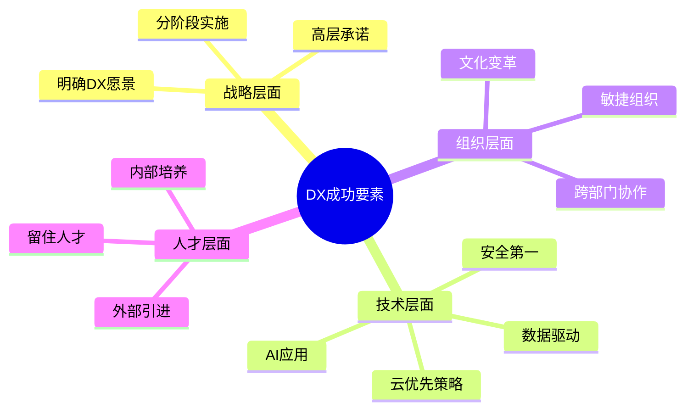

**DX推进路线图建议**

| 阶段 | 时间 | 重点任务 | 投资占比 | 预期成果 |
|------|------|---------|---------|---------|
| **第一阶段：基础建设** | 6-12个月 | 云迁移、数据整合、基础设施现代化 | 40% | 系统稳定性提升 |
| **第二阶段：能力提升** | 12-18个月 | AI/ML应用、自动化、数据分析 | 35% | 效率提升20-30% |
| **第三阶段：创新突破** | 18-36个月 | 新业务模式、生态系统构建 | 25% | 新收入来源 |

**按企业规模的DX策略**

**大企业（1000人以上）**

| 重点领域 | 具体措施 | 投资规模 |
|---------|---------|---------|
| **系统现代化** | 老旧系统迁移、微服务架构 | 年营收的3-5% |
| **AI应用** | 建立AI CoE、全面AI化 | 5-10亿日元/年 |
| **人才培养** | 内部培训、外部招聘 | 2-3亿日元/年 |
| **创新实验** | 创新实验室、POC项目 | 1-2亿日元/年 |

**中型企业（100-999人）**

| 重点领域 | 具体措施 | 投资规模 |
|---------|---------|---------|
| **云化优先** | SaaS优先、减少自建系统 | 年营收的2-3% |
| **重点突破** | 聚焦1-2个关键领域 | 3,000-8,000万日元/年 |
| **外部合作** | 利用DX支援补助金、咨询服务 | 1,000-3,000万日元/年 |
| **人才引进** | 招聘关键人才、外包补充 | 2,000-5,000万日元/年 |

**小企业（10-99人）**

| 重点领域 | 具体措施 | 投资规模 |
|---------|---------|---------|
| **低代码/无代码** | 使用现成工具、减少开发 | 年营收的1-2% |
| **RPA自动化** | 业务流程自动化 | 500-2,000万日元/年 |
| **云服务** | 全面使用云服务 | 300-1,000万日元/年 |
| **补助金利用** | 申请政府DX补助（最高1,000万） | - |

#### **人才培养与引进**

**人才战略三支柱**

1. **内部培养**（占60%）

| 措施 | 内容 | 成本 | 效果 |
|------|------|------|------|
| **技能培训** | AI/云/安全等课程 | 20-50万日元/人·年 | 技能提升 |
| **认证支持** | 考试费用、学习时间 | 10-30万日元/人 | 专业认证 |
| **轮岗制度** | 跨部门经验积累 | 管理成本 | 综合能力 |
| **导师制度** | 高级工程师指导 | 时间成本 | 快速成长 |

2. **外部引进**（占30%）

| 渠道 | 优势 | 成本 | 适用场景 |
|------|------|------|---------|
| **直接招聘** | 长期稳定 | 年薪+招聘费 | 核心岗位 |
| **猎头服务** | 高端人才 | 年薪的25-35% | 管理/专家岗 |
| **外国人才** | 技能互补 | 年薪+签证支持 | 紧缺技能 |
| **应届毕业生** | 可塑性强 | 较低 | 储备人才 |

3. **灵活用工**（占10%）

| 方式 | 优势 | 成本 | 适用场景 |
|------|------|------|---------|
| **外包** | 灵活、专业 | 项目费用 | 非核心项目 |
| **派遣** | 快速补充 | 时薪×1.3-1.5 | 短期需求 |
| **顾问** | 专业指导 | 高 | 战略咨询 |
| **兼职** | 成本低 | 时薪 | 辅助工作 |

**人才留存策略**

| 策略 | 具体措施 | 成本 | 效果 |
|------|---------|------|------|
| **薪资竞争力** | 市场薪资+10-20% | 高 | 直接有效 |
| **职业发展** | 明确晋升路径、技术专家通道 | 中 | 长期激励 |
| **工作环境** | 远程工作、弹性工时、现代化办公 | 中 | 提升满意度 |
| **技术氛围** | 技术分享、参加会议、开源贡献 | 低 | 吸引技术人才 |
| **股权激励** | 期权、限制性股票 | 高 | 长期绑定 |

#### **技术投资方向**

**2025-2030年技术投资优先级**

| 技术领域 | 优先级 | 投资占比 | ROI预期 | 风险 |
|---------|-------|---------|---------|------|
| **云计算** | ⭐⭐⭐⭐⭐ | 25-30% | 高（2-3年） | 低 |
| **AI/ML** | ⭐⭐⭐⭐⭐ | 20-25% | 中高（3-5年） | 中 |
| **网络安全** | ⭐⭐⭐⭐⭐ | 15-20% | 防御性 | 低 |
| **数据分析** | ⭐⭐⭐⭐ | 10-15% | 高（2-4年） | 低 |
| **自动化/RPA** | ⭐⭐⭐⭐ | 10-15% | 高（1-2年） | 低 |
| **IoT** | ⭐⭐⭐ | 5-10% | 中（3-5年） | 中 |
| **区块链** | ⭐⭐ | 2-5% | 不确定 | 高 |
| **量子计算** | ⭐ | 1-2% | 长期 | 高 |

**技术选型建议**

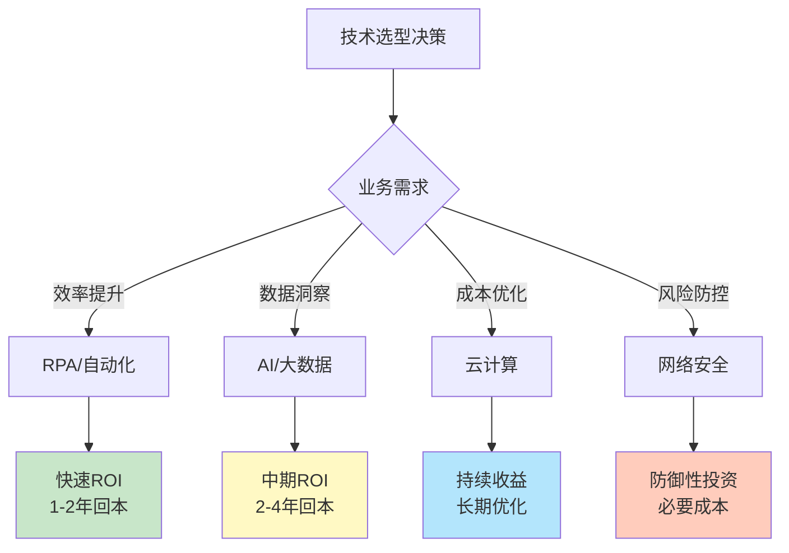

### 7.4.3 对投资者的建议

#### **重点关注领域**

**高增长投资机会（2025-2030）**

| 领域 | 市场规模CAGR | 投资吸引力 | 主要玩家 | 投资时机 |
|------|-------------|-----------|---------|---------|
| **生成式AI** | 22% | ⭐⭐⭐⭐⭐ | OpenAI、Anthropic、日本创业公司 | 现在 |
| **网络安全** | 12% | ⭐⭐⭐⭐⭐ | Palo Alto、CrowdStrike、日本企业 | 现在 |
| **云计算** | 13% | ⭐⭐⭐⭐ | AWS、Azure、GCP、日本云服务商 | 持续 |
| **量子计算** | 28% | ⭐⭐⭐⭐ | IBM、Google、日本研究机构 | 早期 |
| **边缘计算** | 15% | ⭐⭐⭐⭐ | 运营商、设备商 | 现在-2027 |
| **RPA/自动化** | 18% | ⭐⭐⭐ | UiPath、Automation Anywhere | 现在 |
| **区块链** | 17% | ⭐⭐⭐ | 金融科技公司 | 谨慎 |

**按投资阶段的机会**

**早期阶段（Seed/Series A）**

| 领域 | 投资规模 | 预期回报 | 风险 | 推荐比例 |
|------|---------|---------|------|---------|
| **AI应用** | 5,000万-3亿日元 | 10-50x | 高 | 30% |
| **SaaS** | 3,000万-2亿日元 | 5-20x | 中高 | 25% |
| **网络安全** | 5,000万-3亿日元 | 5-15x | 中 | 20% |
| **开发工具** | 3,000万-2亿日元 | 5-20x | 中 | 15% |
| **其他** | - | - | - | 10% |

**成长阶段（Series B/C）**

| 领域 | 投资规模 | 预期回报 | 风险 | 推荐比例 |
|------|---------|---------|------|---------|
| **云服务** | 5-20亿日元 | 3-10x | 中 | 35% |
| **AI平台** | 10-30亿日元 | 3-10x | 中 | 30% |
| **企业SaaS** | 5-15亿日元 | 2-8x | 中低 | 25% |
| **其他** | - | - | - | 10% |

**成熟阶段（Pre-IPO/IPO）**

| 领域 | 投资规模 | 预期回报 | 风险 | 推荐比例 |
|------|---------|---------|------|---------|
| **大型SaaS** | 20-100亿日元 | 2-5x | 低中 | 40% |
| **云基础设施** | 30-150亿日元 | 1.5-4x | 低 | 30% |
| **网络安全** | 20-80亿日元 | 2-5x | 低中 | 20% |
| **其他** | - | - | - | 10% |

#### **投资机会分析**

**日本IT市场投资优势**

| 优势 | 说明 | 机会 |
|------|------|------|
| **市场规模大** | 全球第三大IT市场 | 本土化产品机会 |
| **企业DX需求** | 90%企业需要DX | B2B SaaS机会 |
| **政府支持** | 补助金、税收优惠 | 降低创业成本 |
| **人才质量高** | 工程师素质好 | 技术创新能力 |
| **稳定环境** | 法律健全、社会稳定 | 长期投资安全 |

**投资挑战与风险**

| 挑战 | 影响 | 应对策略 |
|------|------|---------|
| **市场增速慢** | 2.4% CAGR | 聚焦高增长细分市场 |
| **创业生态弱** | 独角兽少 | 早期介入、长期培育 |
| **国际化难** | 语言、文化障碍 | 支持全球化战略 |
| **退出渠道窄** | IPO门槛高、M&A少 | 多元化退出策略 |
| **估值偏低** | 相比美国低30-50% | 价值投资机会 |

**重点关注的日本IT企业类型**

1. **AI应用公司**
   - 垂直行业AI解决方案
   - 生成式AI应用
   - AI基础设施工具
   - 预期：2025-2027年投资热点

2. **企业SaaS**
   - 中小企业DX工具
   - 行业特化SaaS
   - 协作办公平台
   - 预期：稳定增长，2-3年IPO

3. **网络安全**
   - 零信任解决方案
   - 云安全
   - AI驱动安全
   - 预期：持续需求，防御性投资

4. **开发者工具**
   - 低代码/无代码平台
   - DevOps工具
   - AI辅助开发
   - 预期：高增长，全球化潜力

#### **投资组合建议**

**平衡型投资组合（1亿日元）**

| 类别 | 配置比例 | 金额 | 预期回报 | 风险 |
|------|---------|------|---------|------|
| **早期高风险** | 20% | 2,000万 | 10-30x | 高 |
| **成长期** | 40% | 4,000万 | 3-10x | 中 |
| **成熟期** | 30% | 3,000万 | 2-5x | 低中 |
| **现金储备** | 10% | 1,000万 | - | - |

**激进型投资组合（1亿日元）**

| 类别 | 配置比例 | 金额 | 预期回报 | 风险 |
|------|---------|------|---------|------|
| **早期高风险** | 40% | 4,000万 | 10-50x | 高 |
| **成长期** | 45% | 4,500万 | 3-15x | 中高 |
| **成熟期** | 10% | 1,000万 | 2-5x | 低中 |
| **现金储备** | 5% | 500万 | - | - |

**保守型投资组合（1亿日元）**

| 类别 | 配置比例 | 金额 | 预期回报 | 风险 |
|------|---------|------|---------|------|
| **早期高风险** | 10% | 1,000万 | 5-20x | 高 |
| **成长期** | 30% | 3,000万 | 3-8x | 中 |
| **成熟期** | 50% | 5,000万 | 2-4x | 低 |
| **现金储备** | 10% | 1,000万 | - | - |

#### **风险提示**

**主要投资风险**

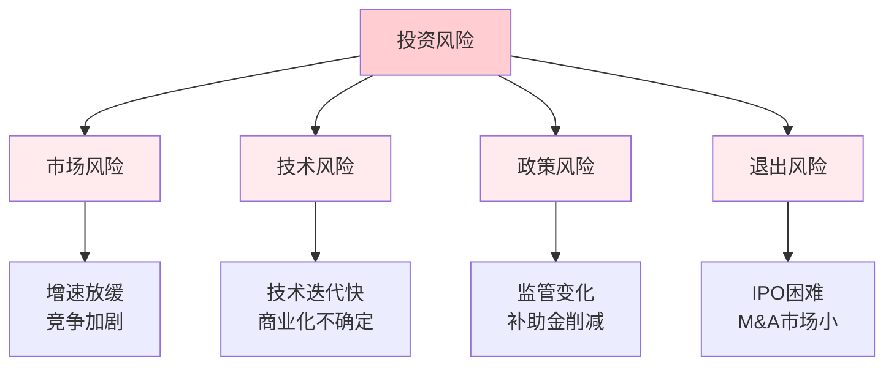

**风险缓释措施**

| 风险类型 | 缓释措施 | 效果 |
|---------|---------|------|
| **市场风险** | 分散投资、聚焦刚需领域 | 中 |
| **技术风险** | 技术尽职调查、分阶段投资 | 中高 |
| **政策风险** | 关注政策动向、合规审查 | 中 |
| **退出风险** | 多元化退出策略、长期持有准备 | 中 |
| **汇率风险** | 对冲、本币投资 | 高 |

**投资时机建议**

| 时期 | 投资策略 | 重点领域 |
|------|---------|---------|
| **2025年** | 积极布局AI、安全 | 生成式AI应用、零信任安全 |
| **2026-2027年** | 关注DX工具、云服务 | 企业SaaS、云原生应用 |
| **2028-2029年** | 量子计算、6G应用 | 早期量子应用、边缘计算 |
| **2030年** | 收获期、退出准备 | IPO、并购退出 |

---

## 章节总结

本章对2025-2030年日本IT行业的未来进行了全面展望，主要结论如下：

### **市场前景**

- **整体增长**：日本ICT市场将从2024年的4,600亿美元增长至2030年的5,300亿美元，CAGR为2.4%
- **结构变化**：云计算、AI、网络安全等新兴领域将快速增长，占比从10%提升至20%以上
- **驱动因素**：DX转型、政府政策、5G/6G建设、劳动力短缺推动自动化
- **主要风险**：人才缺口扩大、国际竞争加剧、经济不确定性、技术安全威胁

### **技术趋势**

- **生成式AI**：将成为最具颠覆性的技术，2030年企业采用率达85%，创造7万个净新增岗位
- **量子计算**：2027-2030年开始商业化应用，药物研发、金融建模等领域率先落地
- **6G通信**：2030年前后试商用，将催生全息通信、数字孪生等新应用，市场规模达5.5万亿日元（2035年）

### **人才市场**

- **缺口扩大**：IT人才缺口将从2024年的64万人增至2030年的85万人，缺口率达66%
- **技能变革**：AI/ML、网络安全、云计算等技能需求激增，传统技能需求下降
- **薪资上涨**：IT平均年薪将从598万日元增至750万日元，CAGR为3.9%
- **政策开放**：外国人才政策持续放宽，2030年外国IT人才将达25万人，占比5.5%

### **实用建议**

**对求职者**：
- 优先学习AI/ML、云计算、网络安全等高需求技能
- 根据经验阶段制定职业发展路径
- 外国人才应准备技术能力、作品集，日语要求正在降低

**对企业**：
- 制定清晰的DX转型路线图，分阶段实施
- 采用"内部培养60% + 外部引进30% + 灵活用工10%"的人才策略
- 优先投资云计算、AI、网络安全等高ROI技术

**对投资者**：
- 重点关注生成式AI、网络安全、企业SaaS等高增长领域
- 根据风险偏好配置早期、成长期、成熟期项目
- 注意市场增速慢、退出渠道窄等风险，采取分散投资策略

### **展望**

尽管面临人才短缺、国际竞争等挑战，日本IT行业在政府政策支持、企业DX需求驱动下，仍将保持稳定增长。生成式AI、量子计算、6G等新技术将带来新的机遇，而外国人才政策的开放也将为行业注入新的活力。对于求职者、企业和投资者而言，把握技术趋势、提前布局，将是未来成功的关键。

---

**全书完**

*本报告完成于2024年12月，数据和预测基于当时可获得的最新信息。实际发展可能因技术突破、政策变化、经济环境等因素而有所不同。建议读者持续关注行业动态，及时调整策略。*
