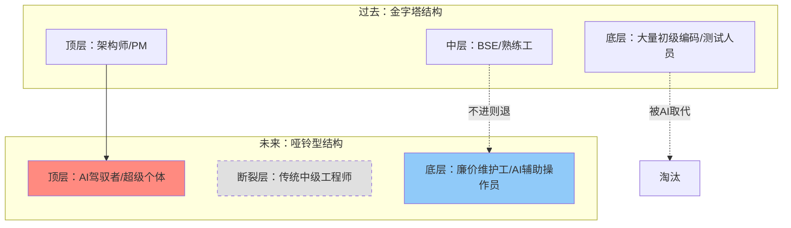

# 特别篇：AI崛起与外国IT从业者的命运推演

## 章节概述

本章是对当前AI技术（特别是生成式AI）爆发背景下，日本IT行业生态将发生何种剧变的深度推演。不同于常规的市场分析，本章将聚焦于**"商业模式的冲突"**与**"个体命运的重构"**，特别关注在日外国IT从业者这一特殊群体，在即将到来的"技术奇点"中面临的生存危机与跃迁机遇。

---

## 8.1 核心冲突：AI效率 vs "人月单价"商业模式

日本IT行业长期依赖的**SES（客驻）**和**多层外包**体系，其商业根基是"人月单价"（每人每月工作时长计费）。AI的出现，正在从根本上动摇这一根基。

### 8.1.1 "人月神话"的崩塌

*   **传统模式**：
    *   项目报价 = `预计工时` × `人月单价`。
    *   利益驱动：乙方倾向于投入更多初级人力，拉长工期以获取更多利润。
    *   *AI是个"坏孩子"*：它能在几分钟内完成几天的编码工作，导致可计费工时断崖式下跌。

*   **推演：商业模式的强制重构**
    *   **短期（1-3年）**：**阵痛与抵制**。传统的SIer和SES公司会禁止员工使用ChatGPT/Copilot，理由是"安全"和"版权"，实则是为了保护计费模式。**这是外国从业者的机会窗口**——如果你能私下熟练运用AI工具，你的实际产出将是同僚的5-10倍，这种"隐形生产力"将成为你的核心秘密武器。
    *   **中期（3-5年）**：**计费模式变革**。从"按时间付费"转向"按价值/成果付费"。企业不再买"5个人做3个月"，而是买"这个系统功能的实现"。
    *   **结论**：**靠"磨洋工"混日子的时代结束了。**

### 8.1.2 "哑铃型"社会的到来

日本IT职场传统的"金字塔"结构（大量初级码农支撑少量架构师）将迅速演变为"哑铃型"结构。

---

## 8.2 深度推演：对外国从业者的"降维打击"

### 8.2.1 "日语+IT"护城河的决堤

过去十年，**"N1日语 + Java/PHP"**是外国人在日本拿高薪的黄金公式。但在AI时代，这个公式失效了。

*   **语言障碍的消失**：
    *   **实时翻译的冲击**：GPT-4o等模型的实时语音翻译能力，让只会英语的印度/欧美顶尖工程师能无障碍与日本客户沟通。
    *   **文档能力的贬值**：编写详细设计书（詳細設計書）曾是外国工程师最头疼的工作，现在AI可以一键生成完美的商务日语文档。
    *   **推演**：**"懂日语"不再是核心竞争力，而是基本生存技能。** 竞争将回归技术本质——谁能解决业务问题。

### 8.2.2 "逆向离岸"现象（Reverse Offshoring）

*   **现状**：以前是日本发包给中国/越南做离岸开发（Offshore）。
*   **推演**：AI赋能下，1个日本本土的高级工程师+AI = 以前的1个5人离岸团队。
*   **结果**：**低端离岸外包需求锐减**。日本企业会发现，与其费劲管理海外团队，不如用AI工具在本地自己搞定。这将直接冲击那些依赖"对日外包"的外国从业者。

---

## 8.3 生存攻略：寻找"AI无法触达"的缝隙

在AI席卷一切的浪潮中，还有哪些领域是安全的？或者说是增值的？

### 8.3.1 成为"老旧系统AI迁移专家"（Legacy AI Migrator）

这是日本市场特有的、巨大的**金矿**。

*   **痛点**：日本有数千亿行COBOL/旧Java代码，文档缺失，逻辑混乱。没人敢动，也没人懂。
*   **AI优势**：AI擅长阅读烂代码，并将其解释为自然语言，进而重构为现代语言。
*   **机会**：
    *   你不必精通COBOL，你只需要学会**"如何用AI解析COBOL"**。
    *   **必杀技**：建立一套工作流，用AI自动生成旧系统的业务逻辑文档，然后用AI辅助重写为Go/Python微服务。
    *   **价值**：这是帮日本企业"续命"的工作，预算极高。

### 8.3.2 进化为"超级BSE"（AI-Enabled Bridge）

传统的BSE（桥梁工程师）是"传话筒"，未来的BSE是**"预处理中心"**。

*   **新工作流**：
    1.  拿到日本客户模糊的需求。
    2.  **自己先用AI跑一遍**：生成原型图、初步代码、需求规格说明书。
    3.  拿着AI生成的半成品跟客户确认（这比空口谈高效10倍）。
    4.  确认无误后，再交给后方开发团队（或者自己用AI写完）。
*   **核心能力**：**Prompt Engineering（提示词工程）** + **日本商业习惯理解**。

### 8.3.3 现场力与"读空气"（Human Touch）

AI越强大，**"必须人在现场"**的服务就越昂贵。

*   **信任成本**：日本商业极度看重"信任"（信頼関係）。AI无法陪客户喝酒，无法在客户焦虑时提供情绪价值，无法处理复杂的部门间政治斗争。
*   **策略**：外国从业者应刻意锻炼**"非技术能力"**——谈判、协调、甚至是在客户现场的"安心感"提供。做一个**"懂技术的顶级销售/咨询师"**。

---

## 8.4 2025-2027 行动清单（Action Items）

| 阶段 | 关键动作 | 目标 |
| :--- | :--- | :--- |
| **立刻** | **掌握AI编码工具**（Cursor, Copilot, Cline） | 达到"1人抵3人"的开发效率，但不要声张，将节省的时间用于学习。 |
| **半年内** | **建立个人知识库**（Obsidian/Notion + RAG） | 将所有经手的日语文档、技术坑点喂给私有AI，打造个人的"第二大脑"。 |
| **一年内** | **尝试"全栈化"** | 借助AI，前端尝试写后端，后端尝试写运维脚本。打破职能边界，成为"能独立交付产品"的人。 |
| **长期** | **押注"实体+AI"** | 关注AI与IoT、机器人、农业、养老等**物理世界**结合的领域。日本在这些领域有硬件优势，且无法纯靠软件AI替代。 |

## 结语

对于在日外国IT从业者，**平庸的时代结束了**。

如果你只想做一个"听话的编码机器"，日本将不再是你的乐土，因为AI更听话、更便宜。但如果你愿意借助AI的杠杆，放大你的跨文化视野和解决问题的能力，你将在这里获得前所未有的**"超级个体"**红利。

**不要温和地走进那个良夜，去拥抱变局，成为那个驾驭风暴的人。**
